# Laporan Rancang Bangun Proyek

## Daftar Isi

- [1. Pendahuluan](#1-pendahuluan)
- [2. Target](#2-target)
- [3. Decision Logs](#3-decision-logs)
- [4. Blueprint](#4-blueprint)
- [5. Tahapan Implementasi](#5-tahapan-implementasi)
  - [Tahap 0 - Membuat folder kosong dan baseline tooling](#tahap-0---membuat-folder-kosong-dan-baseline-tooling)
  - [Tahap 0A - Menetapkan threat model containering dan security](#tahap-0a---menetapkan-threat-model-containering-dan-security)
  - [Tahap 1 - Menentukan image dasar dan isi container](#tahap-1---menentukan-image-dasar-dan-isi-container)
  - [Tahap 2 - Menetapkan environment inti container](#tahap-2---menetapkan-environment-inti-container)
  - [Tahap 3 - Menulis entrypoint untuk bootstrap runtime, secret, sertifikat, dan MySQL](#tahap-3---menulis-entrypoint-untuk-bootstrap-runtime-secret-sertifikat-dan-mysql)
  - [Tahap 4 - Menyalakan HTTPS dan redirect HTTP ke HTTPS](#tahap-4---menyalakan-https-dan-redirect-http-ke-https)
  - [Tahap 5 - Menambahkan security headers di level web server](#tahap-5---menambahkan-security-headers-di-level-web-server)
  - [Tahap 6 - Mengatur hardening PHP runtime](#tahap-6---mengatur-hardening-php-runtime)
  - [Tahap 7 - Menulis konfigurasi aplikasi dan bootstrap](#tahap-7---menulis-konfigurasi-aplikasi-dan-bootstrap)
  - [Tahap 8 - Mendesain schema database yang memenuhi privasi dan rate limit](#tahap-8---mendesain-schema-database-yang-memenuhi-privasi-dan-rate-limit)
  - [Tahap 9 - Menulis helper keamanan inti](#tahap-9---menulis-helper-keamanan-inti)
  - [Tahap 10 - Menulis seluruh query database dengan prepared statement](#tahap-10---menulis-seluruh-query-database-dengan-prepared-statement)
  - [Tahap 11 - Membuat halaman awal berisi form register dan login](#tahap-11---membuat-halaman-awal-berisi-form-register-dan-login)
  - [Tahap 12 - Menulis endpoint registrasi](#tahap-12---menulis-endpoint-registrasi)
  - [Tahap 13 - Menulis endpoint login](#tahap-13---menulis-endpoint-login)
  - [Tahap 14 - Menulis landing page sukses dan gagal](#tahap-14---menulis-landing-page-sukses-dan-gagal)
  - [Tahap 15 - Menambahkan logout aman](#tahap-15---menambahkan-logout-aman)
  - [Tahap 16 - Menambahkan rate limiting login dan register](#tahap-16---menambahkan-rate-limiting-login-dan-register)
  - [Tahap 17 - Menyiapkan Docker Compose untuk development dan demo](#tahap-17---menyiapkan-docker-compose-untuk-development-dan-demo)
  - [Tahap 18 - Menambahkan Snort IDS dan ACL Jaringan](#tahap-18---menambahkan-snort-ids-dan-acl-jaringan)
  - [Tahap 19 - Menulis test otomatis untuk helper keamanan](#tahap-19---menulis-test-otomatis-untuk-helper-keamanan)
  - [Tahap 20 - Mengamankan hygiene repo dan build context](#tahap-20---mengamankan-hygiene-repo-dan-build-context)
  - [Tahap 21 - Menjelaskan privilege runtime dan capability container](#tahap-21---menjelaskan-privilege-runtime-dan-capability-container)
  - [Tahap 22 - Memeriksa supply-chain image dan dependency container](#tahap-22---memeriksa-supply-chain-image-dan-dependency-container)
  - [Tahap 23 - Menutup lifecycle secret dan batas privilege database](#tahap-23---menutup-lifecycle-secret-dan-batas-privilege-database)
  - [Tahap 24 - Menambahkan healthcheck container](#tahap-24---menambahkan-healthcheck-container)
- [6. Alur Demo Singkat Saat Presentasi](#6-alur-demo-singkat-saat-presentasi)
- [7. Urutan Verifikasi Setelah Implementasi](#7-urutan-verifikasi-setelah-implementasi)
  - [Uji 1 - Container hidup](#uji-1---container-hidup)
  - [Uji 2 - HTTP redirect ke HTTPS](#uji-2---http-redirect-ke-https)
  - [Uji 3 - Form tampil di browser](#uji-3---form-tampil-di-browser)
  - [Uji 4 - Register berhasil](#uji-4---register-berhasil)
  - [Uji 5 - Login berhasil](#uji-5---login-berhasil)
  - [Uji 6 - Login gagal](#uji-6---login-gagal)
  - [Uji 7 - Username dan password tidak terbaca asli di database](#uji-7---username-dan-password-tidak-terbaca-asli-di-database)
  - [Uji 8 - CSRF protection](#uji-8---csrf-protection)
  - [Uji 9 - SQL injection](#uji-9---sql-injection)
  - [Uji 10 - XSS](#uji-10---xss)
  - [Uji 11 - Buffer overflow / oversized input](#uji-11---buffer-overflow-oversized-input)
  - [Uji 12 - Rate limit](#uji-12---rate-limit)
  - [Uji 13 - Snort IDS dan rule lokal](#uji-13---snort-ids-dan-rule-lokal)
  - [Uji 14 - ACL port jaringan](#uji-14---acl-port-jaringan)
  - [Uji 15 - Test otomatis helper keamanan](#uji-15---test-otomatis-helper-keamanan)
  - [Uji 16 - Hygiene secret dan build context](#uji-16---hygiene-secret-dan-build-context)
  - [Uji 17 - Runtime privilege dan capability](#uji-17---runtime-privilege-dan-capability)
  - [Uji 18 - Supply-chain image dan dependency](#uji-18---supply-chain-image-dan-dependency)
  - [Uji 19 - Lifecycle secret dan privilege database](#uji-19---lifecycle-secret-dan-privilege-database)
  - [Uji 20 - Healthcheck container](#uji-20---healthcheck-container)
  - [Hasil Verifikasi Aktual](#hasil-verifikasi-aktual)
- [8. Pemetaan Requirement Tugas Ke Tahap Implementasi](#8-pemetaan-requirement-tugas-ke-tahap-implementasi)
- [9. Catatan Transparansi Tentang Bagian Yang Sengaja Tidak Dibesar-besarkan](#9-catatan-transparansi-tentang-bagian-yang-sengaja-tidak-dibesar-besarkan)
- [10. Checklist Final Sebelum Presentasi](#10-checklist-final-sebelum-presentasi)
- [11. Ringkasan Strategi Dari Nol](#11-ringkasan-strategi-dari-nol)

## 1. Pendahuluan

Posisi masalah untuk tugas ini adalah:

1. target utama adalah **demo aplikasi login-register yang benar-benar berjalan**,
2. pengujian dilakukan lewat browser dan konfigurasi container,
3. diminta **satu container** untuk web server dan database,

## 2. Target 

| Kebutuhan | Target |
| --- | --- |
| Satu container berisi server dan database | Satu image/container memuat Apache, PHP, MySQL, OpenSSL |
| Web server bisa diakses via browser | Port HTTP/HTTPS dipublish ke host |
| Ada form login dan register | Halaman awal menyediakan mode register dan login |
| Login sukses masuk landing page selamat datang + username | Session login aktif, username ditampilkan |
| Login gagal masuk landing page belum terdaftar | Redirect ke halaman khusus gagal login |
| Minimal harus bisa login | Flow register -> login -> welcome lulus uji |
| Server dilindungi HTTPS | HTTP redirect ke HTTPS, TLS aktif |
| Algoritma enkripsi web server boleh default | Apache + OpenSSL dipakai, TLS 1.2/1.3 diaktifkan |
| Form dilindungi dari serangan integrity | CSRF token, `POST` only, cookie aman |
| Username/password di database tidak boleh terbaca asli | Password di-hash, username dienkripsi |
| Lindungi dari buffer overflow | Pilih runtime high-level, batasi ukuran input/request, hindari parsing biner, nonaktifkan upload |
| Lindungi SQL injection | Prepared statement PDO + validasi input |
| Lindungi XSS | Output encoding + CSP |
| Tambahan Snort IDS | Snort 3 berjalan sebagai sidecar IDS dan membaca rule lokal/komunitas |
| Tambahan ACL jaringan | `iptables` container membatasi traffic masuk: web diizinkan, MySQL/SSH/ICMP dibatasi |

Container memuat **Apache + PHP + MySQL + OpenSSL** dalam satu runtime. Service `snort` pada `compose.dev.yaml` adalah IDS sidecar tambahan untuk jaringan, berbagi network namespace dengan `app` melalui `network_mode: service:app`. Sidecar tidak memisahkan database dari web server, sehingga satu container web server + database tetap terpenuhi.

## 3. Decision Logs

### 3.1. Satu container

Satu container yang memuat kombinasi Apache, PHP native, MySQL dipilih karena paling lurus untuk browser-based berbasis form. Apache kuat untuk redirect HTTP ke HTTPS, TLS, dan security headers. PHP native membuat hubungan requirement ke kode dan kontrol keamanan tetap terlihat jelas tanpa tertutup abstraksi framework. MySQL dipilih karena umum, mudah diuji, dan relevan dengan kebutuhan penyimpanan akun saja.

| Opsi | Kelebihan | Kekurangan | Keputusan |
| --- | --- | --- | --- |
| Nginx + PHP-FPM + MySQL | arsitektur umum produksi | butuh lebih banyak proses dan konfigurasi | tidak dipilih karena kompleksitas naik |
| Apache + mod_php + MySQL | HTTPS, rewrite, header security, PHP langsung di satu stack | bukan pemisahan service ideal produksi | **dipilih** karena paling lurus untuk tugas satu container |
| Laravel/Node framework | cepat untuk fitur | terlalu banyak abstraksi                  | tidak dipilih agar transparansi implementasi terlihat jelas |
| PHP native procedural terstruktur | sangat transparan, dependency kecil | butuh disiplin struktur file | **dipilih** |

### 3.2. Autentikasi berbasis session

Form login web biasa yang ditest via browser lebih cocok memakai session karena:

1. browser otomatis membawa cookie session,
2. CSRF protection mudah dipasang,
3. logout server-side sederhana,
4. requirement tugas tidak butuh API stateless.

JWT tidak dipakai karena aplikasi ini bukan API stateless. Memaksakan JWT bisa menambah isu baru seperti penyimpanan token di browser, invalidasi token saat logout, dan kebutuhan mekanisme revocation. Session cookie lebih natural untuk form login biasa dan lebih mudah dijelaskan.

### 3.3. Password di-hash dan username dienkripsi serta diindeks dengan HMAC

Requirement landing page meminta username asli tetap bisa ditampilkan setelah login. Itu membuat satu hash saja tidak cukup.

Password tidak dienkripsi dua arah karena tujuan privasi database adalah mencegah attacker membaca password asli ketika database bocor. Hash satu arah memenuhi tujuan itu, sedangkan enkripsi password masih menyisakan kemungkinan plaintext dipulihkan jika key ikut bocor. Karena itu password memakai hash Argon2id, bukan ciphertext.

Keputusan yang tepat:

1. password disimpan sebagai hash Argon2id + pepper,
2. username disimpan dalam dua bentuk:
   - `username_lookup`: HMAC-SHA256 dari username yang sudah dinormalisasi,
   - `username_encrypted`: ciphertext AES-256-GCM agar username asli bisa ditampilkan lagi.

Username tidak disimpan langsung sebagai plaintext karena privasi juga menyentuh data akun, tetapi username asli tetap perlu ditampilkan di landing page sukses. Solusi yang proporsional adalah memisahkan fungsi pencarian dan fungsi tampilan: `username_lookup` untuk pencarian stabil tanpa plaintext, dan `username_encrypted` untuk pemulihan tampilan asli setelah login valid.

Alasan:

1. login butuh pencarian yang stabil dan cepat,
2. halaman welcome butuh nilai asli,
3. database bocor tetap tidak langsung membuka username plaintext.

### 3.4. Buffer overflow

Proyek ini berbasis PHP dengan Apache dan MySQL. Logika bisnis auth ditulis di PHP userland, bukan di C manual. Itu menurunkan risiko buffer overflow pada kode aplikasi yang ditulis sendiri, tetapi tidak berarti seluruh stack native menjadi kebal secara absolut.

Interpretasi yang realistis:

1. logika auth ditulis di bahasa high-level,
2. panjang input dibatasi ketat,
3. ukuran body request dibatasi,
4. file upload dimatikan,
5. parsing file biner tidak dipakai,
6. request yang tidak sesuai ukuran/format dipotong sejak awal.

## 4. Blueprint

Struktur ini dibangun untuk memisahkan area yang boleh diakses browser, area logika aplikasi, dan area hardening container sebelum implementasi.

```text
au7h/
├── Dockerfile
├── docker-entrypoint.sh
├── compose.dev.yaml
├── docker/
│   ├── apache-global.conf
│   ├── apache-http.conf.template
│   ├── apache-ssl.conf.template
│   ├── acl.sh
│   ├── healthcheck.php
│   └── php.ini
├── config/
│   └── bootstrap.php
├── src/
│   ├── Infrastructure/Database.php
│   ├── Security/
│   │   ├── Auth.php
│   │   └── RateLimiter.php
│   ├── Support/Config.php
│   ├── Support/Http.php
│   └── Presentation/
│       ├── Views.php
│       ├── Components.php
│       ├── AuthViews.php
│       └── ResultViews.php
├── public/
│   ├── index.php
│   ├── register.php
│   ├── login.php
│   ├── welcome.php
│   ├── not-registered.php
│   └── logout.php
├── security/
│   └── snort/
│       ├── snort.lua
│       └── rules/
│           ├── au7h.rules
│           ├── local.rules
│           └── community.rules
├── tests/
│   └── AuthSecurityTest.php
└── certs/
```

Struktur awal dipilih untuk membatasi area yang boleh disentuh browser, memusatkan bootstrap request, memisahkan concern aplikasi, dan memisahkan concern runtime container dari logika PHP.

Alasan struktur:

1. `public/` dijadikan area yang boleh diakses browser karena Apache pada repo ini memang diarahkan ke `DocumentRoot /var/www/html/public` dan `DirectoryIndex index.php`, sehingga file di luar folder ini tidak ikut terekspos ke web. Pola ini terlihat di [docker/apache-ssl.conf.template](/home/fxrdhan/au7h/docker/apache-ssl.conf.template:1) dan cocok dengan endpoint yang memang berada di [public/index.php](/home/fxrdhan/au7h/public/index.php:1), [public/register.php](/home/fxrdhan/au7h/public/register.php:1), [public/login.php](/home/fxrdhan/au7h/public/login.php:1), [public/welcome.php](/home/fxrdhan/au7h/public/welcome.php:1), [public/not-registered.php](/home/fxrdhan/au7h/public/not-registered.php:1), dan [public/logout.php](/home/fxrdhan/au7h/public/logout.php:1).
2. `src/` dipisah berdasarkan concern karena alur aplikasi ini memang terbagi jelas: akses database diletakkan di [src/Infrastructure/Database.php](/home/fxrdhan/au7h/src/Infrastructure/Database.php:1), autentikasi di [src/Security/Auth.php](/home/fxrdhan/au7h/src/Security/Auth.php:1), rate limiting di [src/Security/RateLimiter.php](/home/fxrdhan/au7h/src/Security/RateLimiter.php:1), helper umum di [src/Support/Config.php](/home/fxrdhan/au7h/src/Support/Config.php:1) dan [src/Support/Http.php](/home/fxrdhan/au7h/src/Support/Http.php:1), lalu HTML dirender lewat aggregator [src/Presentation/Views.php](/home/fxrdhan/au7h/src/Presentation/Views.php:1) yang memuat komponen di [src/Presentation/Components.php](/home/fxrdhan/au7h/src/Presentation/Components.php:1), form auth di [src/Presentation/AuthViews.php](/home/fxrdhan/au7h/src/Presentation/AuthViews.php:1), dan halaman hasil di [src/Presentation/ResultViews.php](/home/fxrdhan/au7h/src/Presentation/ResultViews.php:1). Pemisahan ini membuat perubahan tampilan tidak langsung mengganggu query database atau aturan login.
3. `docker/` berisi concern runtime dan hardening container: template virtual host Apache, header keamanan, TLS, pengaturan PHP, dan ACL jaringan dibaca oleh [Dockerfile](/home/fxrdhan/au7h/Dockerfile:1), [docker-entrypoint.sh](/home/fxrdhan/au7h/docker-entrypoint.sh:1), serta [docker/acl.sh](/home/fxrdhan/au7h/docker/acl.sh:1). Dengan begitu, konfigurasi server dapat diubah tanpa mencampur file endpoint atau fungsi autentikasi.
4. `security/snort/` dipisah karena Snort IDS adalah concern monitoring jaringan. [security/snort/snort.lua](/home/fxrdhan/au7h/security/snort/snort.lua:1) memuat konfigurasi IDS, sedangkan [security/snort/rules/au7h.rules](/home/fxrdhan/au7h/security/snort/rules/au7h.rules:1), [security/snort/rules/local.rules](/home/fxrdhan/au7h/security/snort/rules/local.rules:1), dan [security/snort/rules/community.rules](/home/fxrdhan/au7h/security/snort/rules/community.rules:1) memisahkan rule aggregator, rule lokal, dan rule komunitas.
5. `tests/` disiapkan untuk verifikasi helper keamanan. [tests/AuthSecurityTest.php](/home/fxrdhan/au7h/tests/AuthSecurityTest.php:1) memeriksa validasi input, normalisasi username, HMAC lookup, enkripsi username, hashing password, CSRF token, dan policy rate limit.
6. `config/bootstrap.php` dipakai sebagai bootstrap aplikasi agar semua endpoint publik memulai request dari titik inisialisasi yang sama. File ini me-load `Config`, `Database`, `Http`, `Auth`, `RateLimiter`, dan `Views`, lalu memanggil `ensure_app_booted();`, sehingga setup koneksi, session, helper HTTP, rate limit, dan renderer tidak perlu diulang di setiap file endpoint. Pola ini terlihat di [config/bootstrap.php](/home/fxrdhan/au7h/config/bootstrap.php:1) dan dipakai ulang dari [public/index.php](/home/fxrdhan/au7h/public/index.php:1).

### Folder `docker/`

Detail referensi isi file di folder `docker/`:

1. [docker/apache-http.conf.template](/home/fxrdhan/au7h/docker/apache-http.conf.template:1) dan [docker/apache-ssl.conf.template](/home/fxrdhan/au7h/docker/apache-ssl.conf.template:1) berisi alur redirect HTTP dan aktivasi HTTPS
2. [docker/apache-global.conf](/home/fxrdhan/au7h/docker/apache-global.conf:1) dan security headers pada [docker/apache-ssl.conf.template](/home/fxrdhan/au7h/docker/apache-ssl.conf.template:12)  fokus pada hardening HTTP-level di web server.
3. [docker/php.ini](/home/fxrdhan/au7h/docker/php.ini:1) isinya adalah hardening runtime PHP dan penguatan session cookie.
4. [docker/acl.sh](/home/fxrdhan/au7h/docker/acl.sh:1) isinya adalah ACL jaringan container dengan `iptables`.
5. [docker/healthcheck.php](/home/fxrdhan/au7h/docker/healthcheck.php:1) isinya adalah healthcheck HTTPS lokal untuk memastikan Apache, PHP, dan bootstrap database merespons dari dalam container.

### File pendukung UI, tooling, dan test

1. [resources/tailwind.css](/home/fxrdhan/au7h/resources/tailwind.css:1) adalah source styling, sedangkan [public/styles.css](/home/fxrdhan/au7h/public/styles.css:1) adalah output build yang dilayani browser dan disalin ke image lewat `Dockerfile`.
2. [public/favicon.svg](/home/fxrdhan/au7h/public/favicon.svg:1), fonts, [public/theme.js](/home/fxrdhan/au7h/public/theme.js:1), [public/password-validation.js](/home/fxrdhan/au7h/public/password-validation.js:1), [public/page-shell.js](/home/fxrdhan/au7h/public/page-shell.js:1), [public/matrix-rain.js](/home/fxrdhan/au7h/public/matrix-rain.js:1), [public/vendor/motion.js](/home/fxrdhan/au7h/public/vendor/motion.js:1), dan [public/vendor/matrix-animation.js](/home/fxrdhan/au7h/public/vendor/matrix-animation.js:1) adalah lapisan presentasi yang dipanggil oleh layout HTML.
3. [scripts/sync-motion-vendor.mjs](/home/fxrdhan/au7h/scripts/sync-motion-vendor.mjs:1) menyalin bundle Motion ke folder publik, sedangkan [scripts/update-snort-community-rules.sh](/home/fxrdhan/au7h/scripts/update-snort-community-rules.sh:1) memperbarui [security/snort/rules/community.rules](/home/fxrdhan/au7h/security/snort/rules/community.rules:1) yang kemudian dimuat oleh `au7h.rules`.
4. [tests/AuthSecurityTest.php](/home/fxrdhan/au7h/tests/AuthSecurityTest.php:1) adalah test helper keamanan yang memverifikasi validasi input, normalisasi username, HMAC lookup, enkripsi username, hashing password, CSRF token, dan policy rate limit.

### Referensi desain

Referensi berikut dipakai untuk menguatkan prinsip desain yang memang diterapkan di proyek ini: batasi web root ke folder publik, pisahkan concern aplikasi, dan jangan campur config deploy dengan kode inti.

[Apache HTTP Server - Mapping URLs to Filesystem Locations](https://httpd.apache.org/docs/current/urlmapping.html)

> In deciding what file to serve for a given request, httpd's default behavior is to take the URL-Path for the request (the part of the URL following the hostname and port) and add it to the end of the `DocumentRoot` specified in your configuration files. Therefore, the files and directories underneath the `DocumentRoot` make up the basic document tree which will be visible from the web.

[MDN - MVC](https://developer.mozilla.org/en-US/docs/Glossary/MVC)

> MVC (Model-View-Controller) is a pattern in software design commonly used to implement user interfaces, data, and controlling logic.
> It emphasizes a separation between the software's business logic and display.
> This "separation of concerns" provides for a better division of labor and improved maintenance.
> Model: Manages data and business logic.
> View: Handles layout and display.
> Controller: Routes commands to the model and view parts.

[The Twelve-Factor App - Config](https://12factor.net/config)

> An app's config is everything that is likely to vary between deploys (staging, production, developer environments, etc).
> Apps sometimes store config as constants in the code. This is a violation of twelve-factor, which requires strict separation of config from code.
> A litmus test for whether an app has all config correctly factored out of the code is whether the codebase could be made open source at any moment, without compromising any credentials.
> The twelve-factor app stores config in environment variables (often shortened to env vars or env).

Dengan tiga referensi ini, maka pemisahan folder dilakukan sesuai kebutuhan masing-masing. `public/` dipilih untuk membatasi permukaan akses browser, `src/` dipisah agar data, tampilan, dan controlling logic tidak bercampur, `docker/` dipisah agar hardening server dan runtime container tidak masuk ke logika aplikasi, dan konfigurasi deploy tetap diambil dari environment variable alih-alih ditanam sebagai konstanta kode.

## 5. Tahapan Implementasi

### Tahap 0 - Membuat folder kosong dan baseline tooling

#### Tujuan

Menyediakan fondasi kerja yang rapi sebelum instalasi dependency.

#### Analisis alur

Jika struktur folder tidak dipatok di awal, file keamanan, runtime, dan endpoint akan cepat tercampur.

#### Implementasi

**Langkah 1:**

- Buat seluruh folder dan placeholder file inti lebih dulu.
- Pastikan file siap diisi secara bertahap.

```bash
mkdir -p au7h/{docker,config,src/Infrastructure,src/Security,src/Support,src/Presentation,public,certs}
cd au7h
touch Dockerfile docker-entrypoint.sh compose.dev.yaml
touch docker/apache-global.conf docker/apache-http.conf.template docker/apache-ssl.conf.template docker/php.ini docker/acl.sh docker/healthcheck.php
touch config/bootstrap.php
touch src/Infrastructure/Database.php src/Security/Auth.php src/Security/RateLimiter.php src/Support/Config.php src/Support/Http.php src/Presentation/Views.php src/Presentation/Components.php
touch public/index.php public/register.php public/login.php public/welcome.php public/not-registered.php public/logout.php
mkdir -p tests security/snort/rules scripts .github/workflows
touch tests/AuthSecurityTest.php security/snort/snort.lua security/snort/rules/au7h.rules security/snort/rules/local.rules security/snort/rules/community.rules
touch .gitignore .dockerignore .github/workflows/ci.yml package.json
```

Tambahan pada skeleton ini sengaja dibatasi ke file yang berhubungan dengan keamanan dan verifikasi: `RateLimiter.php`, `acl.sh`, direktori Snort, test helper keamanan, hygiene ignore file, dan workflow CI. File visual/UI tidak dibesarkan di tahap ini karena bukan inti kontrol keamanan.

### Tahap 0A - Menetapkan threat model containering dan security

#### Tujuan

Menetapkan ancaman utama sebelum memilih image, konfigurasi container, dan kontrol keamanan aplikasi.

#### Analisis alur

Laporan ini perlu bisa dibaca sebagai progress dari nol. Artinya, sebelum menulis Dockerfile dan endpoint login, ancaman yang ingin ditutup harus terlihat dulu. Threat model ini menjadi jembatan antara requirement tugas dan tahap implementasi berikutnya.

Fokus threat model sengaja dibatasi pada containering dan security. UI hanya dianggap sebagai permukaan input untuk register, login, welcome, logout, dan uji negatif.

#### Implementasi

**Langkah 1:**

- Ubah requirement menjadi daftar ancaman yang bisa diuji.
- Pasangkan setiap ancaman dengan kontrol dan tahap implementasi yang menutupnya.

| Ancaman atau risiko | Dampak jika tidak ditutup | Kontrol yang dipakai | Tahap penutup |
| --- | --- | --- | --- |
| Traffic login disadap di jaringan | Credential dan session bisa terbaca | HTTPS, TLS 1.2/1.3, redirect HTTP ke HTTPS | Tahap 4 |
| Database bocor | Username/password bisa terbaca asli | HMAC lookup, AES-256-GCM untuk username, Argon2id untuk password | Tahap 8, 9 |
| SQL injection | Login bisa dibypass atau data bocor | Prepared statement PDO, native prepares, validasi input | Tahap 10 |
| XSS | Script attacker bisa berjalan di browser | Output encoding, allowlist input, CSP | Tahap 5, 9, 11, 14 |
| CSRF | Aksi login/logout/register bisa dipicu lintas situs | Token CSRF, `POST` only, cookie `SameSite=Strict` | Tahap 6, 9, 12, 13, 15 |
| Brute force login/register | Password ditebak atau akun dibuat massal | Rate limit berbasis database | Tahap 8, 16 |
| Oversized input / buffer abuse | Request terlalu besar memaksa parsing tidak perlu | Batas input aplikasi, `post_max_size`, upload off, runtime high-level | Tahap 6, 9 |
| Port sensitif terbuka | MySQL/SSH/ICMP bisa diakses langsung | MySQL bind localhost, ACL `iptables`, port publish hanya HTTP/HTTPS | Tahap 3, 17, 18 |
| Traffic serangan tidak terlihat | Serangan jaringan sulit dibuktikan saat demo | Snort IDS sidecar, local rules, alert log | Tahap 18 |
| Secret masuk Git atau image | Pepper, key, database, atau private key bocor | Runtime secret file, `.gitignore`, `.dockerignore`, build context dibatasi | Tahap 3, 20, 23 |
| Container terlalu privileged | Dampak compromise melebar ke namespace jaringan | Capability default di-drop, hanya capability bootstrap/ACL/IDS yang ditambahkan ulang, `no-new-privileges` aktif, `privileged` tidak dipakai | Tahap 21 |
| Image/dependency rentan | Vulnerability dari base image atau dependency ikut terbawa | Version tag, lockfile frozen, CI build, status pinning/scan dicatat transparan | Tahap 22 |
| Container hidup tetapi aplikasi belum sehat | Demo terlihat `Up`, tetapi web app atau bootstrap DB belum siap | Docker `HEALTHCHECK` ke endpoint HTTPS lokal | Tahap 24 |

**Langkah 2:**

- Tetapkan acceptance criteria minimum yang harus ada di akhir laporan.

Acceptance criteria security dan containering:

1. aplikasi berjalan dari satu image/container utama berisi Apache, PHP, MySQL, dan OpenSSL,
2. HTTP selalu diarahkan ke HTTPS,
3. database tidak menyimpan username/password plaintext,
4. semua query user-facing memakai prepared statement,
5. form state-changing memakai CSRF token dan `POST`,
6. input berbahaya/terlalu panjang ditolak,
7. rate limit aktif untuk login/register,
8. Snort dan ACL punya bukti konfigurasi serta uji,
9. secret lokal tidak masuk Git atau Docker build context,
10. privilege container, supply-chain image, dan lifecycle secret dijelaskan secara jujur,
11. container punya healthcheck agar status runtime tidak hanya bergantung pada proses yang masih hidup.

#### Hasil tahap

Threat model ini membuat setiap kontrol berikutnya punya alasan. Jadi laporan tidak hanya menceritakan file dibuat berurutan, tetapi juga menunjukkan kenapa kontrol itu dipasang dan ancaman apa yang ditutup.

### Tahap 1 - Menentukan image dasar dan isi container

#### Tujuan

Membuat satu image yang memuat Apache, PHP, MySQL, dan OpenSSL.

#### Analisis alur

Tugas memperbolehkan satu container untuk server dan database. Karena itu, image harus langsung memasang semua komponen inti. Pemilihan Apache mengurangi kompleksitas dibanding Nginx + PHP-FPM.

Stack ini sengaja dibuat kecil dan eksplisit. Apache menjadi web server, PHP native menjalankan logika aplikasi tanpa framework besar, dan MySQL menangani penyimpanan akun yang mudah diinspeksi. Dengan begitu, evaluator bisa mengikuti alur dari requirement ke Dockerfile, konfigurasi server, kode PHP, lalu isi database tanpa harus membuka lapisan framework.

#### Referensi

[Docker Docs - Dockerfile overview](https://docs.docker.com/build/concepts/dockerfile/)

> Docker can build images automatically by reading the instructions from a
> Dockerfile. A Dockerfile is a text file containing instructions for building
> your source code. The Dockerfile instruction syntax is defined by the
> specification reference in the Dockerfile reference.
>
> Dockerfiles are crucial inputs for image builds and can facilitate automated,
> multi-layer image builds based on your unique configurations.

[Docker CLI - docker image build](https://docs.docker.com/reference/cli/docker/image/build/)

> | Description | Build an image from a Dockerfile |
> | Usage | `docker image build [OPTIONS] PATH | URL | -` |
> | Aliases | `docker build` `docker builder build` |
>
> The build context is the positional argument you pass when invoking the build
> command. In the following example, the context is `.`, meaning the current
> working directory.
>

[Dockerfile reference - FROM](https://docs.docker.com/reference/dockerfile/#from)

> The `FROM` instruction initializes a new build stage and sets the
> base image for subsequent instructions. As such, a valid Dockerfile must
> start with a `FROM` instruction. The image can be any valid image.
>
> `ARG` is the only instruction that may precede `FROM` in the Dockerfile..

[Dockerfile reference - RUN](https://docs.docker.com/reference/dockerfile/#run)

> The `RUN` instruction will execute any commands to create a new layer on top of
> the current image. The added layer is used in the next step in the Dockerfile.
> `RUN` has two forms:
>
> `RUN [OPTIONS] <command> ...`
> `RUN [OPTIONS] [ "<command>", ... ]`

#### Implementasi

**Langkah 1:**

- Tulis kerangka awal Dockerfile untuk runtime aplikasi.
- Mulai dari image sistem yang stabil.
- Pasang komponen minimum agar web server, PHP, database, dan TLS tersedia.
- Batasi tahap ini pada runtime dasar.

**Sumber:** [Dockerfile:12](/home/fxrdhan/au7h/Dockerfile:12)

**Catatan pembacaan:** sumber mengarah ke stage runtime yang dipakai repo. Cuplikan di bawah adalah bentuk awal runtime pada akhir Tahap 1 saja.

Pada tahap paling awal, Dockerfile cukup memuat runtime dasar:

```dockerfile
FROM ubuntu:25.10

ENV DEBIAN_FRONTEND=noninteractive

RUN apt-get update \
  && apt-get install -y --no-install-recommends \
    apache2 \
    libapache2-mod-php8.4 \
    mysql-server \
    openssl \
    php8.4 \
    php8.4-mysql \
  && rm -rf /var/lib/apt/lists/*
```

Blok awal ini baru menjawab kebutuhan dasar satu container: Apache menerima request browser, PHP menjalankan aplikasi, MySQL menyimpan akun, dan OpenSSL tersedia untuk operasi kriptografi server.

Paket dasar pada tahap awal:

| Paket | Tujuan | Keterangan |
| --- | --- | --- |
| `apache2` | Menjalankan web server HTTP/HTTPS. | Aplikasi harus bisa dibuka dari browser. Pada tahap ini Apache baru dipasang sebagai komponen runtime. |
| `libapache2-mod-php8.4` | Menghubungkan Apache dengan runtime PHP melalui `mod_php`. | Karena aplikasi ditulis dalam PHP native, Apache perlu modul agar file `.php` bisa dieksekusi langsung. Ini juga menjaga arsitektur tetap sederhana dalam satu container tanpa menambah PHP-FPM sebagai proses terpisah. |
| `mysql-server` | Menjalankan database MySQL di container yang sama. | Aplikasi membutuhkan penyimpanan akun, hash password, username terenkripsi, data session/rate limit, dan lookup login. Paket ini memenuhi kebutuhan satu container yang berisi web server sekaligus database. |
| `openssl` | Menyediakan tool kriptografi. | Komponen ini dipakai oleh runtime server untuk kebutuhan keamanan transport dan secret. |
| `php8.4` | Menyediakan runtime utama PHP. | File endpoint di `public/` dan helper di `src/` dijalankan oleh PHP. Paket ini adalah interpreter dasar untuk logika register, login, session, CSRF, validasi input, dan rendering halaman. |
| `php8.4-mysql` | Menyediakan ekstensi PHP untuk koneksi MySQL/PDO. | Kode aplikasi memakai database MySQL melalui PHP. Ekstensi ini memungkinkan prepared statement PDO berjalan, sehingga query login/register dapat dibuat aman dari SQL injection. |

### Tahap 2 - Menetapkan environment inti container

#### Tujuan

Mendefinisikan port, path data, nama database, dan user aplikasi sejak awal.

#### Analisis alur

Environment variable yang eksplisit membuat startup container deterministik dan memudahkan perpindahan antara mode development dan mode demo/presentasi.

#### Referensi

Tahap ini masih memakai referensi Dockerfile yang sama, tetapi fokusnya pindah ke perilaku `ENV`.

[Dockerfile reference - ENV](https://docs.docker.com/reference/dockerfile/#env)

> The environment variables set using `ENV` will persist when a container is run
> from the resulting image. You can view the values using `docker inspect`, and
> change them using `docker run --env <key>=<value>`.
>
> Unlike an `ARG` instruction, `ENV` values are always persisted in the built
> image.

#### Implementasi

**Langkah 1:**

- Deklarasikan semua variabel lingkungan yang dipakai bersama oleh entrypoint, Apache, PHP, dan koneksi database.
- Hindari nilai penting yang terselip hard-code di banyak file.

**Sumber:** [Dockerfile:30](/home/fxrdhan/au7h/Dockerfile:30)

**Alur kode:** blok ini menetapkan satu set environment variable bersama yang dibaca ulang oleh entrypoint, Apache, PHP, dan MySQL agar seluruh komponen bootstrap memakai nilai yang sama.

```dockerfile
ENV APP_PORT_HTTP=8080 \
    APP_PORT_HTTPS=8443 \
    PUBLIC_HTTPS_PORT=8443 \
    APP_DATA_DIR=/var/www/data \
    DB_HOST=127.0.0.1 \
    DB_PORT=3306 \
    DB_NAME=au7h_auth \
    DB_USER=au7h_app \
    CERT_DIR=/var/www/certs \
    MYSQL_DATA_DIR=/var/lib/mysql \
    MYSQL_DATABASE=au7h_auth \
    MYSQL_APP_USER=au7h_app \
    MYSQL_PORT=3306
```

#### Hasil tahap

Semua bagian bootstrap bisa membaca nilai yang konsisten tanpa hard-code tersebar.

### Tahap 3 - Menulis entrypoint untuk bootstrap runtime, secret, sertifikat, dan MySQL

#### Tujuan

Membuat container bisa menyala dari nol tanpa setup manual tambahan.

#### Analisis alur

Tanpa entrypoint, container satu-image akan sulit menghidupkan MySQL lebih dulu, menyiapkan secret runtime, membuat sertifikat lokal, lalu menyalakan Apache. Entry point menjadi pusat orkestrasi internal container.

Sertifikat self-signed dibuat di tahap ini karena target deploy laporan adalah demo lokal. Tujuannya bukan mengklaim trust publik seperti sertifikat CA, tetapi membuktikan bahwa HTTPS aktif, Apache memakai key/certificate, dan redirect HTTP ke HTTPS benar-benar berjalan. Jika aplikasi dipindahkan ke host publik, sertifikat tepercaya tetap menjadi pilihan yang benar.

#### Referensi

Referensi yang dicari pada tahap ini adalah dokumentasi bootstrap MySQL, pembuatan user database, grant privilege, readiness check, dan TLS server dasar.

[MySQL - Data Directory Initialization](https://dev.mysql.com/doc/refman/8.4/en/data-directory-initialization.html)

> After MySQL is installed, the data directory must be initialized, including the tables in the `mysql` system schema.
> To initialize the data directory, invoke [mysqld](https://dev.mysql.com/doc/refman/8.4/en/mysqld.html) with the [--initialize](https://dev.mysql.com/doc/refman/8.4/en/server-options.html#option_mysqld_initialize) or [--initialize-insecure](https://dev.mysql.com/doc/refman/8.4/en/server-options.html#option_mysqld_initialize-insecure) option.
> Use `--initialize` for “secure by default” installation, including generation of a random initial `root` password.
> Typically, data directory initialization need be done only after MySQL first has been installed.
>

[MySQL - CREATE USER](https://dev.mysql.com/doc/refman/8.4/en/create-user.html)

> The [CREATE USER](https://dev.mysql.com/doc/refman/8.4/en/create-user.html) statement creates new MySQL accounts.
> It enables authentication, role, SSL/TLS, resource-limit, password-management, comment, and attribute properties to be established for new accounts.
> `CREATE USER 'jeffrey'@'localhost' IDENTIFIED BY 'password';`
> An account when first created has no privileges and the default role `NONE`.
> To assign privileges or roles to this account, use one or more [GRANT](https://dev.mysql.com/doc/refman/8.4/en/grant.html) statements.

[MySQL - GRANT](https://dev.mysql.com/doc/refman/8.4/en/grant.html)

> The [GRANT](https://dev.mysql.com/doc/refman/8.4/en/grant.html) statement assigns privileges and roles to MySQL user accounts and roles.
> The [GRANT](https://dev.mysql.com/doc/refman/8.4/en/grant.html) statement enables system administrators to grant privileges and roles, which can be granted to user accounts and roles.
> With `ON`, the statement grants privileges.
> Database privileges apply to all objects in a given database. To assign database-level privileges, use `ON db_name.*` syntax.
> `GRANT ALL ON mydb.* TO 'someuser'@'somehost';`

[MySQL - mysqladmin](https://dev.mysql.com/doc/refman/8.4/en/mysqladmin.html)

> [mysqladmin](https://dev.mysql.com/doc/refman/8.4/en/mysqladmin.html) is a client for performing administrative operations.
> Invoke [mysqladmin](https://dev.mysql.com/doc/refman/8.4/en/mysqladmin.html) like this:
> `mysqladmin [options] command [command-arg] [command [command-arg]] ...`
> `ping`: Check whether the server is available. The return status from [mysqladmin](https://dev.mysql.com/doc/refman/8.4/en/mysqladmin.html) is 0 if the server is running, 1 if it is not.
> `shutdown`: Stop the server.

[OpenSSL - openssl req](https://docs.openssl.org/3.5/man1/openssl-req/)

> This command primarily creates and processes certificate requests (CSRs) in
> PKCS#10 format. It can additionally create self-signed certificates for use
> as root CAs for example.
>
> `-x509`
> This option outputs a certificate instead of a certificate request. This is
> typically used to generate test certificates.
>
> `-newkey arg`
> This option is used to generate a new private key unless `-key` is given.
> This option implies the `-new` flag to create a new certificate request or a
> new certificate in case `-x509` is used.
>
> `[rsa:] nbits` generates an RSA key `nbits` in size. If `nbits` is omitted,
> i.e., `-newkey rsa` is specified, the default key size specified in the
> configuration file with the `default_bits` option is used if present, else
> 2048.
>
> `-keyout filename`
> This gives the filename to write any private key to that has been newly
> created or read from `-key`.
>
> `-out filename`
> This specifies the output filename to write to or standard output by default.
>
> `-subj arg`
> Sets subject name for new request or supersedes the subject name when
> processing a certificate request.
>
> `-days n`
> When `-x509` is in use this specifies the number of days from today to
> certify the certificate for.
>
> `-addext ext`
> Add a specific extension to the certificate (if `-x509` is in use) or
> certificate request.

[Dockerfile reference - ENTRYPOINT](https://docs.docker.com/reference/dockerfile/#entrypoint)

> The exec form is best used to specify an `ENTRYPOINT` instruction, combined
> with `CMD` for setting default arguments that can be overridden at runtime.
>
> Using the exec form doesn't automatically invoke a command shell. This means
> that normal shell processing, such as variable substitution, doesn't happen.

Setelah alur bootstrap, privilege, readiness, dan sertifikat lokal terbaca jelas, tahap ini mengubah dua file sekaligus: Dockerfile untuk memasukkan entrypoint ke image, lalu `docker-entrypoint.sh` untuk isi bootstrap-nya. Tanpa perubahan Dockerfile, script entrypoint memang hanya menjadi file repo biasa dan tidak akan dipakai oleh container.

#### Implementasi

**Langkah 1:**

- Salin `docker-entrypoint.sh` ke image.
- Beri izin eksekusi.
- Jadikan script itu sebagai `ENTRYPOINT` container.

**Sumber:** [Dockerfile:54](/home/fxrdhan/au7h/Dockerfile:54), [Dockerfile:58](/home/fxrdhan/au7h/Dockerfile:58), dan [Dockerfile:67](/home/fxrdhan/au7h/Dockerfile:67)

**Alur kode:** Dockerfile yang sudah dibuat pada Tahap 1 ditambah sedikit agar entrypoint tidak hanya ditulis di repo, tetapi benar-benar dibawa ke image dan dipanggil sebagai proses bootstrap sebelum Apache berjalan.

```dockerfile
COPY docker-entrypoint.sh /usr/local/bin/docker-entrypoint-custom.sh
```

Baris ini memasukkan script entrypoint dari repo ke lokasi executable di dalam image.

```dockerfile
RUN chmod +x /usr/local/bin/docker-entrypoint-custom.sh
```

Baris ini memastikan script bisa dieksekusi ketika container start.

```dockerfile
ENTRYPOINT ["docker-entrypoint-custom.sh"]
CMD ["apache2ctl", "-D", "FOREGROUND"]
```

Bagian ini mengatur urutan startup: Docker menjalankan `docker-entrypoint-custom.sh` lebih dulu, lalu argumen default `CMD` dipakai entrypoint untuk menyalakan Apache di foreground setelah bootstrap runtime selesai.

**Langkah 2:**

- Buat secret runtime sekali saja pada startup pertama.
- Simpan secret dalam file dengan hak akses ketat.
- Hindari password dan key dibakar permanen ke image.

Shell dibuka dalam mode ketat, lalu secret runtime hanya dibuat saat file belum ada.

**Sumber:** [docker-entrypoint.sh:50](/home/fxrdhan/au7h/docker-entrypoint.sh:50)

**Alur kode:** saat container pertama kali start, skrip mengecek apakah file secret sudah ada; jika belum, skrip membuat semua secret runtime sekaligus lalu menyimpannya ke satu file yang dimuat kembali oleh proses bootstrap.

```sh
if [ ! -f "${SECRET_FILE}" ]; then
  {
    printf 'PEPPER_SECRET=%s\n' "$(openssl rand -hex 32)"
    printf 'ENCRYPTION_KEY=%s\n' "$(openssl rand -hex 32)"
    printf 'MYSQL_ROOT_PASSWORD=%s\n' "$(openssl rand -hex 24)"
    printf 'MYSQL_APP_PASSWORD=%s\n' "$(openssl rand -hex 24)"
  } > "${SECRET_FILE}"
fi
```

**Langkah 3:**

- Bangun sertifikat self-signed setelah secret siap.
- Pastikan kanal HTTPS langsung tersedia untuk demo lokal tanpa provisioning eksternal.

**Sumber:** [docker-entrypoint.sh:77](/home/fxrdhan/au7h/docker-entrypoint.sh:77)

**Alur kode:** skrip hanya membuat sertifikat ketika file cert atau key belum tersedia, lalu `openssl req` dipakai untuk membangkitkan pasangan TLS self-signed yang langsung cocok untuk `localhost`.

```sh
if [ ! -f "${TLS_CERT_PATH}" ] || [ ! -f "${TLS_KEY_PATH}" ]; then
  openssl req \
    -x509 \
    -nodes \
    -newkey rsa:2048 \
    -sha256 \
    -days 365 \
    -subj "/CN=localhost" \
    -addext "subjectAltName=DNS:localhost,IP:127.0.0.1" \
    -addext "basicConstraints=critical,CA:FALSE" \
    -addext "keyUsage=critical,digitalSignature,keyEncipherment" \
    -addext "extendedKeyUsage=serverAuth" \
    -keyout "${TLS_KEY_PATH}" \
    -out "${TLS_CERT_PATH}" >/dev/null 2>&1
fi
```

**Langkah 4:**

- Nyalakan MySQL sebagai proses background internal container.
- Simpan PID MySQL agar shutdown dapat dikendalikan dengan rapi saat container berhenti.

**Sumber:** [docker-entrypoint.sh:134](/home/fxrdhan/au7h/docker-entrypoint.sh:134)

**Alur kode:** setelah data dir siap, `mysqld` dijalankan sebagai proses background internal container dengan socket, PID file, port, dan bind address yang semuanya diambil dari environment.

```sh
mysqld \
  --user=mysql \
  --datadir="${MYSQL_DATA_DIR}" \
  --socket="${MYSQL_SOCKET}" \
  --pid-file="${MYSQL_PID_FILE}" \
  --port="${MYSQL_PORT}" \
  --bind-address="${MYSQL_BIND_ADDRESS}" \
  --console &
MYSQLD_PID=$!
```

**Langkah 5:**

- Periksa apakah data directory masih kosong.
- Bootstrap akun root, database aplikasi, dan akun aplikasi dalam urutan yang konsisten.
- Selesaikan bootstrap sebelum Apache melayani request.

**Sumber:** [docker-entrypoint.sh:154](/home/fxrdhan/au7h/docker-entrypoint.sh:154)

**Alur kode:** cabang bootstrap ini hanya berjalan untuk database yang masih kosong; urutannya adalah mengunci password root, membuat database aplikasi, membuat akun aplikasi, memberi grant, lalu menutup dengan `FLUSH PRIVILEGES`.

```sh
if [ "${MYSQL_BOOTSTRAP_REQUIRED}" -eq 1 ]; then
  mysql --protocol=socket --socket="${MYSQL_SOCKET}" -uroot <<EOF
ALTER USER 'root'@'localhost' IDENTIFIED BY '${MYSQL_ROOT_PASSWORD}';
CREATE DATABASE IF NOT EXISTS \`${MYSQL_DATABASE}\`
  CHARACTER SET utf8mb4
  COLLATE utf8mb4_unicode_ci;
CREATE USER IF NOT EXISTS '${MYSQL_APP_USER}'@'localhost' IDENTIFIED BY '${MYSQL_APP_PASSWORD}';
CREATE USER IF NOT EXISTS '${MYSQL_APP_USER}'@'127.0.0.1' IDENTIFIED BY '${MYSQL_APP_PASSWORD}';
GRANT ALL PRIVILEGES ON \`${MYSQL_DATABASE}\`.* TO '${MYSQL_APP_USER}'@'localhost';
GRANT ALL PRIVILEGES ON \`${MYSQL_DATABASE}\`.* TO '${MYSQL_APP_USER}'@'127.0.0.1';
${REMOTE_BOOTSTRAP_SQL}
FLUSH PRIVILEGES;
EOF
```

#### Keputusan penting

1. secret runtime tidak ditanam di image, tetapi dibuat saat container pertama kali start,
2. sertifikat self-signed cukup untuk demo lokal; sertifikat host bisa di-mount saat perlu,
3. MySQL dibind ke `127.0.0.1` secara default agar tidak terbuka ke luar container.

### Tahap 4 - Menyalakan HTTPS dan redirect HTTP ke HTTPS

#### Tujuan

Memastikan seluruh akses browser diarahkan ke kanal terenkripsi.

#### Analisis alur

Requirement tugas menyebut server harus dilindungi HTTPS. Karena browser mungkin masih membuka `http://`, perlu redirect permanen ke `https://`.

#### Referensi

Referensi yang dicari pada tahap ini adalah modul Apache yang menangani rewrite dan TLS.

[Apache mod_rewrite](https://httpd.apache.org/docs/current/mod/mod_rewrite.html)

> `mod_rewrite` operates on the full URL path, including the
> path-info section. A rewrite rule can be invoked in
> `httpd.conf` or in `.htaccess`. The path generated
> by a rewrite rule can include a query string, or can lead to internal
> sub-processing, external request redirection, or internal proxy
> throughput.
>
> The `RewriteCond` directive defines a
> rule condition. One or more `RewriteCond`
> can precede a `RewriteRule`
> directive. The following rule is then only used if both
> the current state of the URI matches its pattern, and if
> these conditions are met.
>
> The `RewriteEngine` directive enables or
> disables the runtime rewriting engine.
> Note that rewrite configurations are not
> inherited by virtual hosts. This means that you need to have a
> `RewriteEngine on` directive for each virtual host
> in which you wish to use rewrite rules.

[Apache mod_ssl](https://httpd.apache.org/docs/current/mod/mod_ssl.html)

> This module relies on [OpenSSL](https://www.openssl.org/) to provide the cryptography engine.
>
> This directive toggles the usage of the SSL/TLS Protocol Engine.
>
> This directive points to a file with certificate data in PEM format, or the certificate identifier through a configured cryptographic token. If using a PEM file, at minimum, the file must include an end-entity (leaf) certificate.
>
> This directive points to the PEM-encoded private key file for the server, or the key ID through a configured cryptographic token.
>
> This directive can be used to control which versions of the SSL/TLS protocol will be accepted in new connections.

[GNU gettext manual - Invoking the envsubst program](https://www.gnu.org/software/gettext/manual/html_node/envsubst-Invocation.html)

> The envsubst program substitutes the values of environment variables.
>
> In normal operation mode, standard input is copied to standard output, with
> references to environment variables of the form `$VARIABLE` or `${VARIABLE}`
> being replaced with the corresponding values.

Setelah fungsi rewrite dan modul TLS-nya terbaca jelas, aturan redirect dan virtual host HTTPS baru diimplementasikan.

#### Implementasi

**Langkah 1:**

- Tambahkan dependency renderer template.
- Aktifkan modul Apache untuk redirect dan TLS.
- Salin template virtual host ke image.

**Sumber:** [Dockerfile:19](/home/fxrdhan/au7h/Dockerfile:19), [Dockerfile:26](/home/fxrdhan/au7h/Dockerfile:26), [Dockerfile:46](/home/fxrdhan/au7h/Dockerfile:46), dan [Dockerfile:47](/home/fxrdhan/au7h/Dockerfile:47)

**Alur kode:** tahap ini membuat image membawa template Apache dan tool `envsubst`, sehingga nilai port dan lokasi sertifikat dapat diisi ketika container start.

```dockerfile
    gettext-base \
```

```dockerfile
  && a2enmod rewrite ssl \
```

```dockerfile
COPY docker/apache-http.conf.template /etc/apache2/sites-available/http-redirect.conf.template
COPY docker/apache-ssl.conf.template /etc/apache2/sites-available/app-ssl.conf.template
```

**Langkah 2:**

- Sediakan virtual host HTTP yang tugasnya hanya meredirect.
- Pisahkan virtual host HTTPS sebagai tempat seluruh aplikasi dijalankan.

**Sumber:** [docker/apache-http.conf.template:1-11](/home/fxrdhan/au7h/docker/apache-http.conf.template:1)

**Alur kode:** virtual host HTTP ini sengaja dibuat tipis, hanya menerima request awal, menulis ulang URL ke skema HTTPS yang benar, lalu mencatat log tanpa melayani aplikasi secara langsung.

```apacheconf
<VirtualHost *:${APP_PORT_HTTP}>
    ServerName localhost
    ServerSignature Off

    RewriteEngine On
    RewriteCond %{HTTP_HOST} ^([^:]+)(?::\d+)?$ [NC]
    RewriteRule ^ https://%1${PUBLIC_HTTPS_SUFFIX}%{REQUEST_URI} [R=301,L,NE]

    ErrorLog /proc/self/fd/2
    CustomLog /proc/self/fd/1 combined
</VirtualHost>
```

**Langkah 3:**

- Aktifkan TLS.
- Tentukan document root aplikasi.
- Pastikan direktori `public/` menjadi satu-satunya area yang boleh diakses langsung oleh browser.

**Sumber:** [docker/apache-ssl.conf.template:1](/home/fxrdhan/au7h/docker/apache-ssl.conf.template:1)

**Alur kode:** virtual host HTTPS ini memasang sertifikat, membatasi protokol TLS, lalu mengarahkan Apache agar hanya direktori `public/` yang menjadi entry point request web.

```apacheconf
<VirtualHost *:${APP_PORT_HTTPS}>
    ServerName localhost
    DocumentRoot /var/www/html/public
    DirectoryIndex index.php
    ServerSignature Off

    SSLEngine on
    SSLCertificateFile ${TLS_CERT_PATH}
    SSLCertificateKeyFile ${TLS_KEY_PATH}
    SSLProtocol -all +TLSv1.2 +TLSv1.3
```

Blok ini membuka virtual host HTTPS, menetapkan `public/` sebagai document root, mengaktifkan TLS, memakai sertifikat dari entrypoint, dan membatasi protokol ke TLS 1.2/1.3.

```apacheconf
    <Directory /var/www/html/public>
        AllowOverride None
        Options -Indexes +FollowSymLinks
        Require all granted
    </Directory>
```

Blok ini memastikan hanya direktori `public/` yang bisa dilayani Apache, mematikan directory listing, dan tetap mengizinkan symlink yang dibutuhkan aplikasi.

```apacheconf
    ErrorLog /proc/self/fd/2
    CustomLog /proc/self/fd/1 combined
</VirtualHost>
```

Blok ini mengarahkan error log dan access log ke stdout/stderr container agar mudah dibaca lewat `docker logs`.

**Langkah 4:**

- Tulis port Apache dari environment.
- Render template virtual host.
- Aktifkan site HTTP redirect dan HTTPS.

**Sumber:** [docker-entrypoint.sh:106](/home/fxrdhan/au7h/docker-entrypoint.sh:106), [docker-entrypoint.sh:116](/home/fxrdhan/au7h/docker-entrypoint.sh:116), dan [docker-entrypoint.sh:124](/home/fxrdhan/au7h/docker-entrypoint.sh:124)

**Alur kode:** entrypoint yang sudah dibuat pada Tahap 3 sekarang diberi tugas tambahan khusus server web: menulis `ports.conf`, mengganti variabel pada template Apache, lalu mengaktifkan virtual host hasil render.

```sh
cat > /etc/apache2/ports.conf <<EOF
Listen ${APP_PORT_HTTP}
<IfModule ssl_module>
    Listen ${APP_PORT_HTTPS}
</IfModule>
<IfModule mod_gnutls.c>
    Listen ${APP_PORT_HTTPS}
</IfModule>
EOF
```

```sh
envsubst '${APP_PORT_HTTP} ${PUBLIC_HTTPS_SUFFIX}' \
  < /etc/apache2/sites-available/http-redirect.conf.template \
  > /etc/apache2/sites-available/http-redirect.conf

envsubst '${APP_PORT_HTTPS} ${TLS_CERT_PATH} ${TLS_KEY_PATH}' \
  < /etc/apache2/sites-available/app-ssl.conf.template \
  > /etc/apache2/sites-available/app-ssl.conf
```

```sh
a2ensite http-redirect app-ssl >/dev/null
```

#### Keputusan penting

1. TLS 1.2 dan 1.3 dibiarkan aktif,
2. protokol lama dimatikan,
3. redirect dilakukan di level Apache agar konsisten untuk semua route.

### Tahap 5 - Menambahkan security headers di level web server

#### Tujuan

Memberi perlindungan baseline terhadap XSS, sniffing, clickjacking, dan downgrade risk.

#### Analisis alur

OWASP menekankan bahwa CSP bukan pertahanan utama XSS, tetapi tetap sangat bernilai sebagai defense in depth. Pada tahap ini fokusnya hanya memasang pagar HTTP-level di Apache.

CSP tidak diperlakukan sebagai pengganti escaping. Pertahanan utama XSS tetap output encoding konsisten pada setiap data dinamis yang masuk ke HTML, sedangkan CSP dipakai sebagai pagar tambahan jika suatu saat ada celah rendering yang lolos dari layer aplikasi.

#### Referensi

Referensi yang dicari pada tahap ini adalah dokumentasi identitas server Apache, konfigurasi header Apache, dan deskripsi fungsi setiap response header keamanan yang akan dipasang.

[Apache HTTP Server - Server-Wide Configuration](https://httpd.apache.org/docs/current/server-wide.html)

> This document explains some of the directives provided by the `core` server which are used to configure the basic operations of the server.
>
> The `ServerAdmin` and `ServerTokens` directives control what information about the server will be presented in server-generated documents such as error messages. The `ServerTokens` directive sets the value of the Server HTTP response header field.

Rujukan ini dipakai langsung untuk membenarkan `ServerTokens Prod` pada `docker/apache-global.conf`, karena Apache sendiri menjelaskan bahwa directive tersebut mengatur informasi server yang dipresentasikan ke klien melalui dokumen buatan server dan header HTTP `Server`. Pada halaman yang sama, `ServerSignature` juga muncul sebagai directive terkait, sehingga `ServerSignature Off` tetap konsisten sebagai pasangan hardening agar banner server tidak diumbar berlebihan.

[Apache mod_headers](https://httpd.apache.org/docs/current/mod/mod_headers.html)

> This module provides directives to control and modify HTTP request and response headers. Headers can be merged, replaced or removed.
>
> This directive can replace, merge or remove HTTP response headers. The header is modified just after the content handler and output filters are run, allowing outgoing headers to be modified.
>
> The optional condition argument determines which internal table of responses headers this directive will operate against: `onsuccess` (default, can be omitted) or `always`. The difference between the two lists is that the headers contained in the latter are added to the response even on error, and persisted across internal redirects (for example, ErrorDocument handlers).
>
> You're adding a header to a locally generated non-success (non-2xx) response, such as a redirect, in which case only the table corresponding to `always` is used in the ultimate response.

[OWASP - HTTP Security Response Headers Cheat Sheet](https://cheatsheetseries.owasp.org/cheatsheets/HTTP_Headers_Cheat_Sheet.html)

> HTTP Headers are a great booster for web security with easy implementation. Proper HTTP response headers can help prevent security vulnerabilities like Cross-Site Scripting, Clickjacking, Information disclosure and more.
>
> The `X-Content-Type-Options` response HTTP header is used by the server to indicate to the browsers that the MIME types advertised in the Content-Type headers should be followed and not guessed.
>
> This header is used to block browsers' MIME type sniffing, which can transform non-executable MIME types into executable MIME types.
>
> The `Cache-Control` header defines how responses are cached by browsers and intermediate caches.
>
> Use `no-store` for sensitive data to prevent any form of caching.
>
> The HTTP `Strict-Transport-Security` response header (often abbreviated as HSTS) instructs browsers to only access the website using HTTPS, even if a user attempts to connect over HTTP.
>
> Permissions-Policy allows you to control which origins can use which browser features, both in the top-level page and in embedded frames.
>
> Do not set this header or explicitly turn it off.
>
> `X-XSS-Protection: 0`

[MDN - Content-Security-Policy](https://developer.mozilla.org/en-US/docs/Web/HTTP/Headers/Content-Security-Policy)

> The HTTP **`Content-Security-Policy`** response header allows website administrators to control resources the user agent is allowed to load for a given page.
> With a few exceptions, policies mostly involve specifying server origins and script endpoints.
> This helps guard against [cross-site scripting](https://developer.mozilla.org/en-US/docs/Glossary/Cross-site_scripting) attacks.
>
> - `default-src` is a fallback for all other fetch directives.

[MDN - Permissions-Policy](https://developer.mozilla.org/en-US/docs/Web/HTTP/Headers/Permissions-Policy)

> The HTTP **`Permissions-Policy`** response header provides a mechanism to allow and deny the use of browser features in a document or within any [`<iframe>`](https://developer.mozilla.org/en-US/docs/Web/HTML/Reference/Elements/iframe) elements in the document.
>
> `Permissions-Policy: <directive>=<allowlist>`
>
> `()` (empty allowlist)
>
> The feature is disabled in top-level and nested browsing contexts. The equivalent for `<iframe>``allow` attributes is `'none'`.

[MDN - Referrer-Policy](https://developer.mozilla.org/en-US/docs/Web/HTTP/Headers/Referrer-Policy)

> The HTTP **`Referrer-Policy`** response header controls how much [referrer information](https://developer.mozilla.org/en-US/docs/Web/Privacy/Guides/Referer_header:_privacy_and_security_concerns) (sent with the [`Referer`](https://developer.mozilla.org/en-US/docs/Web/HTTP/Reference/Headers/Referer) header) should be included with requests.
>
> [`no-referrer`](https://developer.mozilla.org/en-US/docs/Web/HTTP/Reference/Headers/Referrer-Policy#no-referrer_2)
>
> The [`Referer`](https://developer.mozilla.org/en-US/docs/Web/HTTP/Reference/Headers/Referer) header will be omitted: sent requests do not include any referrer information.

[MDN - X-Frame-Options](https://developer.mozilla.org/en-US/docs/Web/HTTP/Headers/X-Frame-Options)

> The HTTP **`X-Frame-Options`** response header can be used to indicate whether a browser should be allowed to render the document in a [`<frame>`](https://developer.mozilla.org/en-US/docs/Web/HTML/Reference/Elements/frame), [`<iframe>`](https://developer.mozilla.org/en-US/docs/Web/HTML/Reference/Elements/iframe), [`<embed>`](https://developer.mozilla.org/en-US/docs/Web/HTML/Reference/Elements/embed) or [`<object>`](https://developer.mozilla.org/en-US/docs/Web/HTML/Reference/Elements/object). Sites can use this to avoid [clickjacking](https://developer.mozilla.org/en-US/docs/Web/Security/Attacks/Clickjacking) attacks and some [cross-site leaks](https://developer.mozilla.org/en-US/docs/Web/Security/Attacks/XS-Leaks), by ensuring that their content is not embedded into other sites.
>
> [`SAMEORIGIN`](https://developer.mozilla.org/en-US/docs/Web/HTTP/Reference/Headers/X-Frame-Options#sameorigin)
>
> The document can only be embedded if all ancestor frames have the same [origin](https://developer.mozilla.org/en-US/docs/Glossary/Origin) as the page itself.

[MDN - X-Content-Type-Options](https://developer.mozilla.org/en-US/docs/Web/HTTP/Headers/X-Content-Type-Options)

> The HTTP **`X-Content-Type-Options`** response header indicates that the [MIME types](https://developer.mozilla.org/en-US/docs/Web/HTTP/Guides/MIME_types) advertised in the [`Content-Type`](https://developer.mozilla.org/en-US/docs/Web/HTTP/Reference/Headers/Content-Type) headers should be respected and not changed.
> The header allows you to avoid [MIME type sniffing](https://developer.mozilla.org/en-US/docs/Web/HTTP/Guides/MIME_types#mime_sniffing) by specifying that the MIME types are deliberately configured.
>
> The `nosniff` directive has two effects depending on the context:
>
> - **Request blocking**: For requests with a [destination](https://developer.mozilla.org/en-US/docs/Web/API/Request/destination) of `"script"` or `"style"`, the browser blocks the response if the MIME type doesn't match an expected type.
> - **MIME type sniffing disabled**: For other response types, including navigations to a new HTML document, the browser uses the supplied [`Content-Type`](https://developer.mozilla.org/en-US/docs/Web/HTTP/Reference/Headers/Content-Type) as-is instead of examining the content to infer the type.

[OWASP - Clickjacking](https://owasp.org/www-community/attacks/Clickjacking)

> Clickjacking, also known as a “UI redress attack”, is when an attacker uses multiple transparent or opaque layers to trick a user into clicking on a button or link on another page when they were intending to click on the top level page. Thus, the attacker is “hijacking” clicks meant for their page and routing them to another page, most likely owned by another application, domain, or both.
>
> There are three main ways to prevent clickjacking:
>
> 1. Sending the proper Content Security Policy (CSP) frame-ancestors directive response headers that instruct the browser to not allow framing from other domains. The older `X-Frame-Options` HTTP headers is used for graceful degradation and older browser compatibility.

[OWASP - Content Security Policy Cheat Sheet](https://cheatsheetseries.owasp.org/cheatsheets/Content_Security_Policy_Cheat_Sheet.html)

> This article brings forth a way to integrate the **defense in depth** concept to the client-side of web applications. By injecting the Content-Security-Policy (CSP) headers from the server, the browser is aware and capable of protecting the user from dynamic calls that will load content into the page currently being visited.
>
> The increase in XSS (Cross-Site Scripting), clickjacking, and cross-site leak vulnerabilities demands a more **defense in depth** security approach.
>
> CSP defends against XSS attacks in the following ways:
>
> #### 1\. Restricting Inline Scripts

[MDN - Strict-Transport-Security](https://developer.mozilla.org/en-US/docs/Web/HTTP/Headers/Strict-Transport-Security)

> The HTTP **`Strict-Transport-Security`** response header (often abbreviated as HSTS) informs browsers that the host should only be accessed using HTTPS, and that any future attempts to access it using HTTP should automatically be upgraded to HTTPS.
>
> [`max-age=<expire-time>`](https://developer.mozilla.org/en-US/docs/Web/HTTP/Reference/Headers/Strict-Transport-Security#max-ageexpire-time)
>
> The time, in seconds, that the browser should remember that a host is only to be accessed using HTTPS.
>
> [`includeSubDomains`Optional](https://developer.mozilla.org/en-US/docs/Web/HTTP/Reference/Headers/Strict-Transport-Security#includesubdomains)
>
> If this directive is specified, the HSTS policy applies to all subdomains of the host's domain as well.

Setelah fungsi masing-masing header dibaca, kombinasi header yang benar-benar relevan dengan tugas baru dipasang di virtual host HTTPS.

#### Implementasi

**Langkah 1:**

- Aktifkan modul Apache untuk response header.
- Rapikan fingerprint server di konfigurasi global Apache.
- Salin dan aktifkan konfigurasi global Apache di image.

**Sumber:** [Dockerfile:26](/home/fxrdhan/au7h/Dockerfile:26), [Dockerfile:45](/home/fxrdhan/au7h/Dockerfile:45), [Dockerfile:57](/home/fxrdhan/au7h/Dockerfile:57), dan [docker/apache-global.conf:1](/home/fxrdhan/au7h/docker/apache-global.conf:1)

**Alur kode:** Dockerfile mengaktifkan modul header, membawa konfigurasi global Apache ke image, lalu mengaktifkan konfigurasi itu. Isi konfigurasi globalnya merapikan fingerprint server dengan menetapkan nama host lokal, menurunkan detail banner, mematikan signature, dan menonaktifkan TRACE.

```dockerfile
  && a2enmod headers \
```

```dockerfile
COPY docker/apache-global.conf /etc/apache2/conf-available/zzz-au7h-global.conf
```

```dockerfile
  && a2enconf zzz-au7h-global \
```

```apacheconf
ServerName localhost
ServerTokens Prod
ServerSignature Off
TraceEnable Off
```

**Langkah 2:**

- Tambahkan security headers pada virtual host HTTPS sebagai lapisan pertahanan browser.
- Pasang header yang relevan dengan requirement tugas.
- Tambahkan CSP untuk defense in depth XSS.
- Tambahkan `nosniff`, `SAMEORIGIN`, `Referrer-Policy`, dan HSTS conditional.

**Sumber:** [docker/apache-ssl.conf.template:12-20](/home/fxrdhan/au7h/docker/apache-ssl.conf.template:12)

**Alur kode:** bagian ini adalah lapisan header keamanan browser; setiap `Header always set` menambah satu kebijakan response yang aktif untuk semua request HTTPS yang lolos ke virtual host aplikasi.

```apacheconf
    Header always set Cache-Control "no-store"
    Header always set Content-Security-Policy "default-src 'self'; base-uri 'self'; form-action 'self'; frame-ancestors 'none'; img-src 'self' data:; object-src 'none'; script-src 'self'; style-src 'self'; upgrade-insecure-requests"
    Header always set Permissions-Policy "camera=(), geolocation=(), microphone=()"
    Header always set Referrer-Policy "no-referrer"
    Header always set Strict-Transport-Security "max-age=31536000; includeSubDomains" "expr=%{req:Host} !~ m#^(localhost|127\\.0\\.0\\.1|\\[::1\\])(?::\\d+)?$#"
    Header always set X-Content-Type-Options "nosniff"
    Header always set X-Frame-Options "SAMEORIGIN"
    Header always set X-Permitted-Cross-Domain-Policies "none"
    Header always set X-XSS-Protection "0"
```

#### Hasil tahap

Web server sudah memiliki pagar keamanan HTTP-level sebelum aplikasi PHP dijalankan.

#### Catatan transparansi

Untuk demo murni di `localhost`, HSTS bisa dibuat conditional atau dilewati agar perilaku browser saat memakai self-signed cert lebih mudah dikendalikan. Untuk host non-lokal, HSTS sebaiknya aktif.

### Tahap 6 - Mengatur hardening PHP runtime

#### Tujuan

Membatasi permukaan serangan pada interpreter.

#### Analisis alur

Inilah bagian yang paling dekat dengan requirement “buffer overflow” pada level tugas. Logika bisnis memang ada di PHP userland, tetapi pembatasan ukuran input dan menonaktifkan fitur yang tidak dipakai tetap perlu agar request berbahaya tidak melebar ke komponen yang tidak relevan.

Requirement buffer overflow tidak dibesar-besarkan menjadi klaim bahwa Apache, PHP, atau MySQL kebal terhadap bug native. Interpretasi yang lebih jujur adalah memilih runtime high-level untuk kode aplikasi, membatasi ukuran input/request, mematikan upload, dan mengurangi permukaan parsing yang tidak dibutuhkan oleh form login-register.

#### Referensi

Referensi yang dicari pada tahap ini adalah directive `php.ini` yang mengatur disclosure, batas input, upload, dan cookie/session hardening yang memang dipakai oleh runtime aplikasi.

[PHP Manual - Runtime Configuration](https://www.php.net/manual/en/ini.core.php)

> `expose_php`
>
> Exposes to the world that PHP is installed on the server, which includes the PHP version within the HTTP header (e.g., X-Powered-By: PHP/5.3.7).
>
> `memory_limit`
>
> This sets the maximum amount of memory in bytes that a script is allowed to allocate. This helps prevent poorly written scripts for eating up all available memory on a server.
>
> `post_max_size`
>
> Sets max size of post data allowed. This setting also affects file upload. To upload large files, this value must be larger than `upload_max_filesize`.
>
> `default_charset`
>
> "UTF-8" is the default value and its value is used as the default character encoding for `htmlentities()`, `html_entity_decode()` and `htmlspecialchars()` if the `encoding` parameter is omitted.
>
> `file_uploads`
>
> Whether or not to allow HTTP file uploads.
>
> `upload_max_filesize`
>
> The maximum size of an uploaded file.

[PHP Manual - Session Configuration](https://www.php.net/manual/en/session.configuration.php)

> `session.use_strict_mode` specifies whether the module will use strict session id mode. If this mode is enabled, the module does not accept uninitialized session IDs. If an uninitialized session ID is sent from the browser, a new session ID is sent to the browser. Applications are protected from session fixation via session adoption with strict mode.
>
> Enabling `session.use_strict_mode` is mandatory for general session security. All sites are advised to enable this.
>
> `session.use_only_cookies` specifies whether the module will **only** use cookies to store the session id on the client side. Enabling this setting prevents attacks that involve passing session IDs in URLs.
>
> `session.cookie_secure` specifies whether cookies should only be sent over secure connections. With this option set to `on`, sessions only work with HTTPS connections.
>
> `session.cookie_httponly`
>
> Marks the cookie as accessible only through the HTTP protocol. This means that the cookie won't be accessible by scripting languages, such as JavaScript. This setting can effectively help to reduce identity theft through XSS attacks.
>
> `session.cookie_samesite`
>
> Allows servers to assert that a cookie ought not to be sent along with cross-site requests. This assertion allows user agents to mitigate the risk of cross-origin information leakage, and provides some protection against cross-site request forgery attacks.

Setelah arti directive disclosure, batas input, upload, dan session cookie hardening jelas, barulah file `php.ini` dipersempit untuk kebutuhan form auth yang sederhana.

#### Implementasi

**Langkah 1:**

- Kecilkan permukaan serangan interpreter.
- Matikan fitur yang tidak dipakai.
- Batasi ukuran request.
- Keraskan cookie session untuk konteks HTTPS.

**Sumber:** [docker/php.ini:1-18](/home/fxrdhan/au7h/docker/php.ini:1)

**Alur kode:** runtime PHP diketatkan dari awal dengan mematikan fitur bocor informasi, membatasi ukuran input, mengunci perilaku session cookie, dan menutup jalur upload yang tidak dibutuhkan aplikasi.

```ini
default_charset = "UTF-8"
display_errors = Off
display_startup_errors = Off
expose_php = Off
file_uploads = Off
log_errors = On
max_execution_time = 30
max_input_time = 15
max_input_vars = 20
memory_limit = 128M
post_max_size = 8K
session.cookie_httponly = 1
session.cookie_samesite = "Strict"
session.cookie_secure = 1
session.gc_maxlifetime = 1800
session.use_only_cookies = 1
session.use_strict_mode = 1
upload_max_filesize = 1K
```

**Langkah 2:**

- Salin konfigurasi hardening PHP ke direktori `conf.d` milik Apache PHP.

**Sumber:** [Dockerfile:44](/home/fxrdhan/au7h/Dockerfile:44)

**Alur kode:** file `docker/php.ini` yang sudah dibuat pada langkah sebelumnya dimasukkan ke image sebagai konfigurasi tambahan PHP untuk Apache.

```dockerfile
COPY docker/php.ini /etc/php/8.4/apache2/conf.d/90-au7h-security.ini
```

#### Keputusan penting

1. `file_uploads = Off` karena tugas auth tidak butuh upload file,
2. `post_max_size` kecil karena form hanya membawa username, password, confirm password, dan CSRF token,
3. `max_input_vars` dipersempit karena endpoint sangat sederhana.

### Tahap 7 - Menulis konfigurasi aplikasi dan bootstrap

#### Tujuan

Menyediakan satu titik pusat pembacaan konfigurasi, session, header dasar, dan inisialisasi database.

#### Analisis alur

Bootstrap terpusat membuat setiap endpoint memakai aturan keamanan yang sama. Jika bootstrap tersebar, route yang lupa diproteksi akan mudah muncul.

#### Referensi

Referensi yang dicari pada tahap ini adalah dokumentasi session PHP yang mengatur nama session, parameter cookie, dan urutan start session.

[PHP Manual - session_name()](https://www.php.net/manual/en/function.session-name.php)

> `session_name()` returns the name of the current session. If `name` is given, `session_name()` will update the session name and return the old session name.
>
> The session name is reset to the default value stored in `session.name` at request startup time. Thus, you need to call `session_name()` for every request (and before `session_start()` is called).
>
> The session name references the name of the session, which is used in cookies and URLs (e.g. `PHPSESSID`).

[PHP Manual - session_set_cookie_params()](https://www.php.net/manual/en/function.session-set-cookie-params.php)

> Set cookie parameters defined in the php.ini file. The effect of this function only lasts for the duration of the script. Thus, you need to call `session_set_cookie_params()` for every request and before `session_start()` is called.
>
> When using the second signature, an associative array which may have any of the keys `lifetime`, `path`, `domain`, `secure`, `httponly` and `samesite`.
>
> The value of the `samesite` element should be either `Lax` or `Strict`.

[PHP Manual - session_start()](https://www.php.net/manual/en/function.session-start.php)

> `session_start()` creates a session or resumes the current one based on a session identifier passed via a GET or POST request, or passed via a cookie.
>
> To use a named session, call `session_name()` before calling `session_start()`.
>
> When `session_start()` is called or when a session auto starts, PHP will call the open and read session save handlers.

Setelah urutan nama session -> cookie params -> start session jelas, bootstrap aplikasi baru dipusatkan ke satu jalur.

#### Implementasi

**Langkah 1:**

- Bangun file bootstrap yang selalu dimuat oleh endpoint publik.
- Pastikan semua helper, konfigurasi, dan koneksi database aktif dari jalur yang sama.

**Sumber:** [config/bootstrap.php:1-14](/home/fxrdhan/au7h/config/bootstrap.php:1)

**Alur kode:** file bootstrap ini menjadi pintu masuk bersama, jadi ia memuat seluruh helper inti lebih dulu lalu mengeksekusi `ensure_app_booted()` agar session, header, dan database selalu siap sebelum endpoint berjalan.

```php
<?php

declare(strict_types=1);

const APP_ROOT = __DIR__ . '/..';

require_once APP_ROOT . '/src/Support/Config.php';
require_once APP_ROOT . '/src/Infrastructure/Database.php';
require_once APP_ROOT . '/src/Support/Http.php';
require_once APP_ROOT . '/src/Security/Auth.php';
require_once APP_ROOT . '/src/Security/RateLimiter.php';
require_once APP_ROOT . '/src/Presentation/Views.php';

ensure_app_booted();
```

**Langkah 2:**

- Pusatkan pembacaan environment dan policy aplikasi dalam satu fungsi konfigurasi.
- Pastikan perubahan nilai port, secret, dan rate limit tidak tersebar.

**Sumber:** [src/Support/Config.php:12-52](/home/fxrdhan/au7h/src/Support/Config.php:12)

**Alur kode:** fungsi ini membaca environment, membuat direktori data bila belum ada, lalu menyusun satu array konfigurasi yang dipakai ulang oleh layer database, session, crypto, dan rate limit.

```php
function app_config(): array
{
    static $config = null;

    if ($config !== null) {
        return $config;
    }

    $dataDir = env_string('APP_DATA_DIR', APP_ROOT . '/data');
    if (!is_dir($dataDir)) {
        mkdir($dataDir, 0700, true);
    }
```

Blok ini membuat cache konfigurasi lewat variabel statis, lalu memastikan direktori data aplikasi tersedia sebelum konfigurasi dipakai bagian lain.

```php
    $config = [
        'db_host' => env_string('DB_HOST', '127.0.0.1'),
        'db_port' => env_string('DB_PORT', '3306'),
        'db_name' => env_string('DB_NAME', 'au7h_auth'),
        'db_user' => env_string('DB_USER', 'au7h_app'),
        'db_password' => env_string('DB_PASSWORD', 'change-me'),
        'pepper_secret' => env_string('PEPPER_SECRET', 'replace-me-demo-pepper'),
        'encryption_key' => hash('sha256', env_string('ENCRYPTION_KEY', 'replace-me-demo-key'), true),
```

Blok ini membaca konfigurasi database dan secret keamanan dari environment. Nilai default hanya menjadi fallback demo, sedangkan runtime container mengisi nilai sebenarnya dari secret yang dibuat entrypoint.

```php
        'auth_rate_limits' => [
            'default' => [
                'max_attempts' => 5,
                'window_seconds' => 900,
            ],
            'login' => [
                'max_attempts' => 5,
                'window_seconds' => 900,
            ],
            'register' => [
                'max_attempts' => 3,
                'window_seconds' => 900,
            ],
        ],
        'session_name' => 'au7h_sid',
        'session_ttl' => 1800,
    ];
```

Blok ini menetapkan policy rate limit dan session. Register dibuat lebih ketat daripada login, sedangkan session diberi nama khusus dan TTL 30 menit.

```php
    return $config;
}
```

Blok penutup ini mengembalikan konfigurasi final agar bisa dipakai ulang oleh layer database, session, crypto, dan rate limiter.

**Langkah 3:**

- Jalankan session aman.
- Kirim security header dasar.
- Inisialisasi schema sebelum request diproses lebih jauh.

**Sumber:** [src/Support/Http.php:36](/home/fxrdhan/au7h/src/Support/Http.php:36)

**Alur kode:** `ensure_app_booted()` memakai guard statis supaya hanya berjalan sekali, lalu menjalankan urutan bootstrap tetap: session aman dulu, header dasar kedua, inisialisasi database terakhir.

```php
function ensure_app_booted(): void
{
    static $booted = false;

    if ($booted) {
        return;
    }

    start_secure_session();
    send_security_headers();
    initialize_database();
    $booted = true;
}
```

**Langkah 4:**

- Bentuk session cookie yang cocok untuk aplikasi login berbasis browser.
- Aktifkan atribut `secure`, `httponly`, dan `SameSite=Strict`.

**Sumber:** [src/Support/Http.php:10](/home/fxrdhan/au7h/src/Support/Http.php:10)

**Alur kode:** fungsi ini berhenti jika session sudah aktif, kalau belum ia mengambil policy dari konfigurasi, menerapkan nama dan atribut cookie yang aman, lalu baru memanggil `session_start()`.

```php
function start_secure_session(): void
{
    if (session_status() === PHP_SESSION_ACTIVE) {
        return;
    }

    $config = app_config();

    session_name($config['session_name']);
    session_set_cookie_params([
        'lifetime' => $config['session_ttl'],
        'path' => '/',
        'secure' => true,
        'httponly' => true,
        'samesite' => 'Strict',
    ]);

    session_start();
}
```

**Langkah 5:**

- Kirim header dasar anti-cache dari sisi aplikasi.
- Pastikan halaman sensitif tidak mudah tersisa di cache browser bersama session lama.

**Sumber:** [src/Support/Http.php:30](/home/fxrdhan/au7h/src/Support/Http.php:30)

**Alur kode:** header respons dasar dikirim sangat awal dengan dua langkah sederhana, yaitu menghapus fingerprint `X-Powered-By` dan memaksa halaman sensitif tidak disimpan di cache.

```php
function send_security_headers(): void
{
    header_remove('X-Powered-By');
    header('Cache-Control: no-store');
}
```

**Langkah 6:**

- Paksa seluruh aksi perubahan state memakai `POST`.
- Pastikan form register, login, dan logout tidak pernah dipicu lewat query string biasa.

**Sumber:** [src/Support/Http.php:109](/home/fxrdhan/au7h/src/Support/Http.php:109)

**Alur kode:** helper ini memeriksa metode request terlebih dulu; jika bukan `POST`, alur langsung diputus dengan response 405 sehingga endpoint sensitif tidak pernah jalan lewat metode yang salah.

```php
function require_post_method(): void
{
    if (!request_method_is('POST')) {
        render_page_response(405, render_error_page('Metode tidak diizinkan', 'Gunakan request POST untuk aksi ini.'));
    }
}
```

### Tahap 8 - Mendesain schema database yang memenuhi privasi dan rate limit

#### Tujuan

Menyimpan akun dengan aman dan menambah tabel rate limit.

#### Analisis alur

Schema harus mendukung tiga hal sekaligus:

1. login berdasarkan username,
2. penyimpanan aman jika database bocor,
3. pelacakan percobaan login/register berulang.

#### Referensi

Tahap ini tidak menambah URL baru. Skema tabel langsung diturunkan dari hasil riset sebelumnya: username harus bisa dicari tanpa plaintext, password harus disimpan dalam bentuk hash, dan rate limit harus punya penyimpanan terpisah agar penguncian percobaan bisa konsisten antar request.

#### Implementasi

**Langkah 1:**

- Bentuk tabel `users` lebih dulu.
- Simpan lookup username, ciphertext username, dan hash password sebagai dasar flow autentikasi.

**Sumber:** [src/Infrastructure/Database.php:35-43](/home/fxrdhan/au7h/src/Infrastructure/Database.php:35)

**Alur kode:** tabel `users` dibentuk dengan kolom yang memisahkan lookup username, ciphertext username, dan hash password, sehingga pencarian akun dan perlindungan data tetap bisa berjalan bersamaan.

```php
    $pdo->exec(
        'CREATE TABLE IF NOT EXISTS users (
            id BIGINT UNSIGNED NOT NULL AUTO_INCREMENT PRIMARY KEY,
            username_lookup CHAR(64) NOT NULL UNIQUE,
            username_encrypted TEXT NOT NULL,
            password_hash VARCHAR(255) NOT NULL,
            created_at DATETIME(6) NOT NULL DEFAULT CURRENT_TIMESTAMP(6)
        ) ENGINE=InnoDB DEFAULT CHARSET=utf8mb4 COLLATE=utf8mb4_unicode_ci'
    );
```

**Langkah 2:**

- Tambahkan tabel terpisah untuk percobaan autentikasi.
- Pastikan throttling tidak tercampur dengan data akun utama.

**Sumber:** [src/Infrastructure/Database.php:45-51](/home/fxrdhan/au7h/src/Infrastructure/Database.php:45)

**Alur kode:** tabel kedua ini khusus menyimpan state throttling, jadi percobaan autentikasi bisa dihitung terpisah dari data akun utama dan tetap konsisten antar request.

```php
    $pdo->exec(
        'CREATE TABLE IF NOT EXISTS auth_rate_limits (
            rate_key CHAR(64) NOT NULL PRIMARY KEY,
            attempts INTEGER NOT NULL,
            window_start INTEGER NOT NULL
        ) ENGINE=InnoDB DEFAULT CHARSET=utf8mb4 COLLATE=utf8mb4_unicode_ci'
    );
```

#### Keputusan penting

1. `username_lookup` dibuat fixed length karena hasil SHA-256 hex,
2. `password_hash` diberi `VARCHAR(255)` agar aman untuk format hash modern,
3. tabel rate limit disimpan di database agar tetap konsisten antar request.

### Tahap 9 - Menulis helper keamanan inti

#### Tujuan

Menyatukan validasi input, CSRF, hashing password, enkripsi username, escaping output, dan rate limiting.

#### Analisis alur

Bagian ini adalah jantung keamanan aplikasi. Jika helper ini rapi, endpoint publik tinggal merangkai alur tanpa mengulang logika sensitif.

Validasi input, output encoding, CSRF, hashing, dan enkripsi username sengaja dipisah sebagai helper karena masing-masing menutup risiko yang berbeda. Prepared statement tidak membuat validasi input menjadi tidak perlu, dan CSP tidak membuat output encoding boleh dilewati. Kombinasi kontrol ini membuat jalur input dan output tetap kecil, eksplisit, dan mudah diuji.

#### Referensi

Tahap ini adalah titik paling jelas untuk pola: requirement keamanan -> cari referensi -> baca bagian yang relevan -> tempel kutipan -> implementasi helper. Karena tiap helper menutup ancaman yang berbeda, bukti referensi ditempel per subbagian agar alurnya tidak putus.

#### Implementasi

**Langkah 1:**

- Output encoding.

Output encoding ditempatkan sebagai pertahanan utama XSS di level aplikasi. CSP sudah dipasang di Apache pada Tahap 5, tetapi tugas encoding tetap berada di view karena hanya layer aplikasi yang tahu nilai mana yang berasal dari data dinamis.

Referensi yang dicari: `OWASP XSS Prevention Cheat Sheet` dan PHP `htmlspecialchars()`.

[OWASP XSS Prevention Cheat Sheet](https://cheatsheetseries.owasp.org/cheatsheets/Cross_Site_Scripting_Prevention_Cheat_Sheet.html)

> **This cheatsheet contains techniques to prevent or limit the impact of XSS. Since no single technique will solve XSS, using the right combination of defensive techniques will be necessary to prevent XSS.**
>
> When you need to safely display data exactly as a user types it in, output encoding is recommended. Variables should not be interpreted as code instead of text.
>
> Each variable used in the user interface should be passed through an output encoding function.

[PHP Manual - htmlspecialchars()](https://www.php.net/manual/en/function.htmlspecialchars.php)

> Certain characters have special significance in HTML, and should be represented by HTML entities if they are to preserve their meanings. This function returns a string with these conversions made.
>
> The default is `ENT_QUOTES | ENT_SUBSTITUTE | ENT_HTML401`.
>
> | Character | Replacement |
> | --- | --- |
> | `&` (ampersand) | `&amp;` |
> | `"` (double quote) | `&quot;`, unless **`ENT_NOQUOTES`** is set |
> | `'` (single quote) | `&#039;` (for **`ENT_HTML401`**) or `&apos;` (for<br> **`ENT_XML1`**, **`ENT_XHTML`** or<br> **`ENT_HTML5`**), but only when<br> **`ENT_QUOTES`** is set |
> | `<` (less than) | `&lt;` |
> | `>` (greater than) | `&gt;` |

**Implementasi:** siapkan helper escaping sesederhana mungkin agar setiap nilai dinamis yang keluar ke HTML selalu lewat jalur yang sama.

**Sumber:** [src/Presentation/Components.php:5](/home/fxrdhan/au7h/src/Presentation/Components.php:5)

**Alur kode:** semua nilai dinamis yang akan masuk ke HTML dilewatkan ke helper ini agar escaping selalu konsisten dan tidak tersebar manual di banyak view.

```php
function escape_html(string $value): string
{
    return htmlspecialchars($value, ENT_QUOTES | ENT_SUBSTITUTE, 'UTF-8');
}
```

**Langkah 2:**

- CSRF token.

Referensi yang dicari: `OWASP CSRF Prevention Cheat Sheet` dan PHP `random_bytes()`.

[OWASP CSRF Prevention Cheat Sheet](https://cheatsheetseries.owasp.org/cheatsheets/Cross-Site_Request_Forgery_Prevention_Cheat_Sheet.html)

> Since browser requests automatically include all cookies including session cookies, this attack works unless proper authorization is used, which means that the target site's challenge-response mechanism does not verify the identity and authority of the requester.
>
> - **If the framework does not have built-in CSRF protection, add [CSRF tokens](https://cheatsheetseries.owasp.org/cheatsheets/Cross-Site_Request_Forgery_Prevention_Cheat_Sheet.html#token-based-mitigation) to all state-changing requests (requests that cause actions on the site) and validate them on the backend.**
> - **Stateful software should use the [synchronizer token pattern](https://cheatsheetseries.owasp.org/cheatsheets/Cross-Site_Request_Forgery_Prevention_Cheat_Sheet.html#synchronizer-token-pattern)**
> - **Do not use GET requests for state changing operations.**
>
> CSRF tokens should be generated on the server-side and they should be generated only once per user session or each request.
>
> When a client issues a request, the server-side component must verify the existence and validity of the token in that request and compare it to the token found in the user session. The request should be rejected if that token was not found within the request or the value provided does not match the value within the user session.
>
> CSRF tokens should be:
>
> - Unique per user session.
> - Secret
> - Unpredictable (large random value generated by a secure method).

[PHP Manual - random_bytes()](https://www.php.net/manual/en/function.random-bytes.php)

> `random_bytes()` generates a string containing uniformly selected random bytes with the requested `length`.
>
> As the returned bytes are selected completely randomly, the resulting string is likely to contain unprintable characters or invalid UTF-8 sequences. It may be necessary to encode it before transmission or display.
>
> The randomness generated by this function is suitable for all applications, including the generation of long-term secrets, such as encryption keys.

**Implementasi:** hasilkan token acak yang hidup di session, lalu pakai token yang sama untuk semua form sampai token diganti atau session berakhir.

**Sumber:** [src/Security/Auth.php:5](/home/fxrdhan/au7h/src/Security/Auth.php:5)

**Alur kode:** token CSRF dibuat secara lazy, artinya session hanya diisi token baru saat token belum ada atau formatnya tidak valid, lalu token yang sama dipakai kembali sampai diregenerasi.

```php
function csrf_token(): string
{
    if (
        !isset($_SESSION['csrf_token'])
        || !is_string($_SESSION['csrf_token'])
        || !csrf_token_is_well_formed($_SESSION['csrf_token'])
    ) {
        $_SESSION['csrf_token'] = bin2hex(random_bytes(32));
    }

    return $_SESSION['csrf_token'];
}
```

**Lanjutan:** memverifikasi format token sebelum `hash_equals()` agar token kosong atau token rusak tidak pernah dianggap valid, lalu langsung memutus request jika integritas form gagal.

**Sumber:** [src/Security/Auth.php:24](/home/fxrdhan/au7h/src/Security/Auth.php:24), [src/Security/Auth.php:29](/home/fxrdhan/au7h/src/Security/Auth.php:29)

**Alur kode:** helper verifikasi ini mengambil token tersimpan dari session, memastikan token yang dikirim dan token session sama-sama berbentuk 64 karakter hex, membandingkannya dengan `hash_equals()`, lalu langsung mengembalikan halaman 403 bila integritas form gagal.

```php
function csrf_token_is_well_formed(string $token): bool
{
    return preg_match('/\A[a-f0-9]{64}\z/', $token) === 1;
}

function verify_csrf_or_fail(?string $submittedToken): void
{
    $storedToken = $_SESSION['csrf_token'] ?? null;
    $tokenIsValid = is_string($submittedToken)
        && is_string($storedToken)
        && csrf_token_is_well_formed($submittedToken)
        && csrf_token_is_well_formed($storedToken)
        && hash_equals($storedToken, $submittedToken);

    if (!$tokenIsValid) {
        render_page_response(
            403,
            render_error_page('Form ditolak', 'Token integritas form tidak valid atau sudah kedaluwarsa.')
        );
    }
}
```

**Langkah 3:**

- Validasi username dan password.

Validasi tetap diperlukan walaupun query database sudah memakai prepared statement. Prepared statement menutup jalur SQL injection, sedangkan validasi membatasi format, panjang, dan kualitas data sebelum data masuk ke helper auth, query, session, atau tampilan.

Referensi yang dicari: `OWASP Input Validation Cheat Sheet`.

[OWASP Input Validation Cheat Sheet](https://cheatsheetseries.owasp.org/cheatsheets/Input_Validation_Cheat_Sheet.html)

> Input validation is performed to ensure only properly formed data is entering the workflow in an information system, preventing malformed data from persisting in the database and triggering malfunction of various downstream components.
> Input validation should happen as early as possible in the data flow, preferably as soon as the data is received from the external party.
> Input validation can be implemented using any programming technique that allows effective enforcement of syntactic and semantic correctness, for example:
> Minimum and maximum value range check for numerical parameters and dates, minimum and maximum length check for strings.
> Allowlist validation is appropriate for all input fields provided by the user.
> Input validation **must** be implemented on the server-side before any data is processed by an application’s functions, as any JavaScript-based input validation performed on the client-side can be circumvented by an attacker who disables JavaScript or uses a web proxy.

**Implementasi:** validasi username dipasang lebih dulu dengan pendekatan allowlist dan batas panjang tetap agar input berbahaya berhenti sebelum menyentuh query atau penyimpanan.

**Sumber:** [src/Security/Auth.php:46](/home/fxrdhan/au7h/src/Security/Auth.php:46)

**Alur kode:** username lebih dulu di-trim, kemudian diperiksa panjang minimumnya, lalu diuji dengan regex allowlist; hanya input yang lolos semua gerbang ini yang diteruskan sebagai nilai valid.

```php
function validate_username(string $username): array
{
    $trimmed = trim($username);

    if (strlen($trimmed) < 3 || strlen($trimmed) > 32) {
        return ['ok' => false, 'message' => 'Username harus 3-32 karakter.'];
    }

    if (!preg_match('/^[A-Za-z0-9_. -]+$/', $trimmed)) {
        return ['ok' => false, 'message' => 'Username hanya boleh huruf, angka, spasi, titik, strip, atau underscore.'];
    }

    return ['ok' => true, 'value' => $trimmed];
}
```

**Lanjutan:** memaksa kompleksitas minimum password dan menetapkan batas atas panjang agar hashing tetap terkontrol.

**Sumber:** [src/Security/Auth.php:61](/home/fxrdhan/au7h/src/Security/Auth.php:61)

**Alur kode:** password diperiksa dari dua sisi, yaitu batas panjang untuk keamanan operasional dan kombinasi karakter untuk kompleksitas dasar, baru kemudian dikembalikan sebagai nilai yang boleh diproses lebih jauh.

```php
function validate_password(string $password): array
{
    if (strlen($password) < 10 || strlen($password) > 72) {
        return ['ok' => false, 'message' => 'Password harus 10-72 karakter.'];
    }

    $checks = preg_match('/[a-z]/', $password)
        && preg_match('/[A-Z]/', $password)
        && preg_match('/[0-9]/', $password);

    if (!$checks) {
        return ['ok' => false, 'message' => 'Password harus memuat huruf kecil, huruf besar, dan angka.'];
    }

    return ['ok' => true, 'value' => $password];
}
```

**Langkah 4:**

- Privasi username.

Referensi yang dicari: OWASP Cryptographic Storage, PHP `hash_hmac()`, `openssl_encrypt()`, dan `openssl_decrypt()`.

[OWASP Cryptographic Storage Cheat Sheet](https://cheatsheetseries.owasp.org/cheatsheets/Cryptographic_Storage_Cheat_Sheet.html)

> For symmetric encryption **AES** with a key that's at least **128 bits** (ideally **256 bits**) and a secure mode should be used as the preferred algorithm.
>
> Where available, authenticated modes should always be used. These provide guarantees of the integrity and authenticity of the data, as well as confidentiality. The most commonly used authenticated modes are **GCM** and **CCM**, which should be used as a first preference.

[PHP Manual - hash_hmac()](https://www.php.net/manual/en/function.hash-hmac.php)

> `hash_hmac()` — Generate a keyed hash value using the HMAC method
>
> `algo`
>
> Name of selected hashing algorithm (e.g. `"sha256"`).
>
> `key`
>
> Shared secret key used for generating the HMAC variant of the message digest.
>
> `binary`
>
> When set to `true`, outputs raw binary data. `false` outputs lowercase hexits.
>
> Returns a string containing the calculated message digest as lowercase hexits unless `binary` is set to true in which case the raw binary representation of the message digest is returned.

[PHP Manual - openssl_encrypt()](https://www.php.net/manual/en/function.openssl-encrypt.php)

> `openssl_encrypt()` — Encrypts data
>
> Encrypts given data with given method and passphrase, returns a raw or base64 encoded string.
>
> `options` is a bitwise disjunction of the flags `OPENSSL_RAW_DATA`, and `OPENSSL_ZERO_PADDING` or `OPENSSL_DONT_ZERO_PAD_KEY`.
>
> `tag`
>
> The authentication tag passed by reference when using AEAD cipher mode (GCM or CCM).

[PHP Manual - openssl_decrypt()](https://www.php.net/manual/en/function.openssl-decrypt.php)

> `openssl_decrypt()` — Decrypts data
>
> Takes a raw or base64 encoded string and decrypts it using a given method and passphrase.
>
> `tag`
>
> The authentication tag in AEAD cipher mode. If it is incorrect, the authentication fails and the function returns `false`.

**Implementasi:** normalisasi username lebih dulu supaya variasi huruf besar-kecil dan spasi tidak memecah identitas yang sebenarnya sama.

**Sumber:** [src/Security/Auth.php:78](/home/fxrdhan/au7h/src/Security/Auth.php:78)

**Alur kode:** username lebih dulu dinormalisasi menjadi bentuk stabil, lalu bentuk stabil itu di-hash dengan HMAC dan pepper aplikasi sehingga login bisa mencari akun tanpa menyimpan plaintext.

```php
function normalize_username(string $username): string
{
    return strtolower(trim($username));
}

function username_lookup(string $username): string
{
    return hash_hmac('sha256', normalize_username($username), app_config()['pepper_secret']);
}
```

**Lanjutan:** menyiapkan utilitas `base64url` karena ciphertext AES-GCM perlu dibawa dalam format string yang aman disimpan dan dibaca ulang.

**Sumber:** [src/Security/Auth.php:88](/home/fxrdhan/au7h/src/Security/Auth.php:88)

**Alur kode:** dua helper ini mengubah data biner menjadi format base64url yang aman dipakai di payload string, lalu menyediakan jalur baliknya saat payload perlu didekode.

```php
function base64url_encode(string $value): string
{
    return rtrim(strtr(base64_encode($value), '+/', '-_'), '=');
}

function base64url_decode(string $value): string
{
    $padding = strlen($value) % 4;
    if ($padding !== 0) {
        $value .= str_repeat('=', 4 - $padding);
    }

    return (string) base64_decode(strtr($value, '-_', '+/'), true);
}
```

**Lanjutan:** mengenkripsi username untuk penyimpanan dan menyediakan pasangan fungsi dekripsi agar landing page sukses masih bisa menampilkan nama asli.

**Sumber:** [src/Security/Auth.php:103](/home/fxrdhan/au7h/src/Security/Auth.php:103)

**Alur kode:** username dienkripsi dengan AES-256-GCM memakai IV acak, lalu IV, tag, dan ciphertext digabung menjadi satu payload; fungsi kebalikannya memecah payload itu lagi dan mendekripsinya hanya jika strukturnya valid.

```php
function encrypt_username(string $username): string
{
    $key = app_config()['encryption_key'];
    $iv = random_bytes(12);
    $tag = '';
    $cipherText = openssl_encrypt($username, 'aes-256-gcm', $key, OPENSSL_RAW_DATA, $iv, $tag);

    if ($cipherText === false) {
        throw new RuntimeException('Username encryption failed.');
    }

    return implode('.', [
        base64url_encode($iv),
        base64url_encode($tag),
        base64url_encode($cipherText),
    ]);
}
```

Blok ini mengenkripsi username memakai AES-256-GCM. IV dibuat acak, tag autentikasi disimpan bersama ciphertext, lalu semuanya dibungkus menjadi payload string yang aman disimpan di database.

```php
function decrypt_username(string $payload): string
{
    $parts = explode('.', $payload);
    if (count($parts) !== 3) {
        throw new RuntimeException('Encrypted username payload is invalid.');
    }

    [$ivPart, $tagPart, $cipherPart] = $parts;
```

Blok ini memvalidasi struktur payload username terenkripsi. Payload harus berisi tiga bagian: IV, tag autentikasi, dan ciphertext.

```php
    $plainText = openssl_decrypt(
        base64url_decode($cipherPart),
        'aes-256-gcm',
        app_config()['encryption_key'],
        OPENSSL_RAW_DATA,
        base64url_decode($ivPart),
        base64url_decode($tagPart)
    );
```

Blok ini menjalankan dekripsi AES-256-GCM dengan key aplikasi, IV, dan tag autentikasi yang sudah didecode dari payload.

```php
    if ($plainText === false) {
        throw new RuntimeException('Username decryption failed.');
    }

    return $plainText;
}
```

Blok ini memastikan hasil dekripsi valid. Jika tag autentikasi gagal atau data rusak, fungsi tidak mengembalikan nilai palsu ke halaman.

**Langkah 5:**

- Privasi password.

Password diperlakukan sebagai secret yang tidak boleh bisa dipulihkan kembali dari database. Karena itu mekanismenya adalah hashing satu arah, bukan enkripsi dua arah. Enkripsi cocok untuk username karena username perlu ditampilkan kembali, tetapi tidak cocok sebagai mekanisme utama penyimpanan password.

Referensi yang dicari: `OWASP Password Storage Cheat Sheet`, PHP `password_hash()`, PHP `password_verify()`, dan `PHP Password Hashing FAQ`.

[OWASP Password Storage Cheat Sheet](https://cheatsheetseries.owasp.org/cheatsheets/Password_Storage_Cheat_Sheet.html)

> When passwords are stored, they must be protected from an attacker even if the application or database is compromised.
> Use Argon2id with a minimum configuration of 19 MiB of memory, an iteration count of 2, and 1 degree of parallelism.

[PHP Manual - password_hash()](https://www.php.net/manual/en/function.password-hash.php)

> `password_hash()` creates a new password hash using a strong one-way hashing algorithm.
>
> The following algorithms are currently supported:
>
> - `PASSWORD_ARGON2ID` - Use the Argon2id hashing algorithm to create the hash.
>
> Returns the hashed password.
>
> The used algorithm, cost and salt are returned as part of the hash. Therefore, all information that's needed to verify the hash is included in it.

[PHP Manual - password_verify()](https://www.php.net/manual/en/function.password-verify.php)

> Verifies that the given hash matches the given password.
>
> Note that `password_hash()` returns the algorithm, cost and salt as part of the returned hash. Therefore, all information that's needed to verify the hash is included in it.
>
> This function is safe against timing attacks.

[PHP Manual - Password Hashing FAQ](https://www.php.net/manual/en/faq.passwords.php)

> Password hashing is one of the most basic security considerations that must be made when designing any application or service that accepts passwords from users.
>
> By applying a hashing algorithm to the user's passwords before storing them, it becomes implausible for any attacker to determine the original password, while still being able to compare the resulting hash to the original password in the future.
>
> PHP provides a native password hashing API that safely handles both hashing and verifying passwords in a secure manner.
>
> `password_verify()` should always be used instead of re-hashing and comparing the result to a stored hash in order to avoid timing attacks.

**Implementasi:** password dipadukan dengan pepper aplikasi lalu di-hash memakai Argon2id, sehingga kebocoran database tidak langsung membuka password asli.

**Sumber:** [src/Security/Auth.php:145](/home/fxrdhan/au7h/src/Security/Auth.php:145)

**Alur kode:** sebelum disimpan, password digabung dulu dengan pepper aplikasi, lalu hasil gabungannya di-hash menggunakan Argon2id sehingga kebocoran hash tidak langsung membuka password asli.

```php
function hash_password_for_storage(string $password): string
{
    $pepperedPassword = $password . '|' . app_config()['pepper_secret'];
    return password_hash($pepperedPassword, PASSWORD_ARGON2ID);
}
```

**Lanjutan:** memverifikasi input login terhadap hash tersimpan tanpa pernah mengubah data hash menjadi plaintext.

**Sumber:** [src/Security/Auth.php:151](/home/fxrdhan/au7h/src/Security/Auth.php:151)

**Alur kode:** saat login, input password dibentuk kembali dengan pepper yang sama, lalu diverifikasi terhadap hash tersimpan tanpa pernah mengubah hash itu menjadi plaintext.

```php
function verify_stored_password(string $password, string $storedHash): bool
{
    return password_verify($password . '|' . app_config()['pepper_secret'], $storedHash);
}
```

#### Keputusan penting

1. `hash_equals()` dipakai untuk membandingkan token agar tidak memakai compare biasa,
2. username tidak dicari lewat ciphertext,
3. password tidak pernah disimpan dalam bentuk yang bisa didekripsi balik.

### Tahap 10 - Menulis seluruh query database dengan prepared statement

#### Tujuan

Menutup celah SQL injection dan memastikan akses data konsisten.

#### Analisis alur

OWASP menempatkan parameterized query sebagai pertahanan utama. Karena itu, seluruh operasi `SELECT`, `INSERT`, `UPDATE`, dan `DELETE` harus lewat prepared statement.

Prepared statement adalah kontrol utama terhadap SQL injection, tetapi bukan pengganti validasi input. Di dokumen ini keduanya sengaja dipasang berlapis: validasi membatasi bentuk data sejak awal, sedangkan prepared statement memastikan data yang lolos tetap masuk SQL sebagai parameter, bukan sebagai bagian dari struktur query.

#### Referensi

Referensi yang dicari pada tahap ini adalah `OWASP SQL Injection Prevention Cheat Sheet`, PHP `PDO::prepare()`, dan overview PDO.

[OWASP SQL Injection Prevention Cheat Sheet](https://cheatsheetseries.owasp.org/cheatsheets/SQL_Injection_Prevention_Cheat_Sheet.html)

> Attackers can use SQL injection on an application if it has dynamic database queries that use string concatenation and user-supplied input.

[PHP Manual - PDO::prepare()](https://www.php.net/manual/en/pdo.prepare.php)

> `PDO::prepare()` — Prepares a statement for execution and returns a statement object.
>
> Prepares an SQL statement to be executed by the `PDOStatement::execute()` method. The statement template can contain zero or more named (`:name`) or question mark (`?`) parameter markers for which real values will be substituted when the statement is executed.
>
> Use these parameters to bind any user-input, do not include the user-input directly in the query.
>
> Calling `PDO::prepare()` and `PDOStatement::execute()` helps to prevent SQL injection attacks by eliminating the need to manually quote and escape the parameters.

[PHP Manual - PDO](https://www.php.net/manual/en/book.pdo.php)

> PDO provides a data-access abstraction layer, which means that, regardless of which database you're using, you use the same functions to issue queries and fetch data.

#### Implementasi

**Langkah 1:**

- Bentuk koneksi PDO.
- Paksa native prepared statement dan mode SQL ketat sejak awal.

**Sumber:** [src/Infrastructure/Database.php:5-29](/home/fxrdhan/au7h/src/Infrastructure/Database.php:5)

**Alur kode:** koneksi PDO dibuat sekali lalu disimpan statis, sesudah itu koneksi dipaksa memakai prepared statement native, mode error exception, charset utf8mb4, dan SQL mode ketat.

```php
function db_connection(): PDO
{
    static $pdo = null;

    if ($pdo instanceof PDO) {
        return $pdo;
    }

    $config = app_config();
    $dsn = sprintf(
        'mysql:host=%s;port=%s;dbname=%s;charset=utf8mb4',
        $config['db_host'],
        $config['db_port'],
        $config['db_name']
    );
```

Blok ini membuat koneksi PDO hanya sekali, membaca konfigurasi database, lalu menyusun DSN MySQL dengan charset `utf8mb4`.

```php
    $pdo = new PDO($dsn, $config['db_user'], $config['db_password'], [
        PDO::ATTR_EMULATE_PREPARES => false,
    ]);
    $pdo->setAttribute(PDO::ATTR_ERRMODE, PDO::ERRMODE_EXCEPTION);
    $pdo->setAttribute(PDO::ATTR_DEFAULT_FETCH_MODE, PDO::FETCH_ASSOC);
    $pdo->exec("SET NAMES utf8mb4 COLLATE utf8mb4_unicode_ci");
    $pdo->exec("SET SESSION sql_mode = 'STRICT_ALL_TABLES,ERROR_FOR_DIVISION_BY_ZERO,NO_ENGINE_SUBSTITUTION'");
```

Blok ini membuat koneksi memakai prepared statement native, mengaktifkan error exception, menetapkan fetch associative array, dan mengunci charset serta SQL mode.

```php
    return $pdo;
}
```

Blok penutup ini mengembalikan koneksi yang sudah dikonfigurasi agar semua query berikutnya memakai policy database yang sama.

**Langkah 2:**

- Cari akun saat login lewat `username_lookup`.
- Hindari pencarian lewat string mentah dari form.

**Sumber:** [src/Infrastructure/Database.php:56-65](/home/fxrdhan/au7h/src/Infrastructure/Database.php:56)

**Alur kode:** pencarian akun login berjalan lewat satu prepared statement yang hanya menerima `username_lookup`, lalu hasil fetch dinormalisasi menjadi `null` bila tidak ada row yang cocok.

```php
    $statement = db_connection()->prepare(
        'SELECT id, username_lookup, username_encrypted, password_hash, created_at
         FROM users
         WHERE username_lookup = :username_lookup'
    );

    $statement->execute(['username_lookup' => $usernameLookup]);
    $user = $statement->fetch();

    return $user === false ? null : $user;
```

**Langkah 3:**

- Pisahkan pencarian berdasarkan `user_id`.
- Gunakan jalur ini untuk kebutuhan session dan guard halaman setelah login berhasil.

**Sumber:** [src/Infrastructure/Database.php:68-80](/home/fxrdhan/au7h/src/Infrastructure/Database.php:68)

**Alur kode:** helper ini mengambil user berdasarkan `id` dari session, jadi guard halaman privat bisa memvalidasi identitas aktif tanpa perlu membaca credential dari form lagi.

```php
function find_user_by_id(int $userId): ?array
{
    $statement = db_connection()->prepare(
        'SELECT id, username_lookup, username_encrypted, password_hash, created_at
         FROM users
         WHERE id = :id'
    );

    $statement->execute(['id' => $userId]);
    $user = $statement->fetch();

    return $user === false ? null : $user;
}
```

**Langkah 4:**

- Simpan akun baru dengan parameter terikat penuh.
- Hindari concat SQL di jalur registrasi.

**Sumber:** [src/Infrastructure/Database.php:82-104](/home/fxrdhan/au7h/src/Infrastructure/Database.php:82)

**Alur kode:** akun baru ditulis ke database lewat `INSERT` berparameter penuh, sehingga lookup username, ciphertext username, hash password, dan timestamp masuk sebagai satu transaksi penyimpanan yang eksplisit.

```php
function create_user(string $usernameLookup, string $usernameEncrypted, string $passwordHash): void
{
    $statement = db_connection()->prepare(
        'INSERT INTO users (
            username_lookup,
            username_encrypted,
            password_hash,
            created_at
         ) VALUES (
            :username_lookup,
            :username_encrypted,
            :password_hash,
            :created_at
         )'
    );
```

Blok ini menyiapkan query `INSERT` dengan placeholder untuk setiap nilai akun. Tidak ada nilai user yang ditempel langsung ke string SQL.

```php
    $statement->execute([
        'username_lookup' => $usernameLookup,
        'username_encrypted' => $usernameEncrypted,
        'password_hash' => $passwordHash,
        'created_at' => gmdate('Y-m-d H:i:s.u'),
    ]);
}
```

Blok ini mengikat semua nilai lewat parameter `execute()`, sehingga lookup username, ciphertext username, hash password, dan timestamp masuk sebagai data, bukan bagian dari query.

#### Catatan transparansi

Input validation tetap ada, tetapi **bukan pengganti** prepared statement.

### Tahap 11 - Membuat halaman awal berisi form register dan login

#### Tujuan

Memenuhi requirement browser-facing: user harus melihat form register/login dari web server.

#### Analisis alur

Halaman awal harus menjadi titik masuk tunggal. Flow tugas akan jauh lebih mudah diuji jika register dan login langsung tersedia di halaman pertama.

#### Referensi

Tahap ini tidak menambah referensi internet baru. Setelah helper CSRF, escaping, dan session siap pada tahap sebelumnya, tahap ini langsung menerjemahkan requirement browser-facing menjadi form yang benar-benar bisa diuji.

#### Tambahan Dockerfile Untuk File Aplikasi dan UI

Pada tahap ini halaman browser-facing sudah mulai terbentuk, jadi Dockerfile menyalin direktori aplikasi ke image runtime. Ini membuat file PHP, konfigurasi, dan aset publik tersedia di `DocumentRoot` yang sudah disiapkan pada tahap web server.

**Sumber:** [Dockerfile:50](/home/fxrdhan/au7h/Dockerfile:50), [Dockerfile:51](/home/fxrdhan/au7h/Dockerfile:51), dan [Dockerfile:53](/home/fxrdhan/au7h/Dockerfile:53)

```dockerfile
COPY config /var/www/html/config
COPY public /var/www/html/public
COPY src /var/www/html/src
```

UI juga mulai memakai CSS hasil build, jadi Dockerfile ditambah stage kecil untuk membangun `public/styles.css`. Blok ini ditulis di Dockerfile, bukan command terminal manual, dan Docker menjalankannya saat image dibuild.

```dockerfile
FROM oven/bun:1.3.6 AS frontend-builder

WORKDIR /app

COPY package.json bun.lock ./
RUN bun install --frozen-lockfile

COPY resources ./resources
COPY public ./public
RUN bun run build:css
```

Stage ini hanya tempat sementara untuk build asset frontend. Dependency Bun dan package frontend tidak menjadi proses runtime aplikasi; image runtime tetap menjalankan Apache, PHP, dan MySQL.

Setelah CSS selesai dibangun, hasilnya dibawa ke image runtime:

```dockerfile
COPY --from=frontend-builder /app/public/styles.css /var/www/html/public/styles.css
```

Baris ini memastikan browser melayani CSS hasil build dari `public/styles.css`, sementara source styling tetap berada di `resources/tailwind.css`.

#### Implementasi

**Langkah 1:**

- Arahkan root route ke satu file masuk.
- Putuskan mode register atau login dari file tersebut.
- Cegah user yang sudah login kembali ke form awal.

**Sumber:** [public/index.php:5-16](/home/fxrdhan/au7h/public/index.php:5)

**Alur kode:** endpoint root memuat bootstrap dulu, menolak user yang sudah login agar langsung ke welcome page, lalu menormalkan mode form sebelum merender halaman auth yang sesuai.

```php
require_once dirname(__DIR__) . '/config/bootstrap.php';

if (current_user() !== null) {
    redirect_to('/welcome.php');
}

$mode = (string) ($_GET['mode'] ?? 'register');
if (!in_array($mode, ['register', 'login'], true)) {
    $mode = 'register';
}

render_page_response(200, render_auth_page(pull_flash(), $mode));
```

**Langkah 2:**

- Siapkan state form dinamis.
- Tetapkan judul, action, label tombol, dan token CSRF sebelum HTML akhir dirender.

**Sumber:** [src/Presentation/AuthViews.php](/home/fxrdhan/au7h/src/Presentation/AuthViews.php:5)

**Alur kode:** potongan ini membangun seluruh state view untuk kartu auth, mulai dari token CSRF, jenis mode, teks UI, target form, hingga field konfirmasi password yang hanya muncul saat registrasi.

```php
function render_auth_form_card(string $mode, ?array $flash): string
{
    $csrfToken = csrf_token();
    $isRegister = $mode === 'register';
    $title = $isRegister ? 'Create your account' : 'Sign in to your account';
    $description = $isRegister
        ? 'Fill in the form below to create your account'
        : 'Enter your credentials below to sign in to your account';
    $action = $isRegister ? '/register.php' : '/login.php';
    $submitLabel = $isRegister ? 'Create Account' : 'Sign In';
    $switchHref = $isRegister ? '/?mode=login' : '/?mode=register';
    $switchLabel = $isRegister ? 'Already have an account?' : 'Don\'t have an account?';
    $switchAction = $isRegister ? 'Sign in' : 'Create one';
    $passwordAutocomplete = $isRegister ? 'new-password' : 'current-password';
    $topMarginClass = $flash === null ? 'mt-0' : 'mt-4';
```

Blok ini menyiapkan state view berdasarkan mode halaman. Judul, target form, label tombol, link switch, autocomplete password, dan jarak flash message ditentukan sebelum HTML dirangkai.

```php
    $confirmField = $isRegister
        ? render_auth_field(
            'Confirm Password',
            'confirm_password',
            'password',
            'new-password',
            '',
            null,
            true,
            'data-confirm-password-input',
            render_confirm_password_status()
        )
        : '';
```

Blok ini hanya menambahkan field konfirmasi password saat mode register. Saat mode login, `$confirmField` dikosongkan agar form tetap ringkas.

**Langkah 3:**

- Bentuk markup form setelah seluruh state siap.
- Muat hidden CSRF token.
- Muat field username-password.
- Muat switch antar mode.

**Sumber cuplikan relevan:** [src/Presentation/AuthViews.php:35](/home/fxrdhan/au7h/src/Presentation/AuthViews.php:35)

**Alur kode:** setelah semua state siap, blok ini menyusun HTML final form dengan urutan yang konsisten: judul, flash message, hidden CSRF token, field input, tombol submit, lalu link untuk berpindah mode.

```php
    return '
      <div class="w-full max-w-sm text-foreground dark:text-zinc-100">
        <div class="space-y-1 text-left">
          <h1 class="text-[2rem] font-semibold tracking-[-0.035em] text-foreground dark:text-white">' . escape_html($title) . '</h1>
          <p class="text-sm text-muted-foreground dark:text-zinc-200">' . escape_html($description) . '</p>
        </div>
        <div class="' . $topMarginClass . '">' . render_flash($flash) . '</div>
```

Blok ini membentuk pembuka kartu auth: judul, deskripsi, dan area flash message. Teks dinamis tetap dilewatkan ke `escape_html()`.

```php
        <form class="mt-8 space-y-6" method="post" action="' . escape_html($action) . '" autocomplete="off">
          <input type="hidden" name="csrf_token" value="' . escape_html($csrfToken) . '">
          ' . render_auth_field(
              'Username',
              'username',
              'text',
              'username',
              'johndoe'
          ) . '
```

Blok ini membuka form dan memasang hidden CSRF token, lalu merender field username.

```php
          ' . render_auth_field(
              'Password',
              'password',
              'password',
              $passwordAutocomplete,
              '',
              null,
              true,
              $isRegister ? 'data-password-input aria-describedby="password-requirements"' : '',
              $isRegister ? render_password_requirements() : ''
          ) . '
          ' . $confirmField . '
```

Blok ini merender field password, menambahkan atribut bantuan khusus mode register, lalu menyisipkan field konfirmasi password bila diperlukan.

```php
          <button
            class="inline-flex h-10 w-full items-center justify-center rounded-md bg-zinc-900 px-4 text-sm font-medium text-white hover:bg-zinc-800 focus:outline-hidden focus:ring-2 focus:ring-zinc-300 dark:bg-white dark:text-zinc-950 dark:hover:bg-zinc-200 dark:focus:ring-zinc-400/30"
            type="submit"
          >' . escape_html($submitLabel) . '</button>
        </form>
```

Blok ini membuat tombol submit dengan label yang mengikuti mode form.

```php
        <p class="mt-4 text-center text-sm text-muted-foreground dark:text-zinc-300">
          ' . escape_html($switchLabel) . '
          <a class="font-medium text-foreground underline underline-offset-4 dark:text-white" href="' . escape_html($switchHref) . '">' . escape_html($switchAction) . '</a>
        </p>
      </div>';
```

Blok ini menutup kartu dengan link untuk berpindah dari register ke login atau sebaliknya.

### Tahap 12 - Menulis endpoint registrasi

#### Tujuan

Membuat akun baru secara aman dan siap dipakai login.

#### Analisis alur

Endpoint register harus memverifikasi method, CSRF, rate limit, validasi input, duplikasi username, lalu baru menyimpan data terenkripsi/terhash.

#### Referensi

Tahap ini tidak mencari sumber baru. Implementasinya langsung memakai hasil bacaan dari tahap session, CSRF, validasi input, enkripsi username, hashing password, dan prepared statement.

#### Implementasi

**Langkah 1:**

- Hentikan request non-POST.
- Baca input dasar.
- Verifikasi CSRF.
- Throttle jalur registrasi sebelum validasi lebih dalam dilakukan.

**Sumber:** [public/register.php:7-11](/home/fxrdhan/au7h/public/register.php:7)

**Alur kode:** request registrasi dipagari dari awal dengan tiga langkah berurutan, yaitu wajib `POST`, baca username mentah, validasi CSRF, lalu aktifkan throttling sebelum logika lain dijalankan.

```php
require_post_method();
$submittedUsername = (string) ($_POST['username'] ?? '');
verify_csrf_or_fail($_POST['csrf_token'] ?? null);
// Registration throttling is IP-scoped to slow down bulk account creation attempts.
enforce_auth_rate_limit('register');
```

**Langkah 2:**

- Validasi username.
- Validasi password.
- Validasi konfirmasi password sebagai gerbang pertama sebelum menyentuh database.

**Sumber:** [public/register.php:13-15](/home/fxrdhan/au7h/public/register.php:13)

**Alur kode:** setelah lolos guard awal, input form dipisah menjadi tiga jalur validasi agar username, password, dan konfirmasi password bisa diperiksa dengan pesan error yang tepat.

```php
$usernameValidation = validate_username($submittedUsername);
$passwordValidation = validate_password((string) ($_POST['password'] ?? ''));
$confirmPassword = (string) ($_POST['confirm_password'] ?? '');
```

**Langkah 3:**

- Cek duplikasi username berdasarkan lookup stabil.
- Alihkan alur ke form login jika akun ternyata sudah pernah dibuat.

**Sumber:** [public/register.php:33-37](/home/fxrdhan/au7h/public/register.php:33)

**Alur kode:** bila lookup username sudah ditemukan, proses registrasi tidak diteruskan; sistem justru mencatat kegagalan rate limit, menaruh flash message, lalu mengarahkan user ke mode login.

```php
if (find_user_by_lookup($lookup) !== null) {
    record_auth_rate_limit_failure('register');
    set_flash('success', 'Username sudah terdaftar. Silakan login.');
    redirect_to('/?mode=login');
}
```

**Langkah 4:**

- Simpan akun baru jika seluruh pemeriksaan lolos.
- Bersihkan rate limit register.
- Kirim flash success ke halaman login.

**Sumber:** [public/register.php:39-52](/home/fxrdhan/au7h/public/register.php:39)

**Alur kode:** pada jalur sukses, username diubah menjadi lookup dan ciphertext, password di-hash, akun disimpan, rate limit dibersihkan, lalu user diarahkan ke halaman login; bila penyimpanan gagal, endpoint jatuh ke response 500.

```php
try {
    create_user(
        $lookup,
        encrypt_username($username),
        hash_password_for_storage($password)
    );

    clear_auth_rate_limit('register');
    set_flash('success', 'Registrasi berhasil. Silakan login.');
    redirect_to('/?mode=login');
} catch (Throwable $exception) {
    error_log($exception->getMessage());
    render_page_response(500, render_error_page('Registrasi gagal', 'Server gagal menyimpan akun baru.'));
}
```

#### Hasil tahap

Data akun sudah aman di database dan siap dipakai saat login.

### Tahap 13 - Menulis endpoint login

#### Tujuan

Memenuhi requirement login sukses/gagal dengan dua landing page berbeda.

#### Analisis alur

Inilah titik yang dinilai langsung pada tugas. Login harus:

1. hanya menerima `POST`,
2. mengecek CSRF,
3. mengecek rate limit,
4. mencari user via `username_lookup`,
5. memverifikasi hash password,
6. mengaktifkan session,
7. mengarahkan sesuai hasil.

#### Referensi

Referensi yang dicari pada tahap ini adalah PHP `session_regenerate_id()` untuk memastikan session tidak diteruskan mentah setelah autentikasi sukses.

[PHP Manual - session_regenerate_id()](https://www.php.net/manual/en/function.session-regenerate-id.php)

> `session_regenerate_id()` will replace the current session id with a new one, and keep the current session information.
>
> `delete_old_session`
>
> Whether to delete the old associated session file or not.

#### Implementasi

**Langkah 1:**

- Paksa jalur login melewati `POST`.
- Validasi CSRF.
- Terapkan throttle berbasis kombinasi bucket login dan subject username.

**Sumber:** [public/login.php:7-10](/home/fxrdhan/au7h/public/login.php:7)

**Alur kode:** seperti registrasi, login juga dimulai dari guard berlapis: paksa `POST`, baca username mentah, verifikasi token CSRF, lalu aktifkan throttling berbasis bucket login dan subject username.

```php
require_post_method();
$submittedUsername = (string) ($_POST['username'] ?? '');
verify_csrf_or_fail($_POST['csrf_token'] ?? null);
enforce_auth_rate_limit('login', $submittedUsername);
```

**Langkah 2:**

- Cari akun melalui lookup ter-normalisasi.
- Kirim user ke landing page gagal jika user tidak ditemukan atau password salah.

**Sumber:** [public/login.php:21-27](/home/fxrdhan/au7h/public/login.php:21)

**Alur kode:** username valid lebih dulu diubah menjadi lookup stabil untuk mencari akun, lalu satu kondisi gabungan memutuskan kegagalan jika user tidak ditemukan atau hash password tidak cocok.

```php
$user = find_user_by_lookup(username_lookup((string) $usernameValidation['value']));

if ($user === null || !verify_stored_password((string) $passwordValidation['value'], (string) $user['password_hash'])) {
    record_auth_rate_limit_failure('login', $submittedUsername);
    unset($_SESSION['user_id']);
    redirect_to('/not-registered.php');
}
```

**Langkah 3:**

- Reset rate limit setelah autentikasi sukses.
- Regenerasi session ID.
- Rotasi token CSRF.
- Arahkan user ke halaman welcome.

**Sumber:** [public/login.php:29-34](/home/fxrdhan/au7h/public/login.php:29)

**Alur kode:** jalur sukses mereset throttling, mengganti session ID, menyimpan `user_id` aktif, merotasi token CSRF, lalu mengarahkan browser ke welcome page sebagai akhir autentikasi.

```php
clear_auth_rate_limit('login', $submittedUsername);
session_regenerate_id(true);
$_SESSION['user_id'] = (int) $user['id'];
regenerate_csrf_token();

redirect_to('/welcome.php');
```

#### Keputusan penting

1. `session_regenerate_id(true)` dipanggil setelah login untuk mencegah session fixation,
2. CSRF token dirotasi lagi setelah login,
3. login gagal langsung menuju landing page “belum terdaftar”.

### Tahap 14 - Menulis landing page sukses dan gagal

#### Tujuan

Menutup acceptance criteria utama yang diminta pada tugas.

#### Analisis alur

Tanpa dua landing page ini, requirement tugas belum lengkap walaupun autentikasi sebenarnya sudah bekerja.

#### Referensi

Tahap ini tidak menambah referensi internet baru. Implementasinya hanya menyambungkan hasil login, guard session, dan kemampuan dekripsi username yang sudah dibangun pada tahap keamanan sebelumnya.

#### Implementasi

**Langkah 1:**

- Panggil guard login lebih dulu di halaman welcome.
- Dekripsi username agar identitas yang tampil tetap nilai asli, bukan hash atau ciphertext.

**Sumber:** [public/welcome.php:7-14](/home/fxrdhan/au7h/public/welcome.php:7)

**Alur kode:** endpoint ini memastikan user sudah login lebih dulu, lalu mencoba mendekripsi username untuk ditampilkan; jika dekripsi gagal, alur dipindah ke halaman error server.

```php
$user = require_login();

try {
    render_page_response(200, render_welcome_page(decrypt_username((string) $user['username_encrypted'])));
} catch (Throwable $exception) {
    error_log($exception->getMessage());
    render_page_response(500, render_error_page('Data akun tidak bisa dibaca', 'Kunci enkripsi untuk username tidak cocok.'));
}
```

Akses halaman welcome tetap dijaga oleh helper session agar route ini tidak bisa dibuka tanpa login.

**Langkah 2:**

- Bangun guard session secara terpisah.
- Gunakan aturan yang sama untuk semua route privat.
- Hindari pengulangan pengecekan `$_SESSION` mentah.

**Sumber:** [src/Support/Http.php:81](/home/fxrdhan/au7h/src/Support/Http.php:81)

**Alur kode:** `current_user()` membaca `user_id` dari session dan menukarnya menjadi row user nyata, sedangkan `require_login()` memakai hasil itu sebagai guard keras yang me-redirect tamu kembali ke root.

```php
function current_user(): ?array
{
    $userId = $_SESSION['user_id'] ?? null;
    if (!is_int($userId) && !ctype_digit((string) $userId)) {
        return null;
    }

    return find_user_by_id((int) $userId);
}

function require_login(): array
{
    $user = current_user();
    if ($user === null) {
        redirect_to('/');
    }

    return $user;
}
```

**Langkah 3:**

- Buat halaman gagal dengan struktur sangat tipis.
- Sediakan satu respons jelas saat kredensial tidak cocok.

**Sumber:** [public/not-registered.php:7-7](/home/fxrdhan/au7h/public/not-registered.php:7)

**Alur kode:** endpoint ini sengaja tipis karena seluruh keputusan gagal login sudah terjadi sebelumnya; tugasnya tinggal mengembalikan status 401 dengan view gagal yang seragam.

```php
render_page_response(401, render_not_registered_page());
```

**Langkah 4:**

- Tampilkan username hasil dekripsi di view welcome.
- Sediakan form logout yang juga diproteksi CSRF.

**Sumber:** [src/Presentation/ResultViews.php](/home/fxrdhan/au7h/src/Presentation/ResultViews.php:5)

**Alur kode:** view welcome membungkus username yang sudah didekripsi ke shell halaman hasil, lalu menaruh form logout berisi token CSRF agar aksi keluar tetap lewat jalur aman.

```php
function render_welcome_page(string $username): string
{
    $content = render_result_page_shell(
        '
          <h1 class="text-4xl font-semibold tracking-tight text-foreground dark:text-white">Welcome, ' . escape_html($username) . '!</h1>
          <form method="post" action="/logout.php" class="mt-10">
            <input type="hidden" name="csrf_token" value="' . escape_html(csrf_token()) . '">
            <button class="inline-flex h-11 items-center justify-center rounded-xl border border-rose-200/80 bg-rose-50 px-5 text-sm font-medium text-rose-700 hover:bg-rose-500 hover:text-white focus:outline-hidden focus:ring-2 focus:ring-rose-300 dark:border-rose-500/35 dark:bg-rose-500/10 dark:text-rose-300 dark:hover:bg-rose-500 dark:hover:text-white dark:focus:ring-rose-400/35" type="submit">Logout</button>
          </form>
        ',
        'max-w-2xl'
    );

    return render_layout('Welcome | Au7h', $content);
}
```

**Langkah 5:**

- Tutup requirement dengan pesan gagal login yang eksplisit.
- Jangan bocorkan detail apakah username atau password yang salah.

**Sumber:** [src/Presentation/ResultViews.php](/home/fxrdhan/au7h/src/Presentation/ResultViews.php:21)

**Alur kode:** view gagal login ini membentuk satu pesan netral yang tidak membocorkan detail kegagalan, lalu menyediakan satu aksi balik ke form sebagai jalur pemulihan user.

```php
function render_not_registered_page(): string
{
    $content = render_result_page_shell('
          <div class="space-y-4">
            <h1 class="text-3xl font-semibold tracking-tight text-foreground md:text-4xl">You are not registered yet</h1>
            <p class="text-sm leading-6 text-muted-foreground">
              <span class="block">The username or password is incorrect.</span>
              <span class="block">Try logging in again or create a new account.</span>
            </p>
          </div>
          <div class="mt-8">
            <a class="inline-flex h-11 items-center justify-center rounded-xl bg-zinc-900 px-5 text-sm font-medium text-white hover:bg-zinc-800 dark:bg-zinc-100 dark:text-zinc-950 dark:hover:bg-zinc-200" href="/?mode=register">Back to form</a>
          </div>
        ');

    return render_layout('Not Registered Yet', $content);
}
```

### Tahap 15 - Menambahkan logout aman

#### Tujuan

Menutup sesi tanpa menyisakan token lama.

#### Analisis alur

Logout sering dianggap sepele, padahal tetap state-changing action. Karena itu, logout juga perlu `POST` dan CSRF.

#### Referensi

Referensi yang dicari pada tahap ini adalah PHP `session_destroy()` dan `session_get_cookie_params()`.

[PHP Manual - session_destroy()](https://www.php.net/manual/en/function.session-destroy.php)

> `session_destroy()` destroys all of the data associated with the current session. It does not unset any of the global variables associated with the session, or unset the session cookie.
>
> In order to kill the session altogether, the session ID must also be unset. If a cookie is used to propagate the session ID (default behavior), then the session cookie must be deleted.
>
> `setcookie()` may be used for that.

[PHP Manual - session_get_cookie_params()](https://www.php.net/manual/en/function.session-get-cookie-params.php)

> Gets the session cookie parameters.
>
> Returns an array with the current session cookie information, the array contains the following items:
>
> - `"lifetime"` - The lifetime of the cookie in seconds.
> - `"path"` - The path where information is stored.
> - `"domain"` - The domain of the cookie.
> - `"secure"` - The cookie should only be sent over secure connections.
> - `"httponly"` - The cookie can only be accessed through the HTTP protocol.
> - `"samesite"` - Controls the cross-domain sending of the cookie.

#### Implementasi

**Langkah 1:**

- Perlakukan logout seperti aksi sensitif lain.
- Wajibkan `POST`.
- Wajibkan CSRF valid.
- Hapus seluruh state session sebelum redirect.

**Sumber:** [public/logout.php:7-17](/home/fxrdhan/au7h/public/logout.php:7)

**Alur kode:** logout dipagari seperti aksi sensitif lain, lalu session dibersihkan dari memori, cookie session lama dihapus bila ada, session dihancurkan, dan browser dipulangkan ke halaman awal.

```php
require_post_method();
verify_csrf_or_fail($_POST['csrf_token'] ?? null);

$_SESSION = [];
if (ini_get('session.use_cookies')) {
    $params = session_get_cookie_params();
    setcookie(session_name(), '', time() - 42000, $params['path'], '', true, true);
}
session_destroy();

redirect_to('/');
```

### Tahap 16 - Menambahkan rate limiting login dan register

#### Tujuan

Memperlambat brute-force dan pembuatan akun massal.

#### Analisis alur

Password kuat tetap butuh throttling. Tanpa rate limit, endpoint login bisa dipukul terus dari IP atau kombinasi username tertentu.

#### Referensi

Referensi yang dipakai pada tahap ini adalah OWASP Authentication Cheat Sheet bagian **Login Throttling** dan OWASP Blocking Brute Force Attacks. Intinya, password kuat tetap perlu dibantu throttling karena endpoint login bisa diserang dengan percobaan berulang.

[OWASP Authentication Cheat Sheet](https://cheatsheetseries.owasp.org/cheatsheets/Authentication_Cheat_Sheet.html)

> Login Throttling is a protocol used to prevent an attacker from making too many attempts at guessing a password through normal interactive means.
>
> There are a number of different factors that should be considered when implementing an account lockout policy in order to find a balance between security and usability:
>
> - The number of failed attempts before the account is locked out (lockout threshold).
> - The time period that these attempts must occur within (observation window).
> - How long the account is locked out for (lockout duration).

[OWASP Blocking Brute Force Attacks](https://owasp.org/www-community/controls/Blocking_Brute_Force_Attacks)

> Account lockout is not always the best solution, because someone could easily abuse the security measure and lock out hundreds of user accounts.
>
> An attacker can cause a denial of service (DoS) by locking out large numbers of accounts.

Karena itu, implementasi proyek ini memilih throttling ringan berbasis database dan window waktu, bukan lockout permanen. Percobaan dicatat, dievaluasi dalam window, lalu request yang melewati batas dihentikan dengan status `429`.

#### Implementasi

**Langkah 1:**

- Bentuk `rate_key` yang stabil dari alamat klien, bucket aksi, dan subject opsional.
- Pastikan throttling bisa dibedakan antara login dan register.

**Sumber:** [src/Security/RateLimiter.php:5-15](/home/fxrdhan/au7h/src/Security/RateLimiter.php:5)

**Alur kode:** helper ini menyusun identitas throttle dari IP klien, nama bucket aksi, dan subject opsional, lalu mengubah gabungan itu menjadi hash tetap yang aman dipakai sebagai primary key rate limit.

```php
function auth_rate_limit_key(string $bucket, ?string $subject = null): string
{
    $normalizedSubject = normalize_username((string) $subject);
    $keySource = client_address() . '|' . $bucket;

    if ($normalizedSubject !== '') {
        $keySource .= '|' . $normalizedSubject;
    }

    return hash('sha256', $keySource);
}
```

**Langkah 2:**

- Tentukan policy per bucket.
- Buat batas register lebih ketat daripada login.
- Hindari fungsi pengecekan yang bercabang liar.

**Sumber:** [src/Security/RateLimiter.php:17-33](/home/fxrdhan/au7h/src/Security/RateLimiter.php:17)

**Alur kode:** policy rate limit dibaca dari konfigurasi aplikasi, lalu helper ini memilih policy bucket spesifik bila ada atau jatuh ke default bila bucket tersebut belum diatur.

```php
function auth_rate_limit_policy(string $bucket): array
{
    $limits = app_config()['auth_rate_limits'] ?? [];
    $policy = $limits[$bucket] ?? $limits['default'] ?? null;

    if (!is_array($policy)) {
        return [
            'max_attempts' => 5,
            'window_seconds' => 900,
        ];
    }

    return [
        'max_attempts' => (int) ($policy['max_attempts'] ?? 5),
        'window_seconds' => (int) ($policy['window_seconds'] ?? 900),
    ];
}
```

**Langkah 3:**

- Baca record rate limit aktif dari database.
- Tentukan apakah jendela percobaan lama masih berlaku atau perlu direset.

**Sumber:** [src/Security/RateLimiter.php:35-46](/home/fxrdhan/au7h/src/Security/RateLimiter.php:35)

**Alur kode:** fungsi ini hanya bertugas mengambil record throttling aktif untuk kombinasi bucket-subject tertentu, sehingga logika keputusan blokir bisa dipisahkan dari query mentahnya.

```php
function find_auth_rate_limit_record(string $bucket, ?string $subject = null): ?array
{
    $select = db_connection()->prepare(
        'SELECT attempts, window_start
         FROM auth_rate_limits
         WHERE rate_key = :rate_key'
    );
    $select->execute(['rate_key' => auth_rate_limit_key($bucket, $subject)]);
    $record = $select->fetch();

    return $record === false ? null : $record;
}
```

**Langkah 4:**

- Bandingkan jumlah percobaan dengan policy aktif.
- Kembalikan keputusan blokir secara deterministik.

**Sumber:** [src/Security/RateLimiter.php:48-61](/home/fxrdhan/au7h/src/Security/RateLimiter.php:48)

**Alur kode:** keputusan blokir dihitung dengan membaca policy, waktu sekarang, dan record aktif; bila window lama sudah lewat maka percobaan dianggap bersih lagi, kalau belum maka jumlah attempts dibandingkan dengan batas policy.

```php
function auth_rate_limit_exceeded(string $bucket, ?string $subject = null): bool
{
    $policy = auth_rate_limit_policy($bucket);
    $now = time();
    $windowSeconds = $policy['window_seconds'];
    $maxAttempts = $policy['max_attempts'];
    $record = find_auth_rate_limit_record($bucket, $subject);

    if ($record === null || ($now - (int) $record['window_start']) >= $windowSeconds) {
        return false;
    }

    return (int) $record['attempts'] >= $maxAttempts;
}
```

**Langkah 5:**

- Catat kegagalan autentikasi.
- Gunakan upsert awal atau increment lanjutan pada window yang sama.

**Sumber:** [src/Security/RateLimiter.php:63-91](/home/fxrdhan/au7h/src/Security/RateLimiter.php:63)

**Alur kode:** saat autentikasi gagal, helper ini memeriksa apakah window lama masih berlaku; jika tidak, ia membuat atau me-reset record dengan `upsert`, jika ya, ia cukup menambah counter attempts pada record yang sama.

```php
function record_auth_rate_limit_failure(string $bucket, ?string $subject = null): void
{
    $policy = auth_rate_limit_policy($bucket);
    $pdo = db_connection();
    $now = time();
    $windowSeconds = $policy['window_seconds'];
    $rateKey = auth_rate_limit_key($bucket, $subject);
    $record = find_auth_rate_limit_record($bucket, $subject);
```

Blok ini membaca policy aktif, waktu sekarang, key rate limit, dan record percobaan yang sudah ada untuk bucket-subject tersebut.

```php
    if ($record === null || ($now - (int) $record['window_start']) >= $windowSeconds) {
        $upsert = $pdo->prepare(
            'INSERT INTO auth_rate_limits (rate_key, attempts, window_start)
             VALUES (:rate_key, 1, :window_start)
             ON DUPLICATE KEY UPDATE attempts = VALUES(attempts), window_start = VALUES(window_start)'
        );
        $upsert->execute([
            'rate_key' => $rateKey,
            'window_start' => $now,
        ]);
        return;
    }
```

Blok ini membuat window percobaan baru atau mereset window lama yang sudah kedaluwarsa. `ON DUPLICATE KEY UPDATE` menjaga operasi tetap aman saat record sudah ada.

```php
    $update = $pdo->prepare(
        'UPDATE auth_rate_limits
         SET attempts = attempts + 1
         WHERE rate_key = :rate_key'
    );
    $update->execute(['rate_key' => $rateKey]);
}
```

Blok ini menangani kasus window masih aktif: jumlah percobaan cukup dinaikkan satu untuk rate key yang sama.

**Langkah 6:**

- Bersihkan record throttling setelah login atau register sukses.
- Pastikan user sah tidak tetap terkena pembatasan lama.

**Sumber:** [src/Security/RateLimiter.php:93-100](/home/fxrdhan/au7h/src/Security/RateLimiter.php:93)

**Alur kode:** begitu login atau registrasi berhasil, helper ini menghapus record throttling yang sesuai agar user sah tidak mewarisi penalti dari kegagalan sebelumnya.

```php
function clear_auth_rate_limit(string $bucket, ?string $subject = null): void
{
    $delete = db_connection()->prepare(
        'DELETE FROM auth_rate_limits
         WHERE rate_key = :rate_key'
    );
    $delete->execute(['rate_key' => auth_rate_limit_key($bucket, $subject)]);
}
```

**Langkah 7:**

- Jalankan helper enforcement sebelum endpoint melanjutkan logika bisnis.
- Ubah status blokir menjadi respons HTTP 429 yang jelas.

**Sumber:** [src/Security/Auth.php:156](/home/fxrdhan/au7h/src/Security/Auth.php:156)

**Alur kode:** helper enforcement ini berada di tepi endpoint; ia memanggil pengecekan rate limit dan langsung menghentikan request dengan halaman 429 bila bucket tersebut sedang diblokir.

```php
function enforce_auth_rate_limit(string $bucket, ?string $subject = null): void
{
    if (auth_rate_limit_exceeded($bucket, $subject)) {
        render_page_response(
            429,
            render_error_page('Terlalu banyak percobaan', 'Coba lagi beberapa menit lagi.')
        );
    }
}
```

### Tahap 17 - Menyiapkan Docker Compose untuk development dan demo

#### Tujuan

Membuat proyek cepat dijalankan saat demo.

#### Analisis alur

Port harus jelas sejak awal agar browser langsung bisa mengakses web server. Development juga lebih nyaman jika source code bisa di-mount.

#### Referensi

Referensi yang dicari pada tahap ini adalah dokumentasi `docker compose build`, `docker compose up`, bind mount, volume persisten, dan pembuatan sertifikat lokal trusted untuk demo browser.

[Docker CLI - docker compose build](https://docs.docker.com/reference/cli/docker/compose/build/)

> Description: Build or rebuild services
> Usage: `docker compose build [OPTIONS] [SERVICE...]`
> Services are built once and then tagged, by default as `project-service`.
> If you change a service's `Dockerfile` or the contents of its build directory, run `docker compose build` to rebuild it.

[Docker CLI - docker compose up](https://docs.docker.com/reference/cli/docker/compose/up/)

> Description: Create and start containers
> Usage: `docker compose up [OPTIONS] [SERVICE...]`
> Builds, (re)creates, starts, and attaches to containers for a service.
> Running `docker compose up --detach` starts the containers in the background and leaves them running.
> If there are existing containers for a service, and the service’s configuration or image was changed after the container’s creation, `docker compose up` picks up the changes by stopping and recreating the containers (preserving mounted volumes).

[Docker Docs - Bind mounts](https://docs.docker.com/engine/storage/bind-mounts/)

> When you use a bind mount, a file or directory on the host machine is mounted from the host into a container. By contrast, when you use a volume, a new directory is created within Docker's storage directory on the host machine. Docker creates and maintains this storage location, but containers access it directly using standard filesystem operations.
> Bind mounts are appropriate for the following types of use case:
> - Sharing source code or build artifacts between a development environment on the Docker host and a container.
> - Sharing configuration files from the host machine to containers.

[Docker Docs - Volumes](https://docs.docker.com/engine/storage/volumes/)

> Volumes are persistent data stores for containers, created and managed by Docker.
> When you create a volume, it's stored within a directory on the Docker host. When you mount the volume into a container, this directory is what's mounted into the container. This is similar to the way that bind mounts work, except that volumes are managed by Docker and are isolated from the core functionality of the host machine.
> A volume's contents exist outside the lifecycle of a given container. When a container is destroyed, the writable layer is destroyed with it. Using a volume ensures that the data is persisted even if the container using it is removed.

[mkcert - Official README](https://github.com/FiloSottile/mkcert/blob/master/README.md)

> mkcert is a simple tool for making locally-trusted development certificates. It requires no configuration.
>
> On Linux, first install `certutil`.
>
> `sudo apt install libnss3-tools`
>
> or use [the pre-built binaries](https://github.com/FiloSottile/mkcert/releases).
>
> `curl -JLO "https://dl.filippo.io/mkcert/latest?for=linux/amd64"`
>
> `$ mkcert -install`
>
> The local CA is now installed in the system trust store!
>
> The local CA is now installed in the Firefox trust store (requires browser restart)!
>
> `$ mkcert example.com "*.example.com" example.test localhost 127.0.0.1 ::1`
>
> mkcert automatically creates and installs a local CA in the system root store, and generates locally-trusted certificates. mkcert does not automatically configure servers to use the certificates, though, that's up to you.
>
> `-cert-file FILE, -key-file FILE, -p12-file FILE`
>
> Customize the output paths.
>
> **Note:** You must place these options before the domain names list.
>
> `mkcert -key-file key.pem -cert-file cert.pem example.com *.example.com`

Setelah alur build, start, bind mount, dan volume persisten jelas, file Compose baru ditulis sebagai jalur demo lokal.

#### Implementasi

**Langkah 1:**

- Siapkan sertifikat `localhost` yang dipercaya browser untuk demo lokal.
- Pasang local root CA ke trust store host/browser.
- Letakkan sertifikat dan private key ke folder `certs/` agar nanti terbaca oleh bind mount Compose.

**Sumber:** [compose.dev.yaml:22](/home/fxrdhan/au7h/compose.dev.yaml:22), [docker/apache-ssl.conf.template:8](/home/fxrdhan/au7h/docker/apache-ssl.conf.template:8), dan [docker-entrypoint.sh:77](/home/fxrdhan/au7h/docker-entrypoint.sh:77)

**Alur kode:** `mkcert` dijalankan di host, bukan di dalam container. Perintah `mkcert -install` memasang local root CA ke trust store. Setelah itu sertifikat `localhost`, `127.0.0.1`, dan `::1` dibuat langsung ke `certs/server.crt` dan `certs/server.key`. Folder `certs/` ini nanti di-mount oleh Compose ke `/var/www/certs`, sehingga Apache bisa memakai file tersebut lewat `SSLCertificateFile` dan `SSLCertificateKeyFile`.

Pada Linux Debian/Ubuntu, `certutil` disiapkan lebih dulu lewat paket `libnss3-tools`, lalu binary `mkcert` dipasang ke `/usr/local/bin`:

```bash
sudo apt update
sudo apt install -y libnss3-tools
curl -JLO "https://dl.filippo.io/mkcert/latest?for=linux/amd64"
chmod +x mkcert-v*-linux-amd64
sudo cp mkcert-v*-linux-amd64 /usr/local/bin/mkcert
mkcert --version
```

```bash
mkdir -p certs
mkcert -install
mkcert -cert-file certs/server.crt -key-file certs/server.key localhost 127.0.0.1 ::1
```

Opsi `-cert-file` dan `-key-file` dipakai karena dokumentasi mkcert memperbolehkan output path sertifikat dan key diatur manual. Opsi ini diletakkan sebelum daftar nama host sesuai catatan resmi mkcert.

Bukti sertifikat yang dipakai dapat dicek dari file lokal:

```bash
openssl x509 -in certs/server.crt -noout -subject -issuer -fingerprint -sha256
```

Root CA lokal mkcert dapat dicek dari lokasi CA root:

```bash
mkcert -CAROOT
openssl x509 -in "$(mkcert -CAROOT)/rootCA.pem" -noout -subject -issuer -ext basicConstraints
```

**Langkah 2:**

- Deklarasikan port aplikasi pada image.
- Tandai direktori data yang perlu diperlakukan sebagai data persisten.

**Sumber:** [Dockerfile:63](/home/fxrdhan/au7h/Dockerfile:63) dan [Dockerfile:64](/home/fxrdhan/au7h/Dockerfile:64)

**Alur kode:** image runtime menyatakan port HTTP/HTTPS yang dilayani aplikasi dan tiga path data yang tidak boleh dianggap sekadar writable layer container.

```dockerfile
EXPOSE 8080 8443
VOLUME ["/var/www/data", "/var/www/certs", "/var/lib/mysql"]
```

**Langkah 3:**

- Tulis service Compose awal yang cukup untuk menjalankan aplikasi.
- Tetapkan mapping port yang eksplisit.
- Pasang volume mount agar perubahan source dan sertifikat lokal langsung terbaca saat pengujian.

**Sumber cuplikan relevan:** [compose.dev.yaml:1](/home/fxrdhan/au7h/compose.dev.yaml:1)

**Catatan pembacaan:** sumber mengarah ke file Compose yang dipakai repo. Cuplikan Tahap 17 hanya menampilkan bagian yang dibutuhkan untuk menjalankan service `app`, port, environment dasar, bind mount, dan volume data.

**Alur kode:** bagian awal Compose mendefinisikan service aplikasi yang di-build lokal, memetakan port demo HTTP/HTTPS, mengaktifkan environment jaringan aplikasi, dan memasang bind mount source code serta folder sertifikat.

```yaml
name: au7h

services:
  app:
    image: au7h
    build:
      context: .
```

Blok ini mendefinisikan service utama `app` dan membangun image dari source lokal.

```yaml
    ports:
      - "${HOST_HTTP_PORT:-10080}:8080"
      - "${HOST_HTTPS_PORT:-10443}:8443"
    environment:
      PUBLIC_HTTPS_PORT: ${HOST_HTTPS_PORT:-10443}
      MYSQL_BIND_ADDRESS: 127.0.0.1
      MYSQL_ALLOW_REMOTE: "0"
```

Blok ini memetakan port demo dan mengatur environment jaringan dasar. HTTP/HTTPS dibuka ke host, sedangkan MySQL tetap dibatasi ke localhost.

```yaml
    volumes:
      - ./config:/var/www/html/config
      - ./public:/var/www/html/public
      - ./src:/var/www/html/src
      - ./certs:/var/www/certs
      - au7h-data:/var/www/data
      - au7h-mysql:/var/lib/mysql
```

Blok ini memasang bind mount untuk source code agar perubahan lokal langsung tercermin. Mount `./certs:/var/www/certs` menjadi jalur masuk sertifikat dari host ke container. Sertifikat `localhost` yang sudah dibuat pada langkah awal disimpan di folder `certs/`, lalu Apache membacanya dari `/var/www/certs`. Jika file `server.crt` atau `server.key` belum tersedia, entrypoint membuat fallback self-signed.

```yaml
volumes:
  au7h-data:
  au7h-mysql:
```

Blok ini mendeklarasikan named volume untuk data aplikasi dan data MySQL agar tidak hilang ketika container dibuat ulang.

Jika container sudah berjalan sebelum sertifikat dibuat atau diganti, service aplikasi di-restart agar Apache membaca file sertifikat yang baru:

```bash
docker compose restart app
```

#### Hasil tahap

**Catatan pembacaan:** alamat ini menjadi target akses minimal saat demo, sehingga penguji bisa langsung memeriksa redirect HTTP dan akses HTTPS tanpa menebak port.

Browser bisa mengakses:

```text
http://localhost:10080
https://localhost:10443
```

### Tahap 18 - Menambahkan Snort IDS dan ACL Jaringan

#### Tujuan

Menjawab tambahan requirement jaringan: traffic aplikasi dipantau oleh Snort, rule lokal tersedia, rule komunitas dapat diperbarui, dan akses port dibatasi dengan ACL.

#### Analisis alur

Snort diposisikan sebagai IDS sidecar, bukan menggantikan Apache atau MySQL. ACL dipasang di container aplikasi agar browser tetap bisa mengakses HTTP/HTTPS, sementara port sensitif seperti MySQL dan SSH tidak terbuka langsung ke user.

Bagian ini tidak mengubah keputusan satu container untuk aplikasi utama. Container `app` tetap menjadi tempat Apache, PHP, dan MySQL berjalan bersama. Snort dibuat sebagai sidecar karena IDS jaringan perlu proses dan image khusus, tetapi ia hanya menempel pada network namespace `app` untuk memantau traffic yang sama, bukan menjadi container database atau web server terpisah.

#### Referensi

Referensi yang dicari pada tahap ini adalah tutorial Snort 3 di Docker, dokumentasi resmi konfigurasi Snort 3, pemuatan rule `.rules`, sidecar network namespace di Compose, dan dokumentasi Docker terkait `iptables`.

[Docker Recipes - Snort 3 Docker Compose](https://docker.recipes/security/snort3)

> image: ciscotalos/snort3:latest
> cap_add:
>   - NET_ADMIN
>   - NET_RAW
> command: -i eth0 -c /usr/local/etc/snort/snort.lua

[Docker Hub - ciscotalos/snort3](https://hub.docker.com/r/ciscotalos/snort3)

> docker pull ciscotalos/snort3

[Snort 3 Configuration Guide](https://docs.snort.org/start/configuration)

> Snort 3 configuration is now all done in Lua.
>
> Snort doesn't look for a specific configuration file by default, but you can pass one to it very easily with the `-c` argument.

[Snort 3 Rule Writing Guide](https://docs.snort.org/start/rules)

> Snort rules can be placed directly in one's Lua configuration file(s) via the `ips` module, but for the most part they will live in distinct `.rules` files that get "included".
>
> `alert_fast (logger): output event with brief text format`

[Docker Compose services - network_mode](https://docs.docker.com/reference/compose-file/services/#network_mode)

> `network_mode` sets a service container's network mode.
>
> `service:{name}`: Gives the container access to the specified container by referring to its service name.

[Docker Docs - Docker with iptables](https://docs.docker.com/engine/network/firewall-iptables/)

> Docker creates iptables rules in the host's network namespace for bridge networks.
>
> The following rule accepts any incoming or outgoing packet belonging to a flow that has already been accepted by other rules.

[iptables(8)](https://man7.org/linux/man-pages/man8/iptables.8.html)

> A firewall rule specifies criteria for a packet and a target.
>
> `ACCEPT` means to let the packet through. `DROP` means to drop the packet on the floor.

[iptables-extensions(8)](https://man7.org/linux/man-pages/man8/iptables-extensions.8.html)

> `conntrack`
>
> `--ctstate`
>
> `multiport`
>
> This module matches a set of source or destination ports.
>
> `--destination-ports`, `--dports`
>

#### Implementasi

**Langkah 1:**

- Tambahkan service Snort ke Compose setelah service aplikasi sudah bisa berjalan.
- Pasang Snort sebagai sidecar yang memakai network namespace `app`.

**Sumber cuplikan relevan:** [compose.dev.yaml:26](/home/fxrdhan/au7h/compose.dev.yaml:26)

**Alur kode:** service `snort` ditambahkan belakangan pada file Compose final. Ia bergantung pada `app`, memakai image Snort resmi, berbagi network namespace aplikasi, menjatuhkan capability default, lalu menambahkan ulang capability jaringan yang diperlukan untuk membaca traffic.

```yaml
  snort:
    image: ciscotalos/snort3:latest
    depends_on:
      - app
    network_mode: service:app
    entrypoint:
      - /home/snorty/snort3/bin/snort
    user: root
    cap_drop:
      - ALL
    cap_add:
      - DAC_OVERRIDE
      - NET_ADMIN
      - NET_RAW
    security_opt:
      - no-new-privileges:true
    read_only: true
    tmpfs:
      - /tmp:size=16m,mode=1777
```

Blok ini mendefinisikan Snort sebagai sidecar. `network_mode: service:app` membuat Snort memantau network namespace yang sama dengan aplikasi.

```yaml
    volumes:
      - ./security/snort/snort.lua:/home/snorty/snort3/etc/snort/au7h.lua:ro
      - ./security/snort/rules:/home/snorty/snort3/etc/rules/au7h:ro
      - snort-logs:/var/log/snort
    environment:
      SNORT_HOME_NET: ${SNORT_HOME_NET:-any}
      SNORT_EXTERNAL_NET: ${SNORT_EXTERNAL_NET:-any}
```

Blok ini memasang konfigurasi Snort, rule lokal, dan direktori log. Variabel network Snort tetap bisa diubah dari environment saat demo.

```yaml
    command:
      - -i
      - ${SNORT_INTERFACE:-eth0}
      - -i
      - lo
      - -k
      - none
      - -c
      - /home/snorty/snort3/etc/snort/au7h.lua
      - -A
      - alert_fast
      - -l
      - /var/log/snort
```

Blok ini menjalankan Snort pada interface aplikasi dan loopback, memakai konfigurasi proyek, menulis alert cepat, dan menyimpan log ke volume.

```yaml
volumes:
  au7h-data:
  au7h-mysql:
  snort-logs:
```

Blok final ini menambahkan `snort-logs` di samping volume aplikasi dan MySQL, karena log IDS baru muncul setelah Snort ditambahkan.

**Langkah 2:**

- Konfigurasikan Snort sidecar.
- Baca rule proyek.
- Tulis alert.

**Sumber cuplikan relevan:** [security/snort/snort.lua:5](/home/fxrdhan/au7h/security/snort/snort.lua:5)

**Alur kode:** konfigurasi Snort menetapkan network yang dilindungi, memuat default Snort, mengarahkan `RULE_PATH`, mengaktifkan builtin rules, memasukkan file rules proyek, lalu menulis alert ke format `alert_fast`.

```lua
HOME_NET = os.getenv('SNORT_HOME_NET') or 'any'
EXTERNAL_NET = os.getenv('SNORT_EXTERNAL_NET') or 'any'

include 'snort_defaults.lua'

RULE_PATH = '/home/snorty/snort3/etc/rules/au7h'
HTTP_PORTS = '80 443 8080 8443'
SQL_SERVERS = HOME_NET

default_variables.paths.RULE_PATH = RULE_PATH
default_variables.ports.HTTP_PORTS = HTTP_PORTS
default_variables.nets.SQL_SERVERS = SQL_SERVERS
```

Blok ini menetapkan variabel jaringan Snort, memuat default konfigurasi, lalu mengarahkan path rule dan port HTTP yang akan dipantau.

```lua
ips =
{
    enable_builtin_rules = true,
    include = RULE_PATH .. '/au7h.rules',
    variables = default_variables
}
```

Blok ini mengaktifkan builtin rules dan memasukkan rule aggregator proyek, sehingga rule lokal dan komunitas bisa dimuat dari satu pintu.

```lua
alert_fast =
{
    file = true,
    packet = false,
    limit = 10
}
```

Blok ini memilih output alert ringkas ke file log, tanpa menyimpan isi paket penuh, agar hasil demo mudah dibaca.

**Langkah 3:**

- Susun file rule Snort proyek.
- Pastikan rule lokal dan rule komunitas bisa dimuat dari satu aggregator.

**Sumber cuplikan relevan:** [security/snort/rules/au7h.rules:1](/home/fxrdhan/au7h/security/snort/rules/au7h.rules:1) dan [security/snort/rules/local.rules:1](/home/fxrdhan/au7h/security/snort/rules/local.rules:1)

`au7h.rules` menjadi file aggregator yang di-include oleh `snort.lua`, lalu memuat `local.rules` dan `community.rules`. Rule lokal mendeteksi ping, akses HTTP/HTTPS, akses langsung ke MySQL, dan akses SSH.

```conf
include $RULE_PATH/local.rules
include $RULE_PATH/community.rules
```

```conf
alert icmp any any -> $HOME_NET any (msg:"AU7H ICMP ping attempt to protected server"; itype:8; sid:1000001; rev:2; classtype:icmp-event;)
alert tcp any any -> $HOME_NET $HTTP_PORTS (msg:"AU7H HTTP/HTTPS connection to web server"; sid:1000002; rev:3; classtype:web-application-activity;)
alert tcp any any -> $HOME_NET 3306 (msg:"AU7H direct MySQL port access attempt"; sid:1000003; rev:3; classtype:attempted-recon;)
alert tcp any any -> $HOME_NET 22 (msg:"AU7H SSH port access attempt"; sid:1000004; rev:3; classtype:attempted-recon;)
```

**Langkah 4:**

- Tambahkan tool ACL ke image aplikasi.

**Sumber:** [Dockerfile:20](/home/fxrdhan/au7h/Dockerfile:20)

**Alur kode:** `iptables` baru ditambahkan pada tahap jaringan ini agar container aplikasi punya tool untuk memasang aturan ACL.

```dockerfile
    iptables \
```

**Langkah 5:**

- Isi script ACL dengan aturan allow dan deny.

**Sumber cuplikan relevan:** [docker/acl.sh:22](/home/fxrdhan/au7h/docker/acl.sh:22)

**Alur kode:** ACL membuat chain khusus `AU7H_INPUT`, mengizinkan loopback dan koneksi yang sudah established, membuka port HTTP/HTTPS, lalu menolak MySQL, SSH, ICMP ping, dan traffic lain yang tidak masuk daftar allow.

```sh
iptables -w -P INPUT DROP
iptables -w -P FORWARD DROP
iptables -w -P OUTPUT ACCEPT

iptables -w -N "${ACL_CHAIN}" 2>/dev/null || iptables -w -F "${ACL_CHAIN}"
iptables -w -C INPUT -j "${ACL_CHAIN}" 2>/dev/null || iptables -w -I INPUT 1 -j "${ACL_CHAIN}"
```

Blok ini menetapkan default policy yang ketat dan menyiapkan chain khusus `AU7H_INPUT`. Jika chain sudah ada, isinya dibersihkan agar aturan lama tidak menumpuk.

```sh
iptables -w -A "${ACL_CHAIN}" -i lo -j ACCEPT
iptables -w -A "${ACL_CHAIN}" -m conntrack --ctstate ESTABLISHED,RELATED -j ACCEPT
iptables -w -A "${ACL_CHAIN}" -p tcp -s "${ACL_WEB_CIDR}" -m multiport --dports "${APP_PORT_HTTP},${APP_PORT_HTTPS}" -j ACCEPT
```

Blok ini membuka jalur aman yang memang diperlukan: loopback, koneksi yang sudah established, dan akses web HTTP/HTTPS dari CIDR yang diizinkan.

```sh
if [ -n "${ACL_DB_CIDR}" ]; then
  iptables -w -A "${ACL_CHAIN}" -p tcp -s "${ACL_DB_CIDR}" --dport "${MYSQL_PORT}" -j ACCEPT
fi

if [ "${ACL_ALLOW_ICMP}" = "1" ]; then
  iptables -w -A "${ACL_CHAIN}" -p icmp --icmp-type echo-request -j ACCEPT
fi
```

Blok ini menyediakan pengecualian terkontrol untuk akses database dan ICMP. Keduanya hanya aktif jika environment memang mengizinkan.

```sh
iptables -w -A "${ACL_CHAIN}" -p tcp --dport "${MYSQL_PORT}" -j REJECT
iptables -w -A "${ACL_CHAIN}" -p tcp --dport 22 -j REJECT
iptables -w -A "${ACL_CHAIN}" -p icmp --icmp-type echo-request -j DROP
iptables -w -A "${ACL_CHAIN}" -j DROP
```

Blok ini menutup port sensitif dan traffic lain yang tidak masuk daftar allow. MySQL dan SSH ditolak eksplisit, ICMP ping dibuang, lalu aturan terakhir menjadi fallback drop.

**Langkah 6:**

- Salin script ACL ke image dan beri izin eksekusi.
- Drop capability default container aplikasi.
- Tambahkan ulang hanya capability yang dibutuhkan untuk bootstrap internal dan ACL.
- Aktifkan `no-new-privileges`.
- Jalankan ACL dari entrypoint ketika fitur diaktifkan.

**Sumber:** [Dockerfile:48](/home/fxrdhan/au7h/Dockerfile:48), [Dockerfile:59](/home/fxrdhan/au7h/Dockerfile:59), [compose.dev.yaml:8](/home/fxrdhan/au7h/compose.dev.yaml:8), [compose.dev.yaml:17](/home/fxrdhan/au7h/compose.dev.yaml:17), dan [docker-entrypoint.sh:183](/home/fxrdhan/au7h/docker-entrypoint.sh:183)

**Alur kode:** script ACL yang sudah dibuat dipasang ke image. Service `app` tidak lagi menerima capability default Docker secara utuh; Compose melakukan `cap_drop: ALL`, menambahkan ulang capability yang diperlukan untuk `chown`, pembacaan private key bind mount, penurunan user proses, dan `iptables`, lalu entrypoint menjalankan script hanya ketika `ACL_ENABLED=1`.

```dockerfile
COPY docker/acl.sh /usr/local/bin/au7h-apply-acl.sh
```

```dockerfile
  && chmod +x /usr/local/bin/au7h-apply-acl.sh \
```

```yaml
    cap_drop:
      - ALL
    cap_add:
      - CHOWN
      - DAC_OVERRIDE
      - NET_ADMIN
      - SETGID
      - SETUID
    security_opt:
      - no-new-privileges:true
    environment:
      ACL_ENABLED: "1"
      ACL_WEB_CIDR: ${ACL_WEB_CIDR:-0.0.0.0/0}
      ACL_DB_CIDR: ${ACL_DB_CIDR:-}
      ACL_ALLOW_ICMP: ${ACL_ALLOW_ICMP:-0}
```

```sh
if [ "${ACL_ENABLED}" = "1" ]; then
  au7h-apply-acl.sh
fi
```

#### Hasil tahap

Hasil yang dapat ditunjukkan saat demo:

1. `docker compose -f compose.dev.yaml ps` menampilkan service `app` dan `snort` aktif,
2. `bun run snort:test-rules` memvalidasi konfigurasi Snort,
3. `bun run snort:logs` menampilkan alert dari `alert_fast.txt`,
4. `bun run acl:status` menampilkan chain `AU7H_INPUT`,
5. request HTTP/HTTPS tetap berhasil,
6. akses langsung ke MySQL `3306` dan SSH `22` ditolak.

### Tahap 19 - Menulis test otomatis untuk helper keamanan

#### Tujuan

Memastikan kontrol keamanan inti tidak hanya dijelaskan, tetapi juga bisa dicek ulang dengan satu perintah.

#### Analisis alur

Setelah validasi input, CSRF, enkripsi username, hashing password, lookup HMAC, dan rate limit dibuat, risiko berikutnya adalah regresi. Perubahan kecil pada helper bisa membuat proteksi melemah tanpa langsung terlihat dari halaman browser. Karena itu, test otomatis ditempatkan setelah seluruh helper keamanan stabil.

Test ini tidak menggantikan uji manual browser, Snort, atau ACL. Fungsinya adalah menjaga unit keamanan yang bisa diuji tanpa container penuh: validasi input, normalisasi, kriptografi aplikasi, CSRF token, dan pembentukan key rate limit.

#### Referensi

Tahap ini tidak menambah referensi internet baru. Test otomatis langsung memverifikasi kontrol yang sudah dirujuk pada tahap sebelumnya: input validation, CSRF token, cryptographic storage, password storage, dan rate limiting.

#### Implementasi

**Langkah 1:**

- Buat test runner PHP sederhana tanpa framework tambahan.
- Pakai direktori data sementara agar test tidak menyentuh data demo.
- Pakai secret test eksplisit agar output kriptografi tidak bergantung pada secret runtime container.

**Sumber:** [tests/AuthSecurityTest.php:5](/home/fxrdhan/au7h/tests/AuthSecurityTest.php:5)

**Alur kode:** test membuat `APP_DATA_DIR` sementara, mengisi `PEPPER_SECRET` dan `ENCRYPTION_KEY` khusus test, lalu memuat helper keamanan yang akan diverifikasi.

```php
const APP_ROOT = __DIR__ . '/..';

$testDataDir = sys_get_temp_dir() . '/au7h-test-data-' . getmypid();
putenv('APP_DATA_DIR=' . $testDataDir);
putenv('PEPPER_SECRET=test-pepper-secret');
putenv('ENCRYPTION_KEY=test-encryption-key');

require_once APP_ROOT . '/src/Support/Config.php';
require_once APP_ROOT . '/src/Support/Http.php';
require_once APP_ROOT . '/src/Security/Auth.php';
require_once APP_ROOT . '/src/Security/RateLimiter.php';
require_once APP_ROOT . '/src/Presentation/Views.php';
```

Blok ini penting secara keamanan karena test tidak memakai secret asli, tidak menulis ke database demo, dan tidak membutuhkan container berjalan untuk memeriksa helper inti.

**Langkah 2:**

- Siapkan assertion kecil yang berhenti pada kegagalan pertama.
- Buat output gagal eksplisit agar kesalahan security helper mudah ditemukan.

**Sumber:** [tests/AuthSecurityTest.php:24](/home/fxrdhan/au7h/tests/AuthSecurityTest.php:24)

```php
function fail_test(string $message): never
{
    fwrite(STDERR, "FAIL: {$message}\n");
    exit(1);
}

function assert_true(bool $actual, string $message): void
{
    if (!$actual) {
        fail_test($message);
    }
}
```

Assertion sederhana ini cukup untuk proyek kecil karena test yang dibutuhkan adalah pemeriksaan deterministik terhadap helper keamanan, bukan suite aplikasi besar.

**Langkah 3:**

- Uji validasi username dan password.
- Pastikan input pendek, panjang berlebih, dan karakter berbahaya ditolak.
- Pastikan password lemah gagal sebelum masuk hashing atau database.

**Sumber:** [tests/AuthSecurityTest.php:58](/home/fxrdhan/au7h/tests/AuthSecurityTest.php:58)

```php
$validUsername = validate_username(' Alice_1 ');
assert_true($validUsername['ok'], 'valid username should pass');
assert_same('Alice_1', $validUsername['value'] ?? null, 'username should be trimmed');
assert_false(validate_username('ab')['ok'], 'short username should fail');
assert_false(validate_username(str_repeat('a', 33))['ok'], 'long username should fail');
assert_false(validate_username('bad<script>')['ok'], 'username with disallowed characters should fail');

assert_true(validate_password('StrongPass123')['ok'], 'strong password should pass');
assert_false(validate_password('Short1A')['ok'], 'short password should fail');
assert_false(validate_password('lowercase12345')['ok'], 'password without uppercase should fail');
assert_false(validate_password('NoNumberPassword')['ok'], 'password without number should fail');
```

Test ini menutup dua requirement sekaligus: input oversized ditolak dan payload XSS sederhana tidak lolos allowlist username.

**Langkah 4:**

- Uji normalisasi username dan lookup HMAC.
- Pastikan lookup tidak berubah hanya karena huruf besar-kecil atau spasi.
- Pastikan hasil lookup bukan username plaintext.

**Sumber:** [tests/AuthSecurityTest.php:70](/home/fxrdhan/au7h/tests/AuthSecurityTest.php:70)

```php
assert_same('alice', normalize_username(' Alice '), 'username normalization should trim and lowercase');
assert_same(username_lookup(' Alice '), username_lookup('alice'), 'username lookup should use normalized value');
assert_same(64, strlen(username_lookup('alice')), 'username lookup should be a sha256 hex digest');
```

Blok ini memastikan jalur pencarian login tetap stabil tanpa menyimpan username asli sebagai indeks database.

**Langkah 5:**

- Uji enkripsi username.
- Pastikan ciphertext tidak sama dengan plaintext.
- Pastikan payload bisa didekripsi kembali menjadi username asli.

**Sumber:** [tests/AuthSecurityTest.php:74](/home/fxrdhan/au7h/tests/AuthSecurityTest.php:74)

```php
$cipherText = encrypt_username('Alice');
assert_not_same('Alice', $cipherText, 'encrypted username should not equal plaintext');
assert_same(3, count(explode('.', $cipherText)), 'encrypted username payload should contain iv, tag, and cipher text');
assert_same('Alice', decrypt_username($cipherText), 'encrypted username should decrypt to original value');
```

Ini membuktikan keputusan privasi username bekerja dari dua sisi: database tidak menyimpan plaintext, tetapi halaman welcome tetap bisa menampilkan username setelah login valid.

**Langkah 6:**

- Uji hashing password dan verifikasi password.
- Pastikan password benar diterima dan password salah ditolak.

**Sumber:** [tests/AuthSecurityTest.php:79](/home/fxrdhan/au7h/tests/AuthSecurityTest.php:79)

```php
$passwordHash = hash_password_for_storage('StrongPass123');
assert_true(verify_stored_password('StrongPass123', $passwordHash), 'stored password hash should verify the original password');
assert_false(verify_stored_password('WrongPass123', $passwordHash), 'stored password hash should reject another password');
```

Test ini memastikan password tetap one-way hash dan jalur login memakai `password_verify()`, bukan membandingkan plaintext.

**Langkah 7:**

- Uji lifecycle token CSRF.
- Pastikan token session dipakai ulang sampai dirotasi.
- Pastikan token kosong, terlalu pendek, atau non-hex ditolak oleh pemeriksaan format.
- Pastikan token hasil rotasi diterima oleh verifier.

**Sumber:** [tests/AuthSecurityTest.php:83](/home/fxrdhan/au7h/tests/AuthSecurityTest.php:83)

```php
$_SESSION = [];
$csrfToken = csrf_token();
assert_same($csrfToken, csrf_token(), 'csrf_token should reuse the session token');
assert_true(csrf_token_is_well_formed($csrfToken), 'csrf_token should be a 64-character lowercase hex token');
assert_false(csrf_token_is_well_formed(''), 'empty csrf token should be rejected');
assert_false(csrf_token_is_well_formed(str_repeat('a', 63)), 'short csrf token should be rejected');
assert_false(csrf_token_is_well_formed(str_repeat('g', 64)), 'non-hex csrf token should be rejected');
$regeneratedToken = regenerate_csrf_token();
assert_not_same($csrfToken, $regeneratedToken, 'regenerate_csrf_token should rotate the token');
verify_csrf_or_fail($regeneratedToken);
```

Blok ini menjaga integritas form register, login, dan logout karena token benar-benar berada di session dan bisa dirotasi setelah login.

**Langkah 8:**

- Uji key rate limit.
- Pastikan subject username dinormalisasi.
- Pastikan alamat klien ikut membedakan bucket throttling.
- Pastikan policy register lebih ketat daripada default.

**Sumber:** [tests/AuthSecurityTest.php:94](/home/fxrdhan/au7h/tests/AuthSecurityTest.php:94)

```php
$_SERVER['REMOTE_ADDR'] = '203.0.113.10';
$rateKey = auth_rate_limit_key('login', ' Alice ');
assert_same($rateKey, auth_rate_limit_key('login', 'alice'), 'rate-limit key should normalize username subject');
$_SERVER['REMOTE_ADDR'] = '203.0.113.11';
assert_not_same($rateKey, auth_rate_limit_key('login', 'alice'), 'rate-limit key should include client address');

assert_same(
    ['max_attempts' => 3, 'window_seconds' => 900],
    auth_rate_limit_policy('register'),
    'register policy should match configured throttle'
);
```

Rate limit dicek pada level helper supaya perubahan formula key atau policy langsung ketahuan sebelum diuji manual lewat browser.

**Langkah 9:**

- Tambahkan script test ke `package.json`.
- Jadikan perintah test keamanan singkat dan konsisten.

**Sumber:** [package.json:21](/home/fxrdhan/au7h/package.json:21)

```json
"test": "bun run test:php",
"test:php": "php tests/AuthSecurityTest.php"
```

Dengan script ini, verifikasi helper keamanan cukup dijalankan lewat:

```bash
bun run test
```

#### Hasil tahap

Helper keamanan inti sudah punya test otomatis untuk validasi input, lookup HMAC, enkripsi/dekripsi username, hashing/verifikasi password, CSRF token, dan rate limit.

### Tahap 20 - Mengamankan hygiene repo dan build context

#### Tujuan

Mencegah secret, data runtime, cache lokal, dan artefak tidak relevan ikut masuk Git atau Docker build context.

#### Analisis alur

Security proyek tidak berhenti di kode login. Secret yang tidak sengaja masuk Git atau ikut tersalin ke Docker image bisa merusak seluruh kontrol yang sudah dibangun. Karena itu, tahap ini menutup sisi hygiene operasional: file lokal yang sensitif diabaikan oleh Git, build context Docker dipersempit, dan CI menjalankan pemeriksaan dasar yang berkaitan langsung dengan keamanan aplikasi.

#### Referensi

Tahap ini memakai prinsip yang sudah dipakai sebelumnya: config dan secret harus dipisahkan dari kode, build context Docker harus dikendalikan, dan verifikasi harus bisa diulang. Karena fokusnya hygiene repo lokal, bukti utama di tahap ini adalah isi `.gitignore`, `.dockerignore`, dan workflow CI proyek.

#### Implementasi

**Langkah 1:**

- Abaikan dependency lokal, data runtime, sertifikat lokal, artefak browser test, backup, dan catatan privat.
- Pastikan secret demo lokal tidak tersimpan ke repository.

**Sumber:** [.gitignore:1](/home/fxrdhan/au7h/.gitignore:1)

```gitignore
node_modules/
data/
certs/
.playwright-cli/
output/playwright/
.DS_Store
npm-debug.log*
*.bak
docs/DOSEN_QA_PRIVATE.md
```

Baris `data/` melindungi state runtime seperti data aplikasi lokal, sedangkan `certs/` mencegah private key sertifikat lokal masuk Git. Catatan privat dosen juga dikecualikan agar materi internal tidak tercampur dengan laporan final.

**Langkah 2:**

- Persempit Docker build context.
- Jangan kirim `.git`, CI metadata, data runtime, sertifikat, cache browser, dan dokumen pendukung yang tidak dibutuhkan image runtime.

**Sumber:** [.dockerignore:1](/home/fxrdhan/au7h/.dockerignore:1)

```dockerignore
node_modules/
data/
certs/
.git/
.github/
.playwright-cli/
output/

.DS_Store
npm-debug.log*

DOCUMENTATION.md
REFERENCES.md
PETA_TUTORIAL_PROYEK.md
LAPORAN_RANCANG_PROYEK_DARI_NOL.md
*.bak
STATUS_AUDIT_KUTIPAN_SCRAPE.md
```

Bagian ini penting karena Docker build tidak perlu menerima private key lokal, data database, history Git, atau dokumen kerja. Image final tetap mendapatkan file aplikasi lewat `COPY` eksplisit di Dockerfile, bukan lewat build context yang terlalu longgar.

**Langkah 3:**

- Tambahkan CI yang menjalankan lint sintaks PHP.
- Jalankan test helper keamanan.
- Pastikan image Docker tetap bisa dibuild dari konteks yang sudah dibatasi.

**Sumber:** [.github/workflows/ci.yml:33](/home/fxrdhan/au7h/.github/workflows/ci.yml:33)

```yaml
- name: Lint PHP syntax
  run: |
    while IFS= read -r file; do
      php -l "$file"
    done < <(find config public src tests -type f -name '*.php' | sort)

- name: Run PHP tests
  run: bun run test:php

- name: Build Docker image
  run: docker build -t au7h-ci .
```

CI ini menjaga tiga hal yang paling dekat dengan keamanan: file PHP tidak punya syntax error, helper keamanan lulus test otomatis, dan Docker image tetap bisa dibangun tanpa membawa data lokal yang seharusnya dikecualikan.

#### Hasil tahap

Repository lebih aman untuk dibagikan dan dibuild ulang: secret lokal tidak masuk Git, data runtime tidak ikut Docker context, helper keamanan punya test otomatis, dan CI mengulang pemeriksaan dasar pada setiap push atau pull request.

### Tahap 21 - Menjelaskan privilege runtime dan capability container

#### Tujuan

Menutup celah dokumentasi tentang privilege container, capability jaringan, pembatasan capability default, dan proses mana yang benar-benar berjalan dengan user khusus.

#### Analisis alur

ACL container membutuhkan `iptables`, sedangkan `iptables` membutuhkan capability jaringan. Snort juga membutuhkan akses packet capture. Karena itu, bagian ini tidak boleh dibiarkan hanya sebagai baris YAML; evaluator perlu melihat bahwa privilege tinggi ini disadari, capability default Docker tidak diterima utuh, dan privilege yang masih tersisa dibatasi sesuai kebutuhan demo.

Ada empat keputusan privilege yang penting:

1. container `app` melakukan `cap_drop: ALL`, lalu menambahkan ulang `CHOWN`, `DAC_OVERRIDE`, `NET_ADMIN`, `SETGID`, dan `SETUID`,
2. service `snort` melakukan `cap_drop: ALL`, lalu menambahkan ulang `DAC_OVERRIDE`, `NET_ADMIN`, dan `NET_RAW` agar binary Snort resmi tetap bisa dieksekusi dan traffic network namespace aplikasi bisa dibaca,
3. `no-new-privileges:true` aktif pada `app` dan `snort`,
4. root filesystem Snort dibuat read-only, dengan `/tmp` sebagai tmpfs dan `/var/log/snort` tetap writable lewat volume log,
5. MySQL tetap dijalankan sebagai user `mysql`, sedangkan file web dimiliki `www-data`.

#### Implementasi

**Langkah 1:**

- Pastikan capability container terlihat eksplisit di Compose.
- Drop capability default sebelum menambahkan capability yang benar-benar diperlukan.
- Aktifkan `no-new-privileges`.
- Buat root filesystem Snort read-only karena sidecar hanya perlu membaca config/rules dan menulis log ke volume.
- Pastikan tidak ada `privileged: true`.

**Sumber:** [compose.dev.yaml:8](/home/fxrdhan/au7h/compose.dev.yaml:8), [compose.dev.yaml:37](/home/fxrdhan/au7h/compose.dev.yaml:37)

```yaml
  app:
    cap_drop:
      - ALL
    cap_add:
      - CHOWN
      - DAC_OVERRIDE
      - NET_ADMIN
      - SETGID
      - SETUID
    security_opt:
      - no-new-privileges:true

  snort:
    user: root
    cap_drop:
      - ALL
    cap_add:
      - DAC_OVERRIDE
      - NET_ADMIN
      - NET_RAW
    security_opt:
      - no-new-privileges:true
    read_only: true
    tmpfs:
      - /tmp:size=16m,mode=1777
```

`CHOWN` pada `app` dibutuhkan karena entrypoint menyiapkan ownership direktori data dan MySQL volume saat container start. `DAC_OVERRIDE` dibutuhkan agar proses root di dalam container tetap bisa membaca private key TLS dari bind mount `./certs` yang di host bisa berpermission ketat, misalnya `600`. `SETGID` dan `SETUID` dibutuhkan agar proses internal seperti MySQL dan Apache bisa turun ke user layanan yang tepat. `NET_ADMIN` adalah konsekuensi langsung dari ACL berbasis `iptables`; tanpa capability ini, [docker/acl.sh](/home/fxrdhan/au7h/docker/acl.sh:1) tidak bisa membuat chain `AU7H_INPUT` dan tidak bisa memasang aturan `ACCEPT`, `REJECT`, atau `DROP`.

`DAC_OVERRIDE` pada `snort` dibutuhkan karena binary Snort di image resmi memiliki permission yang tidak bisa dieksekusi setelah seluruh capability default dijatuhkan. `NET_ADMIN` dan `NET_RAW` dipakai untuk IDS sidecar. Snort membaca traffic dari interface `eth0` dan `lo`, lalu menulis alert ke `/var/log/snort`. Karena Snort menempel ke network namespace `app`, ia tidak menjadi container database atau web server terpisah. Capability default lain tidak diberikan ulang.

`no-new-privileges:true` dipasang pada kedua service agar proses di dalam container tidak bisa memperoleh privilege baru lewat mekanisme exec/setuid binary. Ini tidak menghilangkan kebutuhan bootstrap sebagai root, tetapi membatasi eskalasi privilege tambahan setelah container berjalan.

Root filesystem `snort` dibuat `read_only: true` karena konfigurasi dan rule sudah di-mount read-only, sedangkan log IDS ditulis ke volume `snort-logs`. `tmpfs` kecil di `/tmp` disediakan agar proses tetap punya ruang sementara tanpa membuka root filesystem menjadi writable.

**Langkah 2:**

- Pisahkan pembacaan antara privilege container dan user proses internal.

**Sumber:** [docker-entrypoint.sh:134](/home/fxrdhan/au7h/docker-entrypoint.sh:134), [Dockerfile:60](/home/fxrdhan/au7h/Dockerfile:60)

```sh
mysqld \
  --user=mysql \
  --datadir="${MYSQL_DATA_DIR}" \
  --socket="${MYSQL_SOCKET}" \
  --pid-file="${MYSQL_PID_FILE}" \
  --port="${MYSQL_PORT}" \
  --bind-address="${MYSQL_BIND_ADDRESS}" \
  --console &
```

```dockerfile
  && chown -R www-data:www-data /var/www \
  && chown -R mysql:mysql /var/run/mysqld /var/lib/mysql
```

Container tetap start dengan privilege yang cukup untuk bootstrap Apache, MySQL, sertifikat, dan ACL. Namun proses MySQL sendiri tidak dijalankan sebagai root; ia dijalankan dengan `--user=mysql`. File aplikasi dan data web juga disiapkan untuk user `www-data`.

**Langkah 3:**

- Catat batasan produksi.

Untuk demo tugas, capability tambahan pada `app` masih proporsional karena container sengaja melakukan bootstrap multi-proses dan memasang ACL dari dalam container. Root filesystem `app` belum dibuat read-only karena entrypoint masih menulis `ports.conf`, render virtual host Apache, bootstrap MySQL, cert fallback, dan aturan ACL saat startup. Untuk produksi yang lebih ketat, ACL idealnya dipasang oleh host firewall, reverse proxy, Kubernetes NetworkPolicy, atau layer orkestrator, lalu container aplikasi bisa berjalan tanpa `NET_ADMIN`, dengan root filesystem read-only, dan dengan model proses yang lebih kecil. Snort juga sebaiknya memakai image dan mode operasi yang paling minimum sesuai deployment nyata.

#### Hasil tahap

Privilege runtime tidak lagi menjadi bagian yang tersirat. Laporan menjelaskan capability mana yang di-drop, capability mana yang ditambahkan ulang, `no-new-privileges`, root filesystem read-only untuk sidecar, kenapa capability tinggi masih dipakai, apa batasannya, dan bagaimana membacanya secara jujur sebagai konfigurasi demo keamanan jaringan.

### Tahap 22 - Memeriksa supply-chain image dan dependency container

#### Tujuan

Memastikan asal image dan dependency container tidak dibiarkan kabur, serta membedakan kontrol yang sudah ada dari kontrol produksi yang belum dipasang.

#### Analisis alur

Security container tidak hanya soal konfigurasi di dalam container. Base image, image sidecar, dependency JavaScript untuk build CSS, dan build context juga menjadi bagian supply-chain. Karena laporan ini fokus containering/security, status supply-chain harus dicatat walaupun tidak semua kontrol enterprise dipakai.

#### Implementasi

**Langkah 1:**

- Catat image yang dipakai dan status pinning-nya.

**Sumber:** [Dockerfile:1](/home/fxrdhan/au7h/Dockerfile:1), [Dockerfile:12](/home/fxrdhan/au7h/Dockerfile:12), [compose.dev.yaml:30](/home/fxrdhan/au7h/compose.dev.yaml:30)

```dockerfile
FROM oven/bun:1.3.6 AS frontend-builder
FROM ubuntu:25.10
```

```yaml
  snort:
    image: ciscotalos/snort3:latest
```

Pembacaan status:

1. `oven/bun:1.3.6` sudah memakai tag versi eksplisit untuk builder,
2. `ubuntu:25.10` memakai tag rilis OS eksplisit untuk runtime,
3. `ciscotalos/snort3:latest` masih memakai tag bergerak karena mengikuti contoh image Snort resmi untuk demo.

Catatan penting: tag versi lebih baik daripada tag yang sepenuhnya kabur, tetapi tag tetap belum sekuat digest pinning. Untuk produksi, image sebaiknya dipin ke digest, misalnya format `image@sha256:...`, setelah image tersebut diverifikasi.

**Langkah 2:**

- Pastikan dependency build memakai lockfile dan mode frozen.

**Sumber:** [Dockerfile:5](/home/fxrdhan/au7h/Dockerfile:5), [.github/workflows/ci.yml:27](/home/fxrdhan/au7h/.github/workflows/ci.yml:27)

```dockerfile
COPY package.json bun.lock ./
RUN bun install --frozen-lockfile
```

```yaml
- name: Install JavaScript dependencies
  run: bun install --frozen-lockfile
```

Dependency JavaScript tidak di-install bebas dari versi terbaru. Build memakai `bun.lock` dan `--frozen-lockfile`, sehingga dependency yang dipakai lokal, image build, dan CI tetap konsisten.

**Langkah 3:**

- Catat verifikasi image build dan opsi vulnerability scan.

**Sumber:** [.github/workflows/ci.yml:42](/home/fxrdhan/au7h/.github/workflows/ci.yml:42)

```yaml
- name: Build Docker image
  run: docker build -t au7h-ci .
```

CI saat ini memverifikasi bahwa image bisa dibuild dari build context yang sudah dibatasi. Untuk vulnerability scanning, proyek juga diuji manual dengan Trivy:

```bash
trivy image --scanners vuln --severity HIGH,CRITICAL --timeout 20m au7h
```

Hasil scan manual menemukan `1` vulnerability severity `HIGH` dan `0` vulnerability severity `CRITICAL` pada image `au7h` berbasis Ubuntu 25.10. Temuan berada pada paket `gpgv` dengan CVE `CVE-2025-68973`; statusnya `fixed`, versi terpasang `2.4.8-2ubuntu2`, dan fixed version `2.4.8-2ubuntu2.1`.

Karena scan vulnerability belum menjadi gate wajib di workflow repo ini, laporan tidak mengklaim bahwa image sudah melewati policy CI vulnerability gate. Laporan hanya mencatat hasil scan manual dan menyarankan update base image/package atau rebuild setelah repository Ubuntu menyediakan fixed package pada environment build.

#### Hasil tahap

Supply-chain container sudah dibaca secara eksplisit: image utama memakai tag versi/rilis, dependency build memakai lockfile frozen, CI membangun image, scan Trivy manual sudah dilakukan, dan kekurangan digest pinning atau vulnerability gate dicatat sebagai batasan yang tidak dibesar-besarkan.

### Tahap 23 - Menutup lifecycle secret dan batas privilege database

#### Tujuan

Menjelaskan siklus hidup secret runtime dan batas privilege database, supaya kontrol privasi database tidak terlihat berhenti pada hashing/enkripsi saja.

#### Analisis alur

Secret yang dipakai untuk pepper, enkripsi username, root MySQL, dan user aplikasi dibuat saat container pertama kali berjalan. Secret ini tidak masuk image dan tidak masuk Git, tetapi tetap punya lifecycle: dibuat, disimpan di volume, dipakai ulang, dan bisa hilang jika volume dihapus. Di sisi database, user aplikasi diberi akses ke database aplikasi agar bootstrap demo bisa berjalan otomatis.

#### Implementasi

**Langkah 1:**

- Pastikan secret dibuat runtime, bukan dibakar ke Dockerfile.

**Sumber:** [docker-entrypoint.sh:50](/home/fxrdhan/au7h/docker-entrypoint.sh:50), [docker-entrypoint.sh:59](/home/fxrdhan/au7h/docker-entrypoint.sh:59)

```sh
if [ ! -f "${SECRET_FILE}" ]; then
  {
    printf 'PEPPER_SECRET=%s\n' "$(openssl rand -hex 32)"
    printf 'ENCRYPTION_KEY=%s\n' "$(openssl rand -hex 32)"
    printf 'MYSQL_ROOT_PASSWORD=%s\n' "$(openssl rand -hex 24)"
    printf 'MYSQL_APP_PASSWORD=%s\n' "$(openssl rand -hex 24)"
  } > "${SECRET_FILE}"
fi

set -a
. "${SECRET_FILE}"
set +a
```

Secret dibuat hanya jika file belum ada. Karena entrypoint memakai `umask 077`, file yang baru dibuat memiliki permission ketat untuk pemiliknya. Di Compose, path `/var/www/data` dipasang ke named volume `au7h-data`, sehingga secret tetap ada saat container dibuat ulang tetapi hilang jika volume dihapus.

**Langkah 2:**

- Pastikan secret dan private key lokal tidak ikut Git atau Docker context.

**Sumber:** [.gitignore:1](/home/fxrdhan/au7h/.gitignore:1), [.dockerignore:1](/home/fxrdhan/au7h/.dockerignore:1)

```gitignore
data/
certs/
```

```dockerignore
data/
certs/
.git/
.github/
```

`data/` menutup risiko secret runtime lokal ikut Git. `certs/` menutup risiko private key TLS lokal ikut Git atau build context. `.git/` dan `.github/` juga dikeluarkan dari build context agar metadata repo dan CI tidak perlu masuk ke image runtime.

**Langkah 3:**

- Jelaskan batas privilege database saat bootstrap demo.

**Sumber:** [docker-entrypoint.sh:160](/home/fxrdhan/au7h/docker-entrypoint.sh:160), [docker-entrypoint.sh:162](/home/fxrdhan/au7h/docker-entrypoint.sh:162), [docker-entrypoint.sh:176](/home/fxrdhan/au7h/docker-entrypoint.sh:176)

```sql
CREATE USER IF NOT EXISTS '${MYSQL_APP_USER}'@'localhost' IDENTIFIED BY '${MYSQL_APP_PASSWORD}';
CREATE USER IF NOT EXISTS '${MYSQL_APP_USER}'@'127.0.0.1' IDENTIFIED BY '${MYSQL_APP_PASSWORD}';
GRANT ALL PRIVILEGES ON `${MYSQL_DATABASE}`.* TO '${MYSQL_APP_USER}'@'localhost';
GRANT ALL PRIVILEGES ON `${MYSQL_DATABASE}`.* TO '${MYSQL_APP_USER}'@'127.0.0.1';
```

Privilege user aplikasi dibatasi ke database `${MYSQL_DATABASE}.*`, bukan seluruh server MySQL. Namun `GRANT ALL PRIVILEGES` pada database aplikasi tetap lebih luas dari runtime minimum. Keputusan ini dipakai agar demo satu container bisa bootstrap database dan membuat tabel sendiri tanpa langkah migrasi manual.

Untuk produksi, pola yang lebih ketat adalah memisahkan:

1. user bootstrap/migration dengan hak membuat schema,
2. user runtime aplikasi dengan hak minimal `SELECT`, `INSERT`, `UPDATE`, dan `DELETE` pada tabel yang diperlukan,
3. rotasi secret lewat secret manager atau environment orchestrator, bukan file volume lokal.

#### Hasil tahap

Lifecycle secret dan privilege database sudah tercatat penuh: secret dibuat runtime dan dipersist di volume, ignore file mencegah kebocoran lokal, privilege database dibatasi pada database aplikasi, dan batasan `GRANT ALL` untuk demo dijelaskan tanpa klaim berlebihan.

### Tahap 24 - Menambahkan healthcheck container

#### Tujuan

Membuat status container tidak hanya berarti proses utama masih hidup, tetapi juga menunjukkan aplikasi HTTPS benar-benar bisa merespons dari dalam container.

#### Analisis alur

Pada container multi-proses demo ini, proses Apache bisa saja masih hidup sementara bootstrap database atau endpoint aplikasi bermasalah. Karena itu, healthcheck ditempatkan setelah entrypoint, HTTPS, database bootstrap, dan Compose selesai dijelaskan. Healthcheck cukup memanggil endpoint HTTPS lokal `127.0.0.1:${APP_PORT_HTTPS}` dari dalam container, sehingga ia ikut menguji Apache, PHP, session/bootstrap, dan koneksi database yang dipakai `initialize_database()`.

#### Implementasi

**Langkah 1:**

- Tambahkan script healthcheck kecil berbasis PHP.
- Abaikan verifikasi CA karena endpoint yang dicek adalah loopback internal container dan sertifikat lokal bisa berasal dari self-signed fallback atau mkcert.
- Gagal jika endpoint HTTPS tidak mengembalikan HTTP 200.

**Sumber:** [docker/healthcheck.php:1](/home/fxrdhan/au7h/docker/healthcheck.php:1)

```php
<?php

declare(strict_types=1);

$port = getenv('APP_PORT_HTTPS') ?: '8443';
$url = 'https://127.0.0.1:' . $port . '/';
$context = stream_context_create([
    'http' => [
        'timeout' => 3,
    ],
    'ssl' => [
        'verify_peer' => false,
        'verify_peer_name' => false,
    ],
]);

$body = @file_get_contents($url, false, $context);
$statusLine = $http_response_header[0] ?? '';

if ($body === false || !preg_match('/\AHTTP\/\S+\s+200\b/', $statusLine)) {
    fwrite(STDERR, "AU7H HTTPS healthcheck failed for {$url}\n");
    exit(1);
}

exit(0);
```

**Langkah 2:**

- Salin script healthcheck ke image runtime.
- Deklarasikan Docker `HEALTHCHECK` agar runtime container punya pemeriksaan readiness yang bisa dibaca lewat `docker ps` atau `docker inspect`.

**Sumber:** [Dockerfile:49](/home/fxrdhan/au7h/Dockerfile:49), [Dockerfile:65](/home/fxrdhan/au7h/Dockerfile:65)

```dockerfile
COPY docker/healthcheck.php /usr/local/bin/au7h-healthcheck.php
```

```dockerfile
HEALTHCHECK --interval=30s --timeout=5s --start-period=30s --retries=3 CMD php /usr/local/bin/au7h-healthcheck.php
```

#### Hasil tahap

Container aplikasi sekarang punya healthcheck internal. Jika Apache, PHP, HTTPS, atau bootstrap database gagal melayani halaman awal, status healthcheck akan berubah menjadi `unhealthy` sehingga demo tidak hanya bergantung pada status proses `Up`.

## 6. Alur Demo Singkat Saat Presentasi

Bagian ini adalah contekan demo cepat. Detail uji lengkap tetap ada pada bagian verifikasi setelahnya, tetapi urutan berikut lebih enak dipakai saat sesi evaluasi meminta bukti langsung.

### 6.1. Start container dan pastikan service aktif

```bash
docker compose -f compose.dev.yaml up -d --build
docker compose -f compose.dev.yaml ps
```

Yang ditunjukkan:

1. service `app` aktif,
2. service `snort` aktif sebagai IDS sidecar,
3. port HTTP `10080` dan HTTPS `10443` terpublish.

### 6.2. Buka aplikasi lewat browser

Pada demo lokal, browser dapat menampilkan status **Connection is secure** dan **Certificate is valid** jika file `certs/server.crt` yang dipakai adalah sertifikat `localhost` dari local CA, misalnya `mkcert`. Di setup ini `compose.dev.yaml` me-mount `./certs` ke `/var/www/certs`, lalu Apache memakai path tersebut lewat `SSLCertificateFile`. Entry point hanya membuat sertifikat self-signed fallback ketika `server.crt` atau `server.key` belum tersedia.

Browser mengenali sertifikat itu karena local root CA dari `mkcert` sudah dipasang ke trust store OS/browser. Setelah root CA atau sertifikat lokal dipasang, browser sebaiknya ditutup total lalu dibuka lewat sesi/profile baru. Refresh halaman hanya memuat ulang page, sedangkan proses browser masih bisa menyimpan security state, koneksi TLS lama, atau cache validasi sertifikat. Sesi baru memastikan trust store dibaca ulang dan TLS handshake dilakukan dari kondisi bersih.

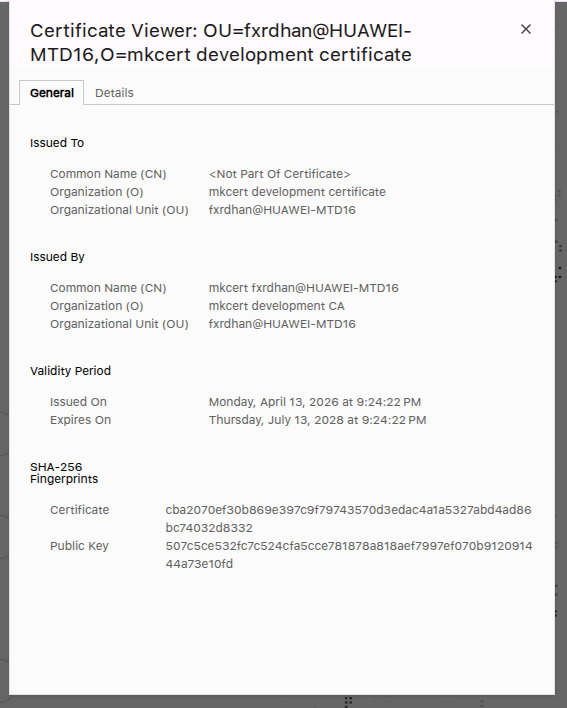

Gambar ini menunjukkan certificate viewer browser untuk `localhost:10443`. Sertifikat diterbitkan untuk `mkcert development certificate`, diterbitkan oleh `mkcert development CA`, dan fingerprint SHA-256-nya cocok dengan sertifikat yang dipakai Apache. Ini menjadi bukti bahwa browser mempercayai koneksi karena chain sertifikat lokalnya dikenali oleh trust store.

Buka:

```text
https://localhost:10443/
```

Yang ditunjukkan:

1. halaman register/login tampil,
2. form memakai metode `POST`,
3. form membawa `csrf_token`.

### 6.3. Buktikan HTTP diarahkan ke HTTPS

```bash
curl -k -I http://localhost:10080
```

Yang ditunjukkan:

1. status `301 Moved Permanently`,
2. header `Location: https://localhost:10443/`.

### 6.4. Demo flow utama login-register

Urutan demo:

1. register username baru dengan password valid,
2. login memakai akun yang baru dibuat,
3. tunjukkan halaman `/welcome.php`,
4. pastikan username muncul pada halaman welcome,
5. logout,
6. coba login dengan akun salah dan tunjukkan redirect ke `/not-registered.php`.

### 6.5. Buktikan database tidak menyimpan kredensial plaintext

Jalankan query inspeksi tabel `users` dari MySQL container:

```sql
SELECT username_lookup, username_encrypted, password_hash FROM users ORDER BY id DESC LIMIT 1;
```

Yang ditunjukkan:

1. `username_lookup` berupa HMAC 64 karakter hex,
2. `username_encrypted` berupa payload terenkripsi `iv.tag.ciphertext`,
3. `password_hash` berformat `$argon2id$...`,
4. tidak ada username/password plaintext di database.

### 6.6. Demo uji negatif keamanan

Urutan paling cepat:

1. kirim login tanpa `csrf_token` dan tunjukkan status `403`,
2. masukkan payload SQL injection `' OR 1=1 --` dan tunjukkan login tetap gagal,
3. masukkan payload XSS `<script>alert(1)</script>` pada register dan tunjukkan input ditolak,
4. masukkan username terlalu panjang dan tunjukkan validasi `Username harus 3-32 karakter.`,
5. lakukan login gagal 6 kali dan tunjukkan request ke-6 menerima `429`.

Catatan saat menjelaskan SQL injection: payload memang ditolak oleh validasi username sebelum query dijalankan, dan layer database tetap memakai PDO prepared statement sebagai pertahanan utama bila input valid sampai ke query.

### 6.7. Demo Snort IDS dan ACL jaringan

```bash
bun run snort:test-rules
bun run acl:status
```

Yang ditunjukkan:

1. konfigurasi Snort valid,
2. rule lokal dan komunitas dimuat,
3. chain `AU7H_INPUT` aktif,
4. HTTP/HTTPS diizinkan,
5. MySQL `3306`, SSH `22`, dan ICMP dibatasi sesuai ACL.

### 6.8. Demo test keamanan dan hygiene secret

```bash
bun run test
git status --short
sed -n '1,40p' .gitignore
sed -n '1,40p' .dockerignore
```

Yang ditunjukkan:

1. test helper keamanan lulus,
2. `data/` dan `certs/` tidak masuk Git,
3. Docker build context mengecualikan `data/`, `certs/`, `.git/`, dan cache lokal,
4. CI punya langkah lint PHP, test PHP, dan build image.

### 6.9. Demo privilege, supply-chain, dan lifecycle secret

```bash
docker compose -f compose.dev.yaml config
sed -n '1,70p' Dockerfile
sed -n '1,80p' .github/workflows/ci.yml
docker compose -f compose.dev.yaml exec app sh -lc 'stat -c "%a %U:%G %n" /var/www/data/runtime-secrets.env'
docker container inspect --format '{{json .State.Health}}' au7h-app-1
```

Yang ditunjukkan:

1. `app` melakukan `cap_drop: ALL` lalu menambahkan ulang `CHOWN`, `DAC_OVERRIDE`, `NET_ADMIN`, `SETGID`, dan `SETUID`,
2. `snort` melakukan `cap_drop: ALL` lalu menambahkan ulang `DAC_OVERRIDE`, `NET_ADMIN`, dan `NET_RAW`,
3. `no-new-privileges:true` aktif pada kedua service,
4. root filesystem `snort` read-only dengan log tetap di volume,
5. tidak ada `privileged: true`,
6. image dan dependency build dibaca dari tag/lockfile yang jelas,
7. `snort3:latest`, digest pinning, dan vulnerability scan dijelaskan sebagai batasan transparan,
8. secret runtime berada di volume data dan tidak masuk Git/build context,
9. healthcheck container tersedia dan dapat dibaca dari state Docker.

## 7. Urutan Verifikasi Setelah Implementasi

Bukti visual ditempel langsung pada uji yang relevan, bukan dikumpulkan sebagai lampiran di akhir. Screenshot yang dipilih menunjukkan hasil final yang berhasil, termasuk uji positif dan uji negatif keamanan; uji yang tidak punya screenshot tersendiri tetap dicatat pada tabel hasil aktual. Screenshot percobaan database yang masih menghasilkan `Access denied` tidak dimasukkan karena bukan bukti final. Screenshot Trivy dicatat sebagai hasil scan manual supply-chain, bukan sebagai klaim bahwa workflow CI sudah memiliki vulnerability gate.

### Uji 1 - Container hidup

Alur pengujian: jalankan build bersih lebih dulu, lalu baca log startup sampai bootstrap MySQL dan Apache benar-benar selesai tanpa fatal error.

```bash
docker compose -f compose.dev.yaml up -d --build
docker compose -f compose.dev.yaml logs -f app
```

Yang harus terlihat:

1. MySQL berhasil bootstrap,
2. Apache listen di port HTTP/HTTPS,
3. tidak ada error fatal PHP saat startup.

#### Bukti visual Uji 1

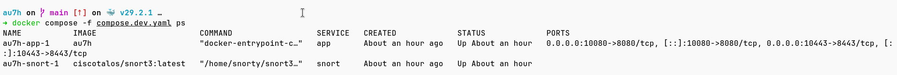

Gambar ini menunjukkan `docker compose -f compose.dev.yaml ps` dengan service `app` dan `snort` berstatus `Up`, serta port `10080->8080` dan `10443->8443` terpublish.

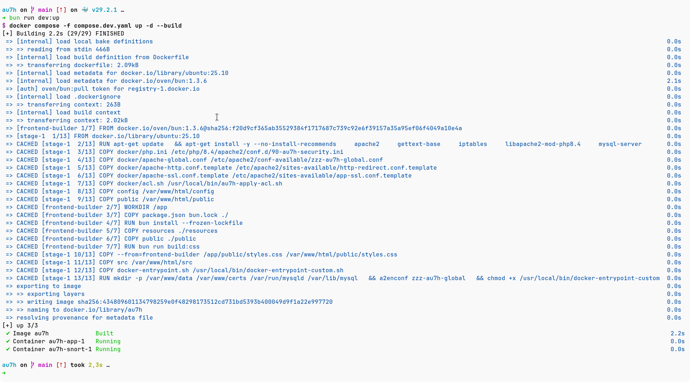

Gambar ini menunjukkan `bun run dev:up` menjalankan `docker compose -f compose.dev.yaml up -d --build`, image `au7h` berhasil dibangun, dan container `au7h-app-1` serta `au7h-snort-1` berjalan.

### Uji 2 - HTTP redirect ke HTTPS

Alur pengujian: kirim request HEAD ke endpoint HTTP untuk memastikan web server tidak melayani konten sensitif di kanal tidak terenkripsi.

```bash
curl -I http://localhost:10080
```

Yang harus terlihat:

1. status redirect,
2. header `Location` menuju `https://localhost:10443/...`.

#### Bukti visual Uji 2

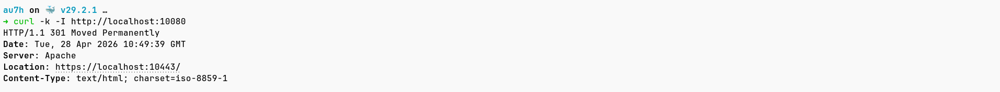

Gambar ini menunjukkan request `curl -k -I http://localhost:10080` menerima status `301 Moved Permanently` dan header `Location: https://localhost:10443/`.

### Uji 3 - Form tampil di browser

Alur pengujian: panggil halaman utama lewat HTTPS dan periksa bahwa HTML yang kembali memang sudah memuat form autentikasi serta hidden field CSRF.

```bash
curl -k https://localhost:10443/
```

Yang harus terlihat:

1. HTML form register/login,
2. hidden field CSRF token,
3. endpoint action menuju `/register.php` atau `/login.php`.

#### Bukti visual Uji 3

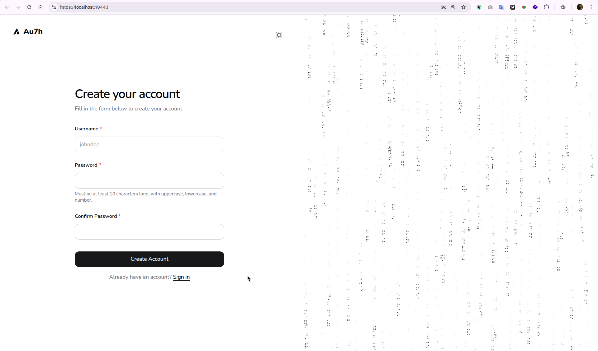

Gambar ini menunjukkan halaman utama aplikasi dapat dibuka lewat `https://localhost:10443/` dan menampilkan form pendaftaran akun.

### Uji 4 - Register berhasil

**Langkah manual:**

1. buka `https://localhost:10443/`,
2. isi username valid,
3. isi password valid,
4. submit register,
5. halaman kembali ke mode login dengan flash sukses.

### Uji 5 - Login berhasil

**Langkah manual:**

1. isi username yang baru terdaftar,
2. isi password benar,
3. submit login.

Hasil yang harus muncul:

1. redirect ke `/welcome.php`,
2. teks `Welcome, <username>!`,
3. session aktif.

#### Bukti visual Uji 5

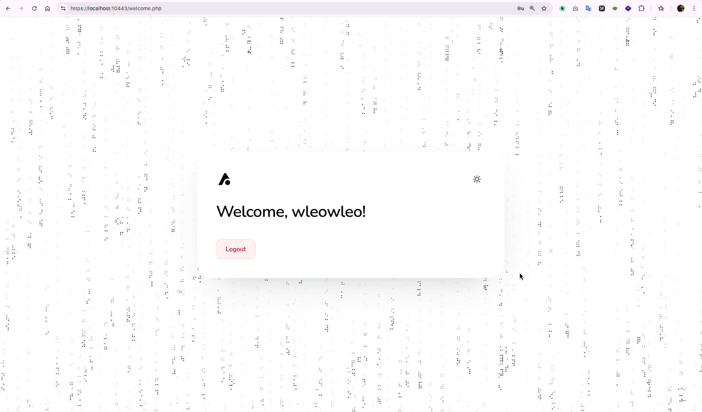

Gambar ini menunjukkan login berhasil dan user diarahkan ke `/welcome.php` dengan username tampil pada halaman welcome.

### Uji 6 - Login gagal

**Langkah manual:**

1. isi username salah atau password salah,
2. submit login.

Hasil yang harus muncul:

1. redirect ke `/not-registered.php`,
2. teks bahwa username atau password salah,
3. session lama dibersihkan.

### Uji 7 - Username dan password tidak terbaca asli di database

Alur pengujian: periksa isi tabel secara langsung untuk membuktikan bahwa database hanya menyimpan lookup, ciphertext, dan hash, bukan kredensial plaintext.

```sql
SELECT username_lookup, username_encrypted, password_hash FROM users;
```

Yang harus terlihat:

1. tidak ada password plaintext,
2. `password_hash` berformat hash Argon2id,
3. `username_encrypted` berupa ciphertext, bukan username asli.

#### Bukti visual Uji 7

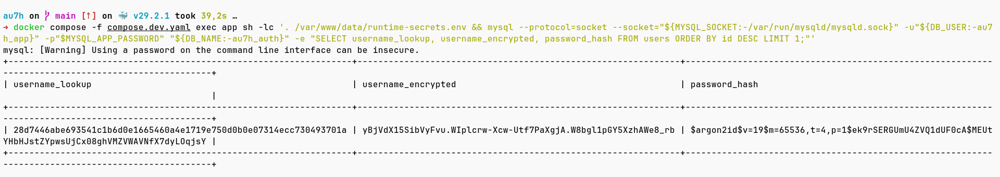

Gambar ini menunjukkan tabel `users` hanya memuat `username_lookup`, `username_encrypted`, dan `password_hash`. Nilai username tidak tampil sebagai plaintext, sedangkan password tersimpan sebagai hash Argon2id.

### Uji 8 - CSRF protection

Cara uji:

1. kirim `POST` login/register tanpa `csrf_token`,
2. atau kirim token yang tidak cocok.

Hasil yang harus muncul:

1. status `403`,
2. halaman error `Form ditolak`.

#### Bukti visual Uji 8

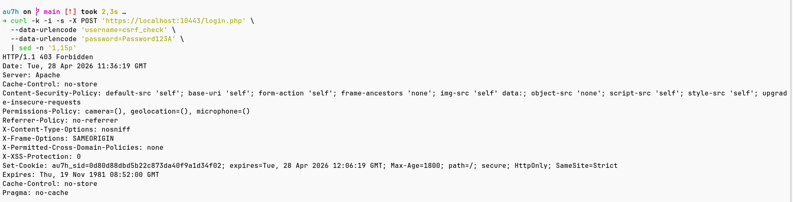

Gambar ini menunjukkan request `POST` ke `/login.php` tanpa `csrf_token` menerima respons `HTTP/1.1 403 Forbidden`, sehingga integritas form benar-benar divalidasi di server.

### Uji 9 - SQL injection

Alur pengujian: gunakan payload klasik pada field username untuk membuktikan prepared statement tetap membuat input itu diperlakukan sebagai data biasa.

Masukkan pada field username:

```text
' OR 1=1 --
```

Hasil yang diharapkan:

1. query tidak pecah,
2. login tetap gagal,
3. tidak ada akun yang lolos secara ilegal.

#### Bukti visual Uji 9

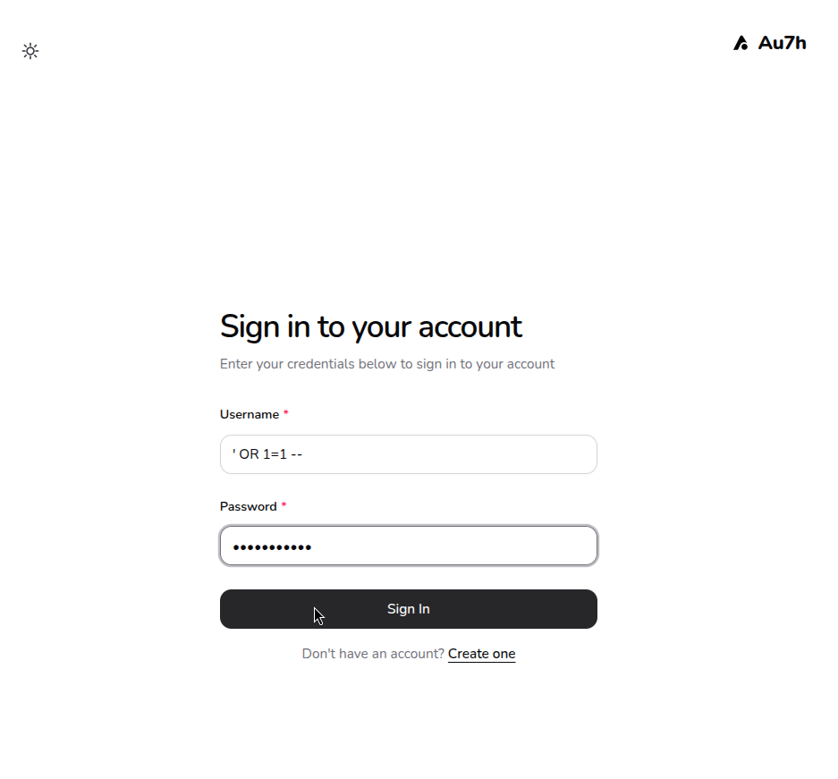

Gambar ini menunjukkan field username diisi payload `' OR 1=1 --` dan field password tetap diisi agar browser benar-benar mengirim request ke server, bukan berhenti pada validasi `required` di sisi browser.

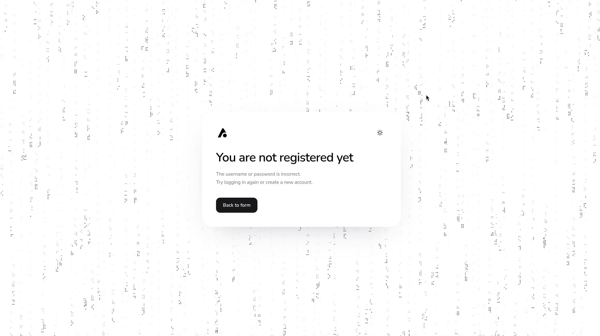

Gambar ini menunjukkan hasil setelah payload dikirim: aplikasi tetap menampilkan halaman `You are not registered yet`, sehingga payload tidak membypass autentikasi dan tidak membuka akun lain.

### Uji 10 - XSS

Alur pengujian: masukkan payload script ke form register untuk melihat bahwa validasi input menghentikan nilai berbahaya bahkan sebelum output encoding dan CSP bekerja.

Masukkan pada username saat register:

```text
<script>alert(1)</script>
```

Hasil yang diharapkan:

1. validasi username menolak input,
2. jika suatu saat nilai itu lolos ke tampilan, `escape_html()` tetap mengubahnya menjadi teks aman,
3. CSP tetap memberi lapisan tambahan.

#### Bukti visual Uji 10

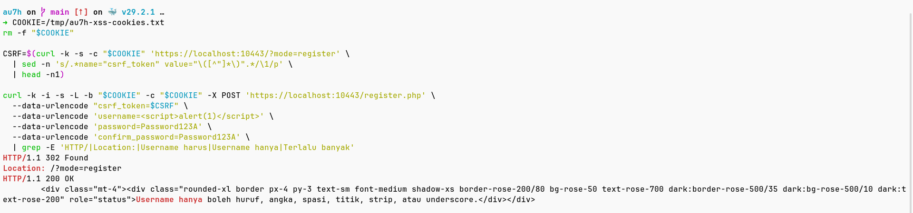

Gambar ini menunjukkan payload `<script>alert(1)</script>` pada username register ditolak dengan pesan `Username hanya boleh huruf, angka, spasi, titik, strip, atau underscore.`

### Uji 11 - Buffer overflow / oversized input

Alur pengujian: kirim input yang sengaja dibuat melewati batas normal aplikasi, lalu cocokkan dengan hardening runtime PHP untuk memastikan request besar tidak diproses bebas.

Contoh input yang diuji:

```text
username = 80 karakter
password = lebih dari 72 karakter
POST body = lebih besar dari post_max_size
```

Yang harus terlihat:

1. username lebih dari 32 karakter ditolak oleh validasi server-side,
2. password lebih dari 72 karakter ditolak oleh validasi server-side,
3. file upload tetap nonaktif,
4. ukuran POST dibatasi oleh konfigurasi Apache PHP,
5. tidak ada data oversized yang masuk ke tabel `users`.

#### Bukti visual Uji 11

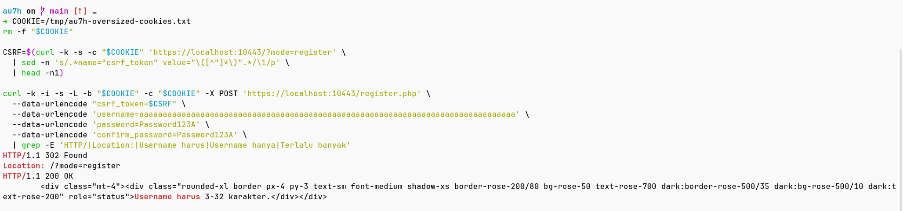

Gambar ini menunjukkan username panjang berlebih ditolak dengan pesan `Username harus 3-32 karakter.`, sehingga batas ukuran input berjalan di sisi server.

### Uji 12 - Rate limit

Lakukan login gagal berulang kali sampai melewati batas.

Hasil yang diharapkan:

1. request berikutnya menerima status `429`,
2. halaman error menyatakan terlalu banyak percobaan.

#### Bukti visual Uji 12

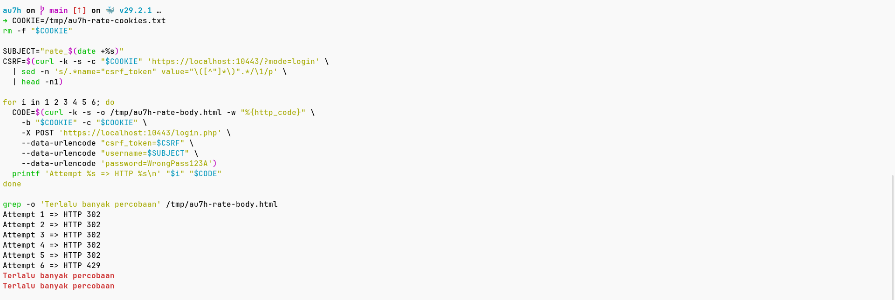

Gambar ini menunjukkan lima percobaan login gagal pertama menerima `HTTP 302`, lalu percobaan keenam menerima `HTTP 429` dengan pesan `Terlalu banyak percobaan`.

### Uji 13 - Snort IDS dan rule lokal

Alur pengujian: validasi konfigurasi Snort, jalankan traffic HTTP/HTTPS, lalu baca file alert Snort.

```bash
bun run snort:test-rules
bun run snort:logs
```

Yang harus terlihat:

1. konfigurasi Snort valid tanpa warning fatal,
2. alert HTTP/HTTPS muncul saat browser atau `curl` mengakses aplikasi,
3. alert MySQL atau SSH muncul saat ada percobaan akses langsung ke port `3306` atau `22`.

#### Bukti visual Uji 13

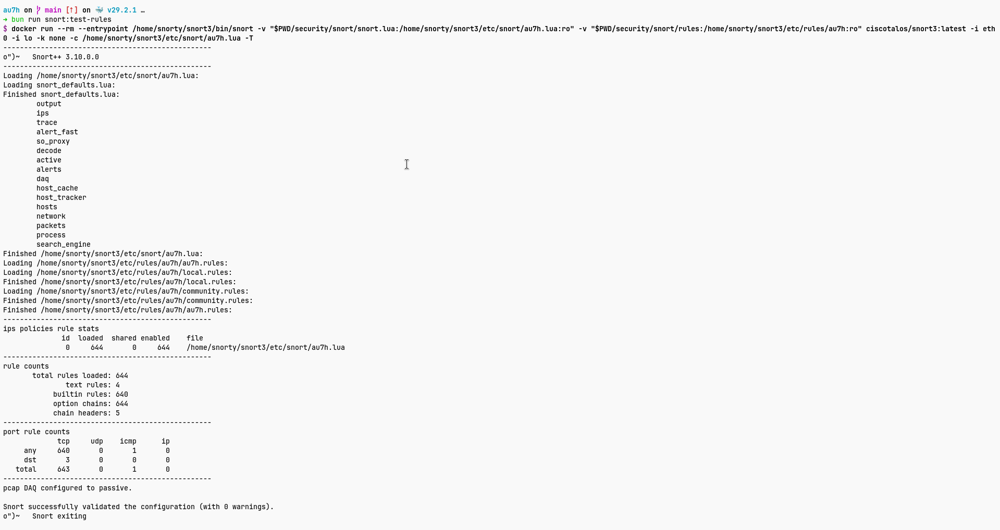

Gambar ini menunjukkan `bun run snort:test-rules` berhasil memvalidasi konfigurasi Snort, memuat `644` rules, dan berakhir dengan `0 warnings`.

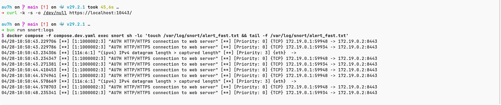

Gambar ini menunjukkan alert `[1:1000002:3] "AU7H HTTP/HTTPS connection to web server"` muncul setelah traffic HTTPS dikirim ke aplikasi.

### Uji 14 - ACL port jaringan

Alur pengujian: tampilkan chain ACL dan pastikan port web diizinkan, sementara MySQL dan SSH ditolak.

```bash
bun run acl:status
```

Yang harus terlihat:

1. chain `AU7H_INPUT` aktif,
2. port `8080` dan `8443` berstatus `ACCEPT`,
3. port `3306` dan `22` berstatus `REJECT`,
4. ICMP echo request berstatus `DROP` kecuali `ACL_ALLOW_ICMP=1`.

#### Bukti visual Uji 14

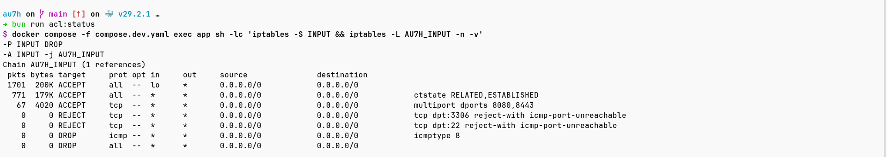

Gambar ini menunjukkan chain `AU7H_INPUT` aktif, port web `8080,8443` diizinkan, port MySQL `3306` dan SSH `22` ditolak, serta ICMP echo request di-drop.

### Uji 15 - Test otomatis helper keamanan

Alur pengujian: jalankan test helper keamanan untuk memastikan kontrol security yang bisa diuji tanpa browser tetap konsisten.

```bash
bun run test
```

Yang harus terlihat:

1. validasi username menolak input pendek, panjang berlebih, dan karakter berbahaya,
2. validasi password menolak password lemah,
3. lookup username berupa HMAC 64 hex,
4. username terenkripsi bisa didekripsi kembali hanya dengan key aplikasi,
5. password hash menerima password benar dan menolak password salah,
6. CSRF token bisa dibuat, dipakai ulang, dirotasi, dan token kosong/format rusak ditolak,
7. key rate limit berubah berdasarkan alamat klien dan subject normalisasi,
8. output akhir `Auth security tests passed.`

#### Bukti visual Uji 15

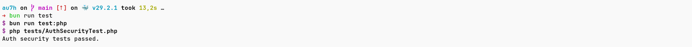

Gambar ini menunjukkan `bun run test` berhasil menjalankan test helper keamanan dan menghasilkan `Auth security tests passed.`

### Uji 16 - Hygiene secret dan build context

Alur pengujian: periksa file ignore dan workflow CI agar data lokal, private key sertifikat, cache, dan metadata Git tidak ikut tersimpan atau terkirim ke image.

```bash
sed -n '1,80p' .gitignore
sed -n '1,100p' .dockerignore
sed -n '1,120p' .github/workflows/ci.yml
```

Yang harus terlihat:

1. `.gitignore` mengecualikan `data/`, `certs/`, backup, dan catatan privat,
2. `.dockerignore` mengecualikan `data/`, `certs/`, `.git/`, `.github/`, cache lokal, dan artefak yang tidak dibutuhkan image,
3. CI menjalankan PHP syntax lint,
4. CI menjalankan `bun run test:php`,
5. CI membangun image Docker sebagai validasi build context.

### Uji 17 - Runtime privilege dan capability

Alur pengujian: baca konfigurasi Compose final dan entrypoint untuk memastikan capability default di-drop, capability tambahan terbatas pada kebutuhan bootstrap/ACL/IDS, dan `no-new-privileges` aktif.

```bash
docker compose -f compose.dev.yaml config
sed -n '1,220p' docker-entrypoint.sh
```

Yang harus terlihat:

1. service `app` memiliki `cap_drop: ALL`,
2. service `app` hanya menambahkan ulang `CHOWN`, `DAC_OVERRIDE`, `NET_ADMIN`, `SETGID`, dan `SETUID`,
3. service `snort` memiliki `cap_drop: ALL`,
4. service `snort` hanya menambahkan ulang `DAC_OVERRIDE`, `NET_ADMIN`, dan `NET_RAW`,
5. kedua service memakai `security_opt: no-new-privileges:true`,
6. service `snort` memakai `read_only: true` dan `tmpfs` untuk `/tmp`,
7. tidak ada `privileged: true`,
8. MySQL dijalankan dengan `--user=mysql`,
9. alasan capability dicatat sebagai kebutuhan bootstrap, `iptables`, dan packet capture, bukan default produksi.

#### Bukti visual Uji 17

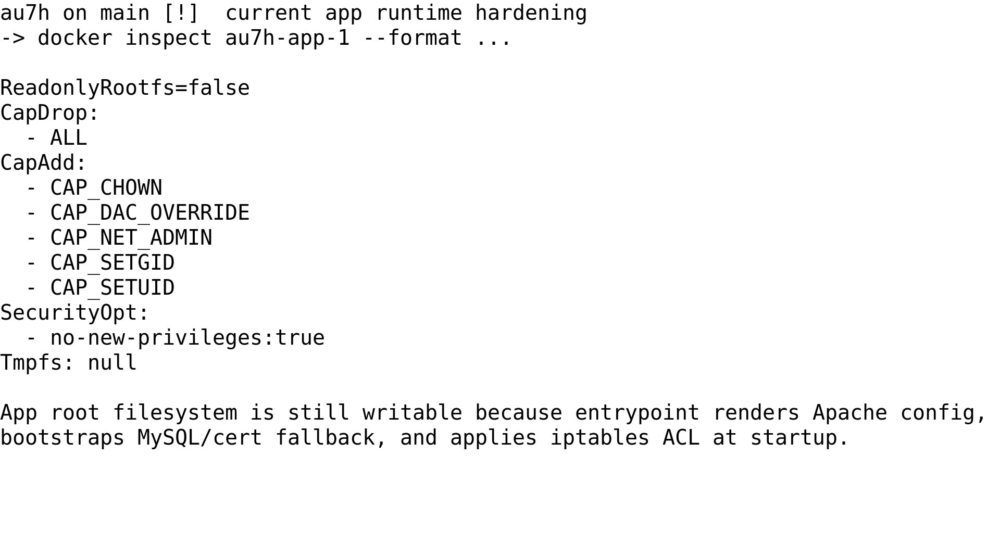

Gambar ini menunjukkan hasil inspeksi runtime untuk service `app`. Service aplikasi menjatuhkan capability default dengan `cap_drop: ALL`, menambahkan ulang capability bootstrap/ACL yang diperlukan, mengaktifkan `no-new-privileges`, dan tetap tidak dibuat read-only karena entrypoint masih merender konfigurasi Apache, bootstrap MySQL/cert fallback, dan memasang ACL saat startup.

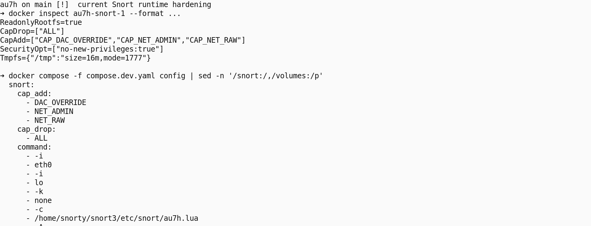

Gambar ini menunjukkan hasil inspeksi runtime dan cuplikan Compose untuk service `snort`. Snort berjalan sebagai sidecar dengan `cap_drop: ALL`, menambahkan ulang hanya `DAC_OVERRIDE`, `NET_ADMIN`, dan `NET_RAW`, mengaktifkan `no-new-privileges`, memakai root filesystem read-only, menjalankan binary Snort pada interface `eth0` dan `lo`, memakai image `ciscotalos/snort3:latest`, serta berbagi network namespace aplikasi lewat `network_mode: service:app`.

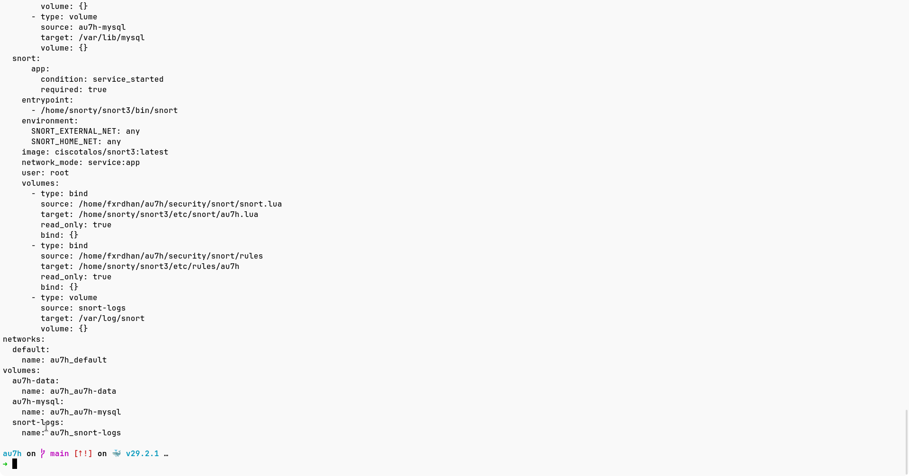

Gambar ini menunjukkan lanjutan konfigurasi service `snort`: file `snort.lua` dan direktori `security/snort/rules` dipasang read-only, log Snort disimpan pada volume `snort-logs`, dan service tetap berada pada network namespace `app`.

### Uji 18 - Supply-chain image dan dependency

Alur pengujian: periksa image source, lockfile dependency, dan CI build untuk memastikan supply-chain dicatat jelas.

```bash
sed -n '1,70p' Dockerfile
sed -n '1,70p' compose.dev.yaml
sed -n '1,80p' .github/workflows/ci.yml
```

Yang harus terlihat:

1. builder memakai `oven/bun:1.3.6`,
2. runtime memakai `ubuntu:25.10`,
3. dependency JavaScript dipasang dengan `bun install --frozen-lockfile`,
4. CI membangun image Docker,
5. `ciscotalos/snort3:latest` dicatat sebagai tradeoff demo dan tidak diklaim sebagai digest-pinned production image.

Jika scanner tersedia, hardening lanjutan dapat diuji dengan:

```bash
trivy image --scanners vuln --severity HIGH,CRITICAL --timeout 20m au7h
```

#### Bukti visual Uji 18

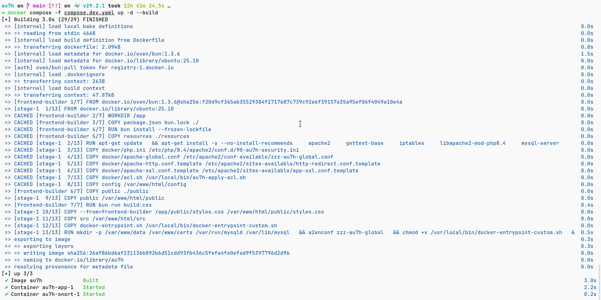

Gambar ini menunjukkan `docker compose -f compose.dev.yaml up -d --build` berhasil membangun image `au7h`. Output build juga memperlihatkan sumber image builder `oven/bun:1.3.6`, runtime `ubuntu:25.10`, penggunaan `.dockerignore`, `bun install --frozen-lockfile`, dan container `app` serta `snort` berhasil start.

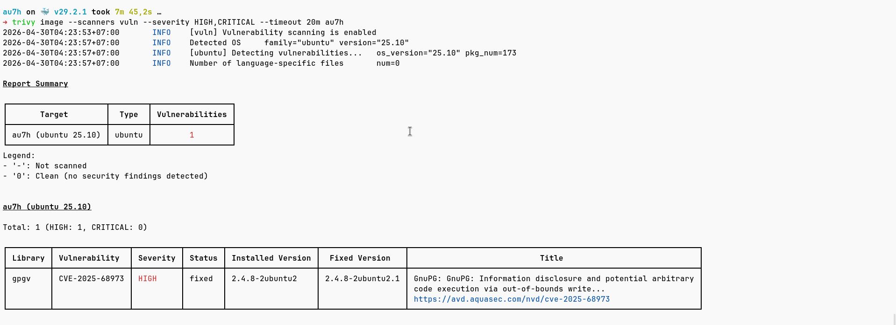

Gambar ini menunjukkan `trivy image --scanners vuln --severity HIGH,CRITICAL --timeout 20m au7h` selesai dijalankan. Hasilnya menemukan `1` vulnerability severity `HIGH` dan `0` severity `CRITICAL` pada image `au7h (ubuntu 25.10)`, yaitu `CVE-2025-68973` pada paket `gpgv` dengan fixed version `2.4.8-2ubuntu2.1`.

### Uji 19 - Lifecycle secret dan privilege database

Alur pengujian: periksa file secret runtime, ignore file, dan grant database untuk memastikan secret dan privilege database tidak hanya dijelaskan secara abstrak.

```bash
docker compose -f compose.dev.yaml exec app sh -lc 'stat -c "%a %U:%G %n" /var/www/data/runtime-secrets.env'
docker compose -f compose.dev.yaml exec app sh -lc '. /var/www/data/runtime-secrets.env; mysql --protocol=socket --socket=/var/run/mysqld/mysqld.sock -uroot -p"$MYSQL_ROOT_PASSWORD" -e "SHOW GRANTS FOR '\''au7h_app'\''@'\''127.0.0.1'\'';"'
```

Yang harus terlihat:

1. `runtime-secrets.env` berada di `/var/www/data`, bukan di image atau repo,
2. permission file secret ketat karena entrypoint memakai `umask 077`,
3. `data/` dan `certs/` dikecualikan dari Git dan Docker build context,
4. grant user aplikasi dibatasi ke database aplikasi,
5. `GRANT ALL` pada database aplikasi dijelaskan sebagai tradeoff bootstrap demo, bukan least-privilege produksi penuh.

#### Bukti visual Uji 19

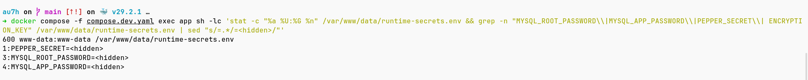

Gambar ini menunjukkan file `/var/www/data/runtime-secrets.env` memiliki permission `600` dan dimiliki `www-data:www-data`. Nilai `PEPPER_SECRET`, `MYSQL_ROOT_PASSWORD`, dan `MYSQL_APP_PASSWORD` sengaja disamarkan menjadi `<hidden>` agar bukti lifecycle secret tidak membocorkan isi secret.

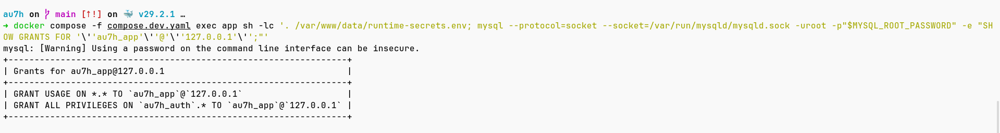

Gambar ini menunjukkan `SHOW GRANTS FOR 'au7h_app'@'127.0.0.1'`. User aplikasi memiliki `USAGE` global dan `GRANT ALL PRIVILEGES` hanya pada database `au7h_auth.*`, sehingga haknya tidak diberikan ke seluruh server MySQL. Bagian ini tetap dicatat sebagai tradeoff bootstrap demo, bukan least-privilege produksi penuh.

### Uji 20 - Healthcheck container

Alur pengujian: periksa Dockerfile dan status container untuk memastikan aplikasi punya pemeriksaan kesehatan internal, bukan hanya status proses hidup.

```bash
sed -n '44,68p' Dockerfile
php -l docker/healthcheck.php
docker image inspect --format '{{json .Config.Healthcheck}}' au7h
docker container inspect --format '{{json .State.Health}}' au7h-app-1
```

Yang harus terlihat:

1. Dockerfile menyalin `docker/healthcheck.php` ke `/usr/local/bin/au7h-healthcheck.php`,
2. Dockerfile mendeklarasikan `HEALTHCHECK` dengan perintah `php /usr/local/bin/au7h-healthcheck.php`,
3. `php -l docker/healthcheck.php` tidak menemukan syntax error,
4. image config memuat `Test` berisi `php /usr/local/bin/au7h-healthcheck.php`,
5. ketika container sudah berjalan cukup lama melewati `start-period`, status healthcheck menjadi `healthy`,
6. jika endpoint HTTPS lokal gagal merespons HTTP 200, healthcheck mengembalikan exit code `1`.

#### Bukti visual Uji 20

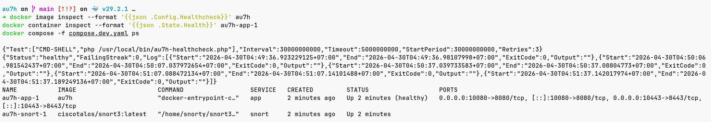

Gambar ini menunjukkan `docker image inspect` membaca metadata healthcheck pada image `au7h`, `docker container inspect` membaca state healthcheck container `au7h-app-1` dengan status `healthy`, dan `docker compose -f compose.dev.yaml ps` menampilkan service aplikasi `Up ... (healthy)` bersama sidecar Snort yang aktif.

### Hasil Verifikasi Aktual

Bagian ini mencatat hasil uji yang sudah dijalankan pada proyek, bukan hanya rencana uji.

| Area yang diuji | Perintah atau cara uji | Hasil aktual |
| --- | --- | --- |
| Unit security helper | `bun run test` | `Auth security tests passed.` |
| Cakupan test helper keamanan | Review `tests/AuthSecurityTest.php` | test mencakup validasi input, normalisasi username, HMAC lookup, enkripsi/dekripsi username, hashing/verifikasi password, CSRF token termasuk token kosong/format rusak, dan key/policy rate limit |
| Container app + Snort | `docker compose -f compose.dev.yaml up -d --build` lalu `docker compose -f compose.dev.yaml ps` | service `app` dan `snort` berstatus `Up`; port `10080->8080` dan `10443->8443` terpublish |
| Redirect HTTP ke HTTPS | `curl -k -I http://localhost:10080` | `HTTP/1.1 301 Moved Permanently`, `Location: https://localhost:10443/` |
| Form dan CSRF | `curl -k -s https://localhost:10443/` | HTML memuat form `POST`, action `/register.php`, dan hidden field `csrf_token` |
| Register berhasil | Submit form register dengan username unik, password valid, dan `confirm_password` cocok | response `302 Found`, `Location: /?mode=login` |
| Login berhasil | Submit form login memakai akun hasil register | response `302 Found`, `Location: /welcome.php` |
| Welcome username | Buka `/welcome.php` dengan cookie session login | halaman memuat teks `Welcome, <username>!` |
| Login gagal | Submit username yang tidak terdaftar | response `302 Found`, `Location: /not-registered.php` |
| Logout | Submit `/logout.php` dengan CSRF token dari halaman welcome | response `302 Found`, `Location: /`; akses ulang `/welcome.php` kembali redirect |
| CSRF protection | Submit `POST /login.php` tanpa `csrf_token` | status `403` |
| Privasi database | Query `SELECT username_lookup, username_encrypted, password_hash FROM users ORDER BY id DESC LIMIT 1` | username tampil sebagai HMAC 64 hex, username terenkripsi berbentuk payload `iv.tag.ciphertext`, password berbentuk hash `$argon2id$...` |
| SQL injection | Payload username `' OR 1=1 --` pada form login | payload tidak membypass login; input ditolak sebagai credential tidak valid dan query auth tetap memakai prepared statement |
| XSS | Payload username `<script>alert(1)</script>` pada form register | validasi username menolak karakter berbahaya; output dinamis tetap melewati `escape_html()` dan CSP aktif sebagai lapisan tambahan |
| Buffer overflow / oversized input | Submit register dengan username 80 karakter, lalu cek `/etc/php/8.4/apache2/conf.d/90-au7h-security.ini` di container app | request ditolak kembali ke `/?mode=register`; config Apache PHP memuat `file_uploads = Off`, `post_max_size = 8K`, `upload_max_filesize = 1K`, dan `max_input_vars = 20` |
| Rate limiting | Login gagal 6 kali beruntun untuk subject yang sama | percobaan 1-5 menghasilkan `302`, percobaan ke-6 menghasilkan `429` |
| Snort rules | `bun run snort:test-rules` | Snort berhasil validasi konfigurasi, `644` rules loaded, `0 warnings` |
| Snort live alert | `curl -k -s -o /dev/null https://localhost:10443/` lalu baca `/var/log/snort/alert_fast.txt` | alert `[1:1000002:3] "AU7H HTTP/HTTPS connection to web server"` muncul untuk traffic ke port `8443` |
| ACL container | `bun run acl:status` | chain `AU7H_INPUT` aktif; HTTP/HTTPS `ACCEPT`; MySQL `3306` dan SSH `22` `REJECT`; ICMP echo request `DROP` |
| Batas satu container | Review `Dockerfile` dan `compose.dev.yaml` | container `app` memuat Apache/PHP/MySQL; `snort` adalah sidecar IDS, bukan pemisahan web/database |
| Hygiene Git untuk secret lokal | Review `.gitignore` | `data/`, `certs/`, backup, dan catatan privat dikecualikan dari Git |
| Hygiene Docker build context | Review `.dockerignore` | `data/`, `certs/`, `.git/`, `.github/`, cache lokal, dan artefak pendukung tidak dikirim ke build context |
| CI check keamanan dasar | Review `.github/workflows/ci.yml` | workflow menjalankan PHP syntax lint, `bun run test:php`, dan `docker build -t au7h-ci .` |
| Threat model containering/security | Review Tahap 0A | ancaman jaringan, database leak, SQLi, XSS, CSRF, brute force, oversized input, ACL, Snort, secret leak, privilege container, dan supply-chain sudah dipetakan ke tahap penutup |
| Runtime privilege dan capability | `docker compose -f compose.dev.yaml config` dan review entrypoint | `app` dan `snort` memakai `cap_drop: ALL`; `app` menambahkan ulang `CHOWN`, `DAC_OVERRIDE`, `NET_ADMIN`, `SETGID`, dan `SETUID`; `snort` menambahkan ulang `DAC_OVERRIDE`/`NET_ADMIN`/`NET_RAW`; `no-new-privileges:true` aktif; root filesystem `snort` read-only; tidak ada `privileged: true`; MySQL dijalankan dengan `--user=mysql` |
| Supply-chain image dan dependency | Review `Dockerfile`, `compose.dev.yaml`, `bun.lock`, dan CI | builder memakai `oven/bun:1.3.6`, runtime memakai `ubuntu:25.10`, dependency memakai `--frozen-lockfile`, CI build image berjalan; `snort3:latest` dicatat sebagai tradeoff demo |
| Trivy vulnerability scan manual | `trivy image --scanners vuln --severity HIGH,CRITICAL --timeout 20m au7h` | scan selesai; ditemukan `1` HIGH dan `0` CRITICAL pada paket `gpgv` (`CVE-2025-68973`), status `fixed`, fixed version `2.4.8-2ubuntu2.1` |
| Lifecycle secret dan privilege database | Review `docker-entrypoint.sh`, ignore file, dan bootstrap SQL | secret dibuat runtime di `/var/www/data`, `data/` dan `certs/` dikecualikan dari Git/build context, grant user aplikasi dibatasi ke database aplikasi, `GRANT ALL` dijelaskan sebagai tradeoff bootstrap demo |
| Healthcheck container | `docker image inspect --format '{{json .Config.Healthcheck}}' au7h`, `docker container inspect --format '{{json .State.Health}}' au7h-app-1`, dan `docker compose -f compose.dev.yaml ps` | metadata image memuat `Test:["CMD-SHELL","php /usr/local/bin/au7h-healthcheck.php"]`; container `au7h-app-1` berstatus `healthy`; Compose menampilkan `Up ... (healthy)` |

## 8. Pemetaan Requirement Tugas Ke Tahap Implementasi

| Requirement tugas | Tahap implementasi yang menutup requirement |
| --- | --- |
| Threat model dan acceptance criteria awal | Tahap 0A |
| Satu container web server + database | Tahap 1, 2, 3 |
| Bisa diakses browser | Tahap 4, 17 |
| Form login dan register | Tahap 11 |
| Minimal harus bisa login | Tahap 12, 13, 14 |
| Login sukses ke welcome + username | Tahap 13, 14 |
| Login gagal ke belum terdaftar | Tahap 13, 14 |
| HTTPS | Tahap 4 |
| Algoritma enkripsi web server boleh default | Tahap 1, 3, 4 |
| Integritas form | Tahap 9, 12, 13, 15, 19 |
| Privasi data di database | Tahap 8, 9, 19, 20, 23 |
| Buffer overflow | Tahap 6 + pilihan stack pada Tahap 1 + Decision Log 3.4 + Tahap 19 |
| SQL injection | Tahap 10, 19 |
| XSS | Tahap 5, 9, 11, 14, 19 |
| Snort IDS + rule lokal | Tahap 18 |
| ACL ICMP dan port | Tahap 18, 21 |
| Test keamanan otomatis | Tahap 19 |
| Secret lokal tidak masuk Git/build context | Tahap 20 |
| Runtime privilege dan capability container | Tahap 21 |
| Supply-chain image dan dependency | Tahap 22 |
| Lifecycle secret dan batas privilege database | Tahap 23 |
| Healthcheck container | Tahap 24 |

## 9. Catatan Transparansi Tentang Bagian Yang Sengaja Tidak Dibesar-besarkan

1. Satu container dipilih karena requirement tugas, bukan karena itu pola terbaik produksi.
2. “Buffer overflow protection” di sini diterapkan secara realistis pada level aplikasi: bahasa high-level, limit ukuran, nonaktif upload, hardening runtime. Ini bukan klaim bahwa seluruh dependency native bebas bug.
3. CSP dipasang sebagai defense in depth, bukan pengganti output encoding.
4. Password tidak dienkripsi karena referensi keamanan modern merekomendasikan hashing satu arah.
5. Username tidak cukup di-hash karena landing page perlu menampilkan nilai asli setelah login.
6. Snort berjalan sebagai sidecar IDS untuk kebutuhan monitoring jaringan; ini tidak mengubah fakta bahwa web server, aplikasi PHP, dan database MySQL tetap berada dalam satu container aplikasi.
7. HTTPS lokal memakai file sertifikat dari `./certs`. Jika file itu berasal dari local CA seperti `mkcert` dan root CA-nya sudah dipercaya browser, browser dapat menampilkan `Certificate is valid`. Jika file tidak tersedia, entrypoint membuat self-signed fallback untuk pembuktian HTTPS, tetapi browser bisa menampilkan warning trust. Untuk host publik, sertifikat dari CA tepercaya lebih tepat.
8. Test otomatis di tahap ini memeriksa helper keamanan yang deterministik. Test itu tidak menggantikan uji browser, Snort live alert, atau ACL container, sehingga verifikasi manual tetap dicatat terpisah.
9. `.gitignore` dan `.dockerignore` adalah kontrol hygiene, bukan pengganti secret manager produksi. Untuk demo lokal, keduanya mencegah data runtime dan private key sertifikat lokal ikut tersimpan atau terkirim ke build context.
10. Container aplikasi menjatuhkan capability default lalu menambahkan ulang capability bootstrap/ACL yang diperlukan. `NET_ADMIN` tetap privilege tinggi karena dipakai untuk memasang ACL `iptables`, bukan rekomendasi default produksi. Root filesystem `app` belum read-only karena entrypoint masih menulis konfigurasi runtime dan bootstrap data.
11. Snort berjalan sebagai root dengan capability default di-drop, lalu hanya `DAC_OVERRIDE`, `NET_ADMIN`, dan `NET_RAW` ditambahkan ulang karena image perlu mengeksekusi binary Snort dan IDS perlu akses packet capture. Root filesystem Snort dibuat read-only dan penulisan alert diarahkan ke volume log.
12. Image utama memakai tag versi/rilis dan dependency memakai lockfile frozen, tetapi belum semua image dipin ke digest. `ciscotalos/snort3:latest` tetap dicatat sebagai tradeoff demo.
13. User database aplikasi mendapat `GRANT ALL PRIVILEGES` pada database aplikasi agar bootstrap schema demo bisa otomatis. Untuk produksi, hak runtime sebaiknya dipersempit dan dipisah dari user migration.

## 10. Checklist Final Sebelum Presentasi

Catatan pembacaan: checklist ini dipakai sebagai pemeriksaan terakhir tepat sebelum demo, supaya tidak ada requirement yang tertinggal saat presentasi berlangsung.

```text
[x] docker compose up berhasil
[x] http:// redirect ke https://
[x] form register tampil
[x] form login tampil
[x] register sukses
[x] login sukses
[x] login gagal menuju halaman belum terdaftar
[x] welcome page menampilkan username
[x] logout berhasil
[x] CSRF token divalidasi
[x] session cookie secure + httponly + samesite
[x] password hash Argon2id
[x] username terenkripsi
[x] lookup username via HMAC
[x] prepared statement aktif
[x] emulate prepares dimatikan
[x] payload SQL injection tidak membypass login
[x] CSP aktif
[x] input validation aktif
[x] payload XSS ditolak atau di-escape
[x] oversized username/password ditolak
[x] rate limiting aktif
[x] file upload dimatikan
[x] ukuran POST dibatasi
[x] batas satu container app vs Snort sidecar dijelaskan
[x] sertifikat self-signed untuk demo lokal dijelaskan
[x] Snort service aktif
[x] au7h.rules memuat local.rules dan community.rules
[x] local.rules memuat ICMP, HTTP/HTTPS, MySQL, dan SSH
[x] snort:test-rules berhasil
[x] Snort alert HTTP/HTTPS muncul di alert_fast.txt
[x] acl:status menampilkan chain AU7H_INPUT
[x] HTTP/HTTPS diizinkan ACL
[x] MySQL 3306 dan SSH 22 ditolak ACL
[x] test helper keamanan otomatis tersedia
[x] test mencakup validasi input, CSRF termasuk token kosong/format rusak, HMAC, enkripsi username, hash password, dan rate limit
[x] .gitignore mengecualikan data runtime dan certs lokal
[x] .dockerignore mengecualikan data, certs, .git, .github, dan cache lokal
[x] CI menjalankan PHP syntax lint
[x] CI menjalankan test helper keamanan
[x] CI membangun Docker image dari build context yang dibatasi
[x] threat model containering dan security dipetakan ke tahap implementasi
[x] capability default app dan Snort di-drop lewat cap_drop ALL
[x] capability app dan Snort ditambahkan ulang secara eksplisit beserta alasannya
[x] no-new-privileges aktif pada app dan Snort
[x] root filesystem Snort read-only dan log tetap memakai volume
[x] tidak ada klaim bahwa capability tinggi adalah pola produksi ideal
[x] supply-chain image dan dependency dicatat transparan
[x] lockfile dependency dipakai dengan frozen install
[x] Trivy scan manual selesai dan temuannya dicatat
[x] status digest pinning dan CI vulnerability gate tidak dibesar-besarkan
[x] lifecycle secret runtime dijelaskan
[x] privilege database aplikasi dijelaskan sebagai tradeoff bootstrap demo
[x] Dockerfile memiliki HEALTHCHECK internal ke endpoint HTTPS lokal
[x] script healthcheck valid secara sintaks
```

## 11. Ringkasan Strategi Dari Nol

Strategi pembangunan yang paling aman dan paling mudah dipertanggungjawabkan untuk tugas ini adalah:

1. terjemahkan requirement dulu menjadi acceptance criteria,
2. tetapkan threat model containering dan security,
3. lakukan riset internet per kontrol keamanan,
4. pilih arsitektur yang paling sederhana namun tetap aman,
5. bangun satu container yang bisa bootstrap sendiri,
6. implementasikan login/register paling kecil dulu,
7. pasang proteksi CSRF, session, hashing, enkripsi, SQLi, XSS, dan rate limit,
8. tambahkan Snort IDS dan ACL untuk kontrol jaringan,
9. tambahkan test otomatis untuk helper keamanan yang paling rawan regresi,
10. amankan hygiene repo agar data runtime dan private key lokal tidak ikut Git atau build context,
11. jelaskan privilege container, supply-chain image, lifecycle secret, dan batas privilege database,
12. tambahkan healthcheck container agar status runtime bisa dipantau,
13. tutup dengan uji manual dan uji negatif,
14. cocokkan satu per satu dengan requirement.

Urutan ini menghasilkan proyek yang tidak hanya “jalan”, tetapi juga mudah dijelaskan saat alasan teknisnya perlu dipertanggungjawabkan di sesi evaluasi.
